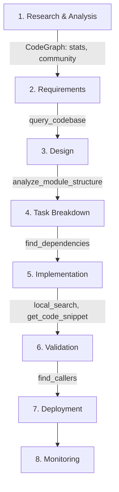

# MUSUBI v2.0 × CodeGraph MCP Server - A Groundbreaking Integration That Gives AI Agents Code Understanding

## Introduction

The biggest challenge for AI coding assistants is "**understanding the entire codebase**." Even when they excel at the file level, grasping the structure, dependencies, and impact scope of a whole project has been difficult.

**MUSUBI v2.0** solves this challenge through integration with the **CodeGraph MCP Server**. Using GraphRAG (Graph Retrieval-Augmented Generation) technology, AI agents can now understand the entire codebase as a "graph."

This article introduces the new features of MUSUBI v2.0, how to set up CodeGraph MCP, and practical usage examples.

:::note info
**Related Articles**
- MUSUBI details: ["MUSUBI" - The Ultimate Specification Driven Development Tool with 7 AI Agent Support and 25 Skills](https://qiita.com/hisaho/items/a245c2ad5adf2ab5a409)
- CodeGraph MCP Server details: [CodeGraph MCP Server - Giving AI Coding Assistants Code Understanding](https://qiita.com/hisaho/items/b99ac51d78119ef60b6b)
:::

## What Is CodeGraph MCP Server?

**CodeGraph MCP Server** is a server that analyzes source code as a graph structure and provides it to AI agents via MCP (Model Context Protocol).

👉 See the [CodeGraph MCP Server introduction article](https://qiita.com/hisaho/items/b99ac51d78119ef60b6b) for details.

### Key Features

| Feature | Description |
|------|------|
| 🔍 **Code structure analysis** | Visualize dependencies of functions, classes, and modules |
| 🧠 **GraphRAG search** | Semantic code search (meaning-based) |
| 🏘️ **Community detection** | Module boundary analysis using the Louvain algorithm |
| 📊 **Impact analysis** | Automatically identify the ripple range of changes |
| 🌐 **14 languages supported** | Python, JavaScript, TypeScript, Java, C#, Go, Rust, Ruby, PHP, C++, HCL, etc. |

### The 14 MCP Tools Provided

```text
# Code graph operations
init_graph          - Initialize graph
get_code_snippet    - Retrieve source code
find_callers        - Trace callers
find_callees        - Trace callees
find_dependencies   - Dependency analysis

# Search features
local_search        - Local context search
global_search       - Global search
query_codebase      - Natural language query

# Analysis features
analyze_module_structure  - Module structure analysis
suggest_refactoring       - Refactoring suggestions
stats                     - Codebase statistics
community                 - Community detection
```

## 🚀 What CodeGraph Integration Newly Makes Possible

Conventional AI coding assistants had a fundamental limitation: "**they cannot understand the entire codebase**." Integration with CodeGraph MCP Server breaks through this limit.

### Before / After Comparison

| Scenario | Before (Conventional) | After (With CodeGraph) |
|----------|----------------|------------------------|
| **Investigating function impact** | Manual grep search, risk of missing things | Complete caller list with `find_callers` |
| **Refactoring planning** | Relies on experience and intuition | Objective analysis with `analyze_module_structure` |
| **Understanding dependencies** | Visually checking import statements | Detect deep dependencies too with `find_dependencies` |
| **Understanding the codebase** | Reading files one by one | Instantly grasp the overall structure with `stats` and `community` |
| **Finding similar code** | Relies on memory or string search | Semantic search with `local_search` |
| **Change ripple range** | Proceeding with "it's probably fine" | Complete analysis with `find_callers` + `find_dependencies` |

### Concrete Examples: Doing What Was Previously Impossible

#### 1. A Complete Answer to "If I Change This Function, What Is Affected?"

**Before**: grep search → visually check the hits → miss indirect calls

**After CodeGraph integration**:

```text
User: I want to change the calculatePrice function. Tell me the impact scope.

🤖 Change Impact Analyzer:
Running find_callers("calculatePrice")...

[Direct Callers] (5 locations)
- OrderService.createOrder() - line 45
- CartController.updateCart() - line 78
- InvoiceGenerator.generate() - line 112
- PriceValidator.validate() - line 23
- BatchProcessor.processAll() - line 89

[Indirect Callers] (3 locations) ← The part that was previously missed
- APIController.handleRequest() → OrderService → calculatePrice
- ScheduledTask.dailyReport() → BatchProcessor → calculatePrice
- WebhookHandler.onPayment() → InvoiceGenerator → calculatePrice

[Affected Tests]
- tests/unit/price.test.ts (direct test)
- tests/integration/order.test.ts (indirect impact)
```

#### 2. An Instant Answer to "Tell Me About This Project's Structure"

**Before**: Look at the directory structure → open and read files → spend hours understanding

**After CodeGraph integration**:

```text
User: Please explain the structure of this project.

🤖 System Architect:
Running stats + community...

[Codebase Statistics]
- Files: 105
- Entities: 1,006 (functions/classes/modules)
- Relations: 5,359 (calls/dependencies/inheritance)
- Communities: 36 (logical module groups)

[Main Communities (Module Boundaries)]
1. Authentication & Authorization (AuthService, TokenManager, PermissionChecker)
2. Order Processing (OrderService, CartService, PaymentProcessor)
3. Data Access (UserRepository, OrderRepository, BaseRepository)
4. API Layer (Controllers, Middleware, Routes)
5. Utilities (Logger, Validator, Formatter)

[Architecture Patterns]
- Layered architecture (Controller → Service → Repository)
- Uses the dependency injection pattern
- Has event-driven asynchronous processing
```

#### 3. A Comprehensive Investigation of "Is There Any Security-Risky Code?"

**Before**: grep for known patterns → experience-based visual review → frequent misses

**After CodeGraph integration**:

```text
User: Please identify code with security risks.

🤖 Security Auditor:
query_codebase("eval, exec, shell execution, SQL injection, XSS") running...
Tracing input paths to each location with find_callers...

[High Risk] 🔴
1. src/utils/dynamicLoader.js:23 - eval() usage
   - Input path: API request → validateInput → dynamicLoader
   - Risk: User input can reach eval
   - Recommendation: Replace with JSON.parse or vm.runInNewContext

2. src/db/queries.js:89 - String-concatenated SQL
   - Input path: WebForm → Controller → queries
   - Risk: SQL injection vulnerability
   - Recommendation: Change to parameterized queries

[Medium Risk] 🟡
3. src/views/renderer.js:45 - innerHTML usage
   - Input path: API response → sanitize → renderer
   - Risk: XSS (depends on the sanitize function implementation)
   - Recommendation: Use textContent or DOMPurify
```

#### 4. A Well-Grounded Proposal for "Where Should I Implement a New Feature?"

**Before**: Read through existing code → pick a place by feel → regret later with "this wasn't the right place"

**After CodeGraph integration**:

```text
User: I want to add an email notification feature. Where should I implement it?

🤖 System Architect:
Running analyze_module_structure + query_codebase("notification, email, send")...

[Existing Similar Features]
- src/services/NotificationService.ts - Push notifications (implemented)
- src/services/SMSService.ts - SMS notifications (implemented)
- src/utils/Mailer.ts - Email sending utility (low-level)

[Recommended Implementation Location]
📁 src/services/EmailNotificationService.ts (new)

[Reason]
1. Maintains consistency by following the same pattern as NotificationService and SMSService
2. Can use the existing Mailer.ts internally
3. The call path from the Controller matches existing patterns

[Proposed Implementation Structure]
EmailNotificationService
  ├── implements: INotificationService (existing interface)
  ├── uses: Mailer (existing utility)
  ├── uses: TemplateEngine (existing)
  └── uses: UserRepository (to get email addresses)
```

### Why This Matters

Conventional AI assistants could only see "**the file currently open**." That is like walking through an unfamiliar city without a map.

With CodeGraph integration, AI now has "**a map of the entire project**":

- 🗺️ **Bird's-eye view**: Instantly grasp what is where
- 🔗 **Understanding relationships**: Fully trace connections between code
- 🎯 **Accurate judgment**: Evidence-based proposals are possible
- ⚡ **Fast analysis**: Complete investigations that would take humans hours in seconds

## Synergy Between MUSUBI × CodeGraph

By leveraging CodeGraph MCP, MUSUBI's 25 specialized agents can provide more advanced analysis and proposals.

### Usage Examples by Agent

| Agent | CodeGraph Usage | Effect |
|-------------|---------------|------|
| **Orchestrator** | `global_search`, `stats` | Grasp the whole project, select the optimal agent |
| **System Architect** | `analyze_module_structure`, `community` | Architecture visualization, refactoring planning |
| **Software Developer** | `get_code_snippet`, `local_search` | Quickly find related code |
| **Code Reviewer** | `find_callers`, `suggest_refactoring` | Check impact scope, suggest improvements |
| **Test Engineer** | `find_dependencies` | Understand dependencies of test targets |
| **Security Auditor** | `find_callers`, `query_codebase` | Identify usage locations of vulnerable functions |
| **Change Impact Analyzer** | `find_dependencies`, `find_callers` | Complete analysis of change impact |
| **Bug Hunter** | `local_search`, `get_code_snippet` | Trace the root cause of bugs |

## Setup

### Method 1: Automatic Setup via Orchestrator (Recommended)

Just ask MUSUBI's Orchestrator, and setup runs automatically.

```text
User: Configure CodeGraph MCP
```

The Orchestrator automatically runs the following:

1. ✅ Check Python environment
2. ✅ Install codegraph-mcp-server
3. ✅ Create the project index
4. ✅ Generate configuration files for your environment

### Method 2: Manual Setup

#### Step 1: Installation

```bash
# Install with pipx (recommended)
# Use --force to update an existing installation to the latest version
pipx install --force codegraph-mcp-server

# Or the latest version from GitHub
pipx install --force git+https://github.com/nahisaho/CodeGraphMCPServer.git
```

#### Step 2: Create the Project Index

```bash
codegraph-mcp index /path/to/your/project --full
```

Example output:

```text
Full indexing...
Indexed 105 files
- Entities: 1006
- Relations: 5359
- Communities: 36
```

#### Step 3: Per-Environment Configuration

**For Claude Code:**

```bash
claude mcp add codegraph -- codegraph-mcp serve --repo /path/to/project
```

**For VS Code (Claude Extension):**

`.vscode/settings.json`:

```json
{
  "mcp.servers": {
    "codegraph": {
      "command": "codegraph-mcp",
      "args": ["serve", "--repo", "${workspaceFolder}"]
    }
  }
}
```

**For Claude Desktop:**

`~/.claude/claude_desktop_config.json`:

```json
{
  "mcpServers": {
    "CodeGraph": {
      "command": "codegraph-mcp",
      "args": ["serve", "--repo", "/absolute/path/to/project"]
    }
  }
}
```

## Practical Usage Scenarios

### Scenario 1: Impact Analysis for Large-Scale Refactoring

```text
User: I want to refactor the UserService class. Tell me the impact scope.
```

**Change Impact Analyzer behavior:**

1. Identify callers with `find_callers("UserService")`
2. Analyze dependencies with `find_dependencies("UserService")`
3. Check module boundaries with `analyze_module_structure`
4. Generate a list of affected files and functions

**Example output:**

```markdown
## Impact Analysis Report: UserService Refactoring

### Direct Impact (12 files)
- src/controllers/AuthController.ts (3 locations)
- src/services/OrderService.ts (5 locations)
- src/api/routes/users.ts (2 locations)
...

### Indirect Impact (8 files)
- tests/integration/auth.test.ts
- src/middleware/authMiddleware.ts
...

### Recommended Actions
1. Update mocks in AuthController
2. Apply the dependency injection pattern to OrderService
3. Update integration tests
```

### Scenario 2: Investigating the Impact of a Security Vulnerability

```text
User: Identify every place that uses the eval() function and assess the security risk.
```

**Security Auditor behavior:**

1. Search for usage locations with `query_codebase("eval function usage")`
2. Trace input paths to each location with `find_callers`
3. Analyze whether user input can reach them
4. Generate risk levels and fix proposals

### Scenario 3: Deciding Where to Implement a New Feature

```text
User: I want to add a notification feature. Where should I implement it?
```

**System Architect behavior:**

1. Analyze the current architecture with `analyze_module_structure`
2. Check module boundaries with `community`
3. Search for patterns of similar features (email, SMS, etc.)
4. Propose the optimal placement

## Integration with the MUSUBI Workflow

CodeGraph MCP is used at each stage of MUSUBI's 8-stage SDD workflow.



### Usage by Workflow Stage

| Workflow Stage | Main MCP Tools | Purpose |
|-----------------|--------------|----------|
| Research & Analysis | `stats`, `community` | Grasp project scale, understand module boundaries |
| Requirements | `query_codebase` | Check for overlap with existing features |
| Design | `analyze_module_structure` | Verify architectural fit |
| Task Breakdown | `find_dependencies` | Determine implementation order |
| Implementation | `local_search`, `get_code_snippet` | Reference similar code |
| Validation | `find_callers` | Identify test targets |

## Integration with CLI Commands

MUSUBI's CLI commands can also use CodeGraph analysis results.

```bash
# Traceability analysis (using CodeGraph)
musubi-trace matrix --use-codegraph

# Impact analysis
musubi-trace impact REQ-001 --use-codegraph

# Gap detection
musubi-gaps detect --use-codegraph

# Change management
musubi-change init feature-xyz --analyze-impact
```

## Performance Metrics

Introducing CodeGraph MCP is expected to yield the following benefits.

| Metric | Before | After | Improvement |
|------|--------|--------|--------|
| Code search time | 5-10 min manually | Instant (<1 sec) | **99% reduction** |
| Impact analysis accuracy | 60-70% | 95% or higher | **+35%** |
| Refactoring planning time | 2-4 hours | 15-30 min | **85% reduction** |
| Bug cause identification time | 30 min-2 hours | 5-15 min | **75% reduction** |

## Summary

With the integration of MUSUBI v2.0 × CodeGraph MCP Server, AI agents have evolved from "file-level assistance" to "**assistance that understands the entire project**."

### Key Benefits

1. 🎯 **Improved accuracy**: Accurate analysis that understands dependencies across the whole codebase
2. ⚡ **Efficiency**: Greatly reduces manual investigation work
3. 🔒 **Improved quality**: Automatically detects overlooked impact ranges
4. 🤝 **Integration**: Works seamlessly with MUSUBI's 25 agents

### Getting Started

```bash
# Install MUSUBI
npm install -g musubi-sdd

# Initialize in your project
musubi init --claude-code

# Ask the Orchestrator
# "Configure CodeGraph MCP"
```

---

## Related Links

### Qiita Articles

- 📚 [MUSUBI - The Ultimate Specification Driven Development Tool with 7 AI Agent Support and 25 Skills](https://qiita.com/hisaho/items/a245c2ad5adf2ab5a409)
- 📊 [CodeGraph MCP Server - Giving AI Coding Assistants Code Understanding](https://qiita.com/hisaho/items/b99ac51d78119ef60b6b)

### GitHub

- [MUSUBI](https://github.com/nahisaho/MUSUBI)
- [CodeGraph MCP Server](https://github.com/nahisaho/CodeGraphMCPServer)
- [MCP (Model Context Protocol)](https://modelcontextprotocol.io/)

---

**Tags:** `MUSUBI` `MCP` `CodeGraph` `AI` `Coding Assistant` `GraphRAG` `Spec-Driven Development` `SDD`
