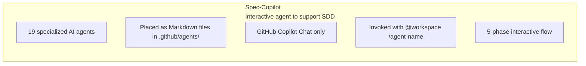
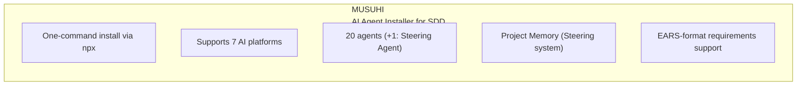
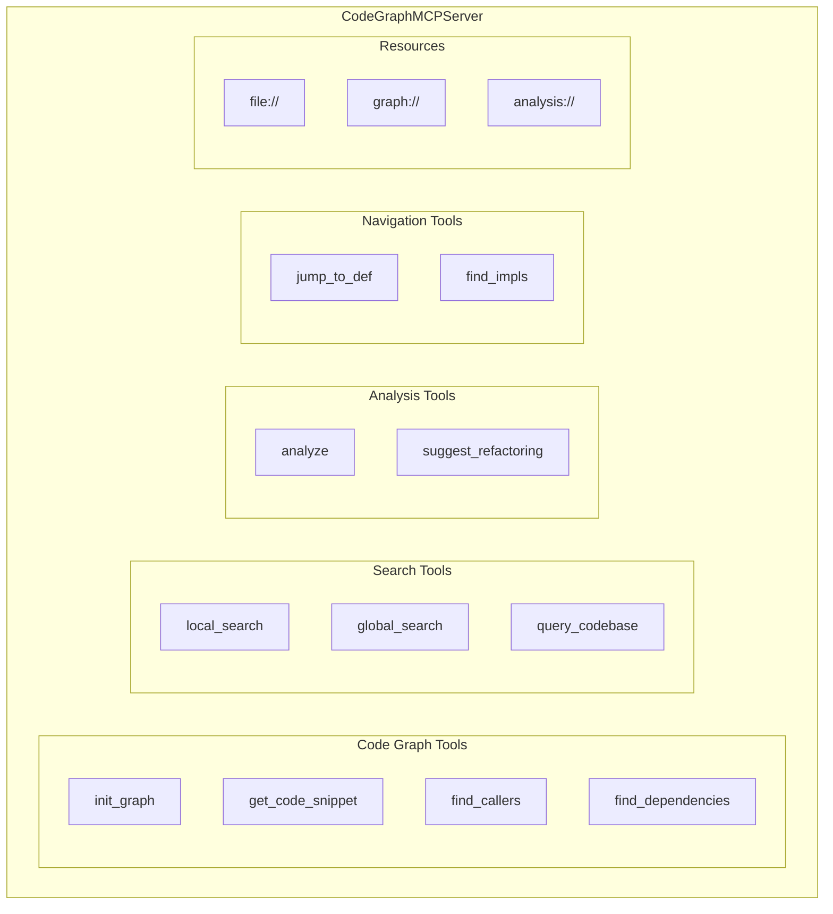
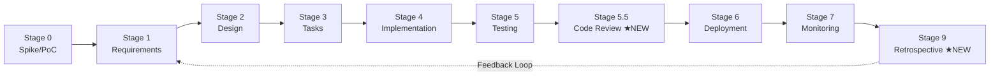
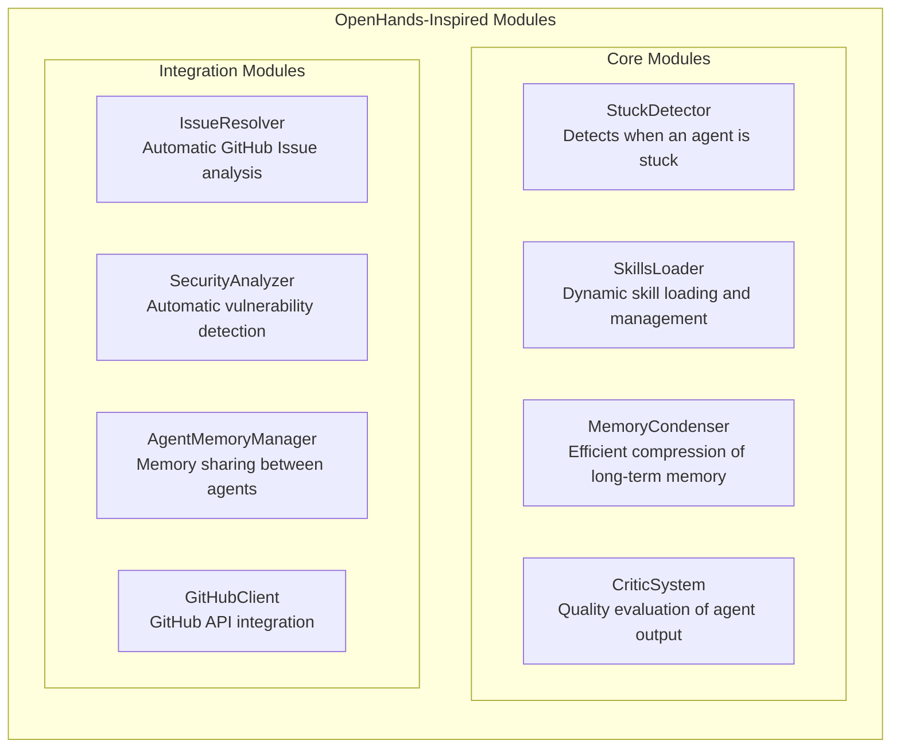
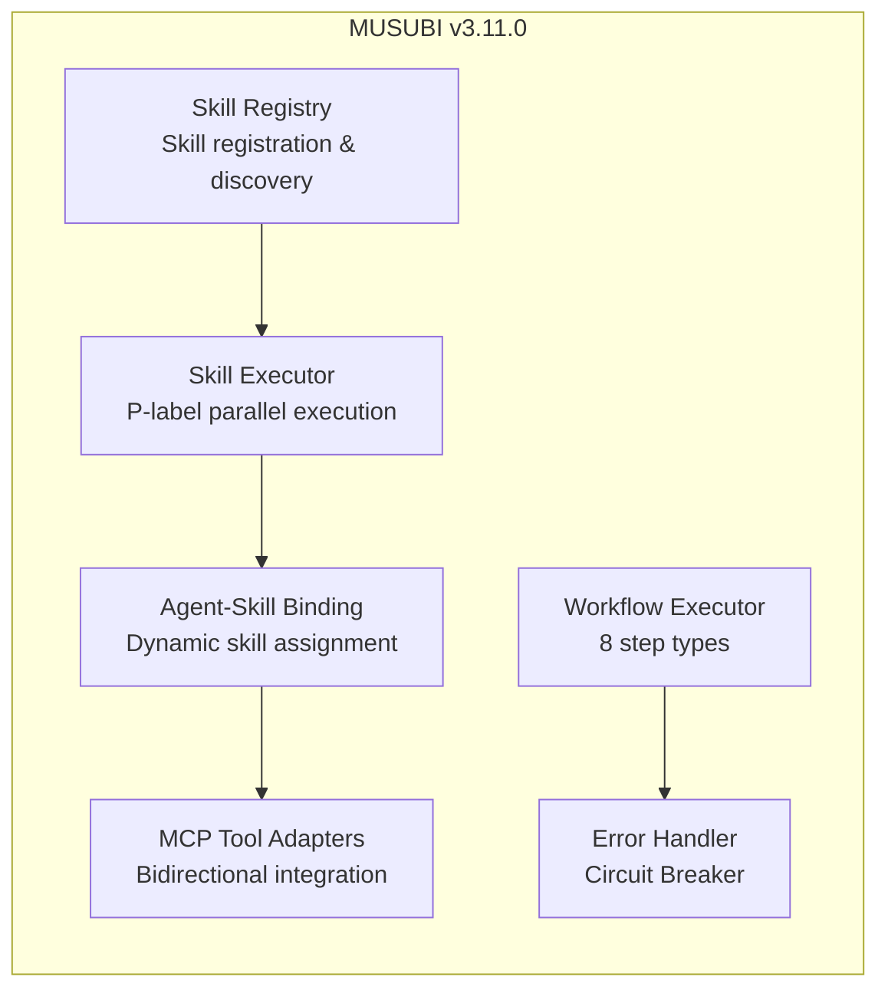
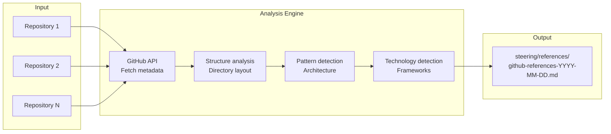

title: The MUSUBI Journey: A Complete Evolution Guide from Spec-Copilot to MUSUHI and Then MUSUBI

# The MUSUBI Journey: A Complete Evolution Guide from Spec-Copilot to MUSUHI and Then MUSUBI

## Introduction

**MUSUBI (Specification Driven Development)** is a specification-driven development framework that leverages AI agents. However, MUSUBI did not appear overnight. It evolved into its current form through three projects: **Spec-Copilot** → **MUSUHI** → **MUSUBI**.

This article looks back at the complete history from the first project in November 2025 to the current v5.9.0, explaining in detail what was added at each stage and what kind of development experience became possible.

**Intended readers:**
- Developers who are using or considering MUSUBI
- People interested in the evolution of AI-assisted development tools
- Teams aiming to make specification-driven development more efficient

**What you will learn in this article:**
- Spec-Copilot: A prompt collection of 19 agents
- MUSUHI: npm packaging and 20 agents
- MUSUBI v0.1.x: 25 skills and support for 7 platforms
- MUSUBI v0.7.0-v1.0.0: Constitutional governance and the CLI foundation
- MUSUBI v2.x-v3.0.0: MCP integration, workflows, and browser automation
- MUSUBI v3.3.0-v3.5.1: Monitoring, advanced Steering, and CLI integration
- MUSUBI v3.6.0-v3.6.1: Dynamic Replanning Engine, goal management, and path optimization
- MUSUBI v3.7.0: Multilingual templates, Ollama integration, cost tracking, and checkpoints
- MUSUBI v3.8.0-v3.10.0: Swarm Enhancement, Guardrails, and Documentation
- MUSUBI v3.11.0: Skill System Architecture and Advanced Workflows
- MUSUBI v4.0.0: Agent Loop, Codebase Intelligence, and Agentic Reasoning
- MUSUBI v5.0.0: Advanced Features, Steering Auto-Update, and Quality Dashboard
- MUSUBI v5.2.0-v5.3.0: Multi-language support and the language recommendation engine
- MUSUBI v5.4.0: GitHub repository references, pattern analysis, and improvement suggestions
- MUSUBI v5.5.0-v5.6.0: Enterprise-scale analysis and Rust migration support
- MUSUBI v5.7.0-v5.8.0: Performance Optimization and CodeGraph MCP v0.8.0 integration
- MUSUBI v5.9.0: Phase 1-4 enterprise features (workflow modes, monorepo support, constitution level management)

---

# Chapter 0 Prehistory: Spec-Copilot (Early November 2025)

## 0.1 What Is Spec-Copilot?

**Repository:** [github.com/nahisaho/spec-copilot](https://github.com/nahisaho/spec-copilot)

Spec-Copilot is the project that became the **prototype** of MUSUBI. It was born as a **prompt collection of 19 specialized AI agents** that works with GitHub Copilot to support specification-driven development.



## 0.2 The 19 Agents

| Category | Agents |
|---------|------------|
| Orchestration | Orchestrator AI |
| Requirements & Planning | Requirements Analyst, Project Manager, Agile Coach |
| Design | System Architect, API Designer, Database Schema Designer, UI/UX Designer |
| Implementation | Software Developer, Code Reviewer, Bug Hunter |
| Testing & Quality | Test Engineer, Quality Assurance, Performance Optimizer |
| Security | Security Auditor |
| Infrastructure | DevOps Engineer, Cloud Architect, Observability Engineer |
| Documentation | Technical Writer |

## 0.3 Usage

```bash
# Using it in GitHub Copilot Chat
@workspace /orchestrator Develop a web application for managing to-dos. Start with requirements definition.

# Individual agents
@workspace /api-designer Design an API for user registration
```

## 0.4 Limitations of Spec-Copilot

- ❌ **GitHub Copilot only**: Cannot be used with other AI tools
- ❌ **Manual copying required**: Files had to be copied for each project
- ❌ **Hard to version-control**: Distributing agent updates was cumbersome
- ❌ **No project context**: Each agent operated independently

---

# Chapter 1 MUSUHI: Packaging and Evolution (Mid-November 2025)

## 1.1 What Is MUSUHI?

**Repository:** [github.com/nahisaho/musuhi](https://github.com/nahisaho/musuhi)

MUSUHI is an **npm package** created to solve the problems of Spec-Copilot. The name "結び" (musubi, "to tie/connect") carries the meaning of "connecting" developers and AI agents.



## 1.2 Major New Features

### npm Packaging

```bash
# One-command install
npx musuhi

# Specify the platform
npx musuhi install --tool claude-code
npx musuhi install --tool github-copilot
npx musuhi install --tool cursor
```

### Support for 7 Platforms

| Platform | Config File | Agent Location |
|----------------|-------------|----------------|
| Claude Code | CLAUDE.md | .claude/agents/ |
| GitHub Copilot | copilot-instructions.md | .github/agents/ |
| Cursor | .cursorrules | .cursor/agents/ |
| Windsurf | .windsurfrules | .windsurf/agents/ |
| Gemini CLI | gemini-config.md | .gemini/agents/ |
| Codex CLI | codex-config.md | .codex/agents/ |
| Qwen Code | qwen-config.md | .qwen/agents/ |

### Project Memory (Steering System)

```
steering/
├── structure.md    # Architecture patterns, directory structure
├── tech.md         # Tech stack, frameworks
├── product.md      # Business context, product purpose
├── rules/          # Development guidelines
│   ├── ears-format.md
│   └── workflow.md
└── templates/      # Document templates
```

### EARS-Format Requirements

```
# The 5 EARS patterns
1. Event-Driven: WHEN [event], the [system] SHALL [response]
2. State-Driven: WHILE [state], the [system] SHALL [response]
3. Unwanted:     IF [error], THEN the [system] SHALL [response]
4. Optional:     WHERE [feature], the [system] SHALL [response]
5. Ubiquitous:   The [system] SHALL [response]
```

## 1.3 MUSUHI Version History

| Version | Key Features |
|-----------|---------|
| v0.3.0 | Introduced the Project Memory (Steering) system |
| v0.3.1 | EARS-format support |
| v0.3.2 | SDD workflow templates |
| v0.4.0 | Support for 7 platforms |
| v0.4.4 | Automatic context referencing |
| v0.4.5 | Incremental document generation |
| v0.4.9 | Steering auto-update feature |

## 1.4 From MUSUHI to MUSUBI

MUSUHI was an excellent agent installer, but it lacked the following:

- ❌ **No CLI commands**: Requirements generation, design, and task management relied on the agents
- ❌ **No validation**: Could not automatically verify constitutional compliance
- ❌ **No traceability**: No way to trace requirements → design → implementation
- ❌ **No tests**: No automated tests for quality assurance

To solve these problems, **MUSUBI** was born.

---

# Chapter 2 The Dawn of MUSUBI: v0.1.0 - v0.1.4 (November 2025)

## 2.1 v0.1.0 - The First Step

**Release date:** 2025-11-08

The first version of MUSUBI was born as a Proof of Concept.

```
v0.1.0 initial features
├── Basic skill structure
├── Project scaffolding
└── Designed exclusively for Claude Code
```

## 2.2 v0.1.2 - The Birth of 25 Skills

**Release date:** 2025-11-15

**An important release in which MUSUBI's core features took shape:**

| Category | Skills | Contents |
|---------|---------|------|
| Orchestration | 2 | Orchestrator, Steering |
| Requirements & Design | 4 | Requirements Analyst, System Architect, etc. |
| Development | 5 | Software Developer, Code Reviewer, etc. |
| Quality & Testing | 4 | Test Engineer, Bug Hunter, etc. |
| Security | 2 | Security Auditor, Penetration Tester |
| Infrastructure | 4 | DevOps Engineer, SRE, etc. |
| Documentation | 4 | Technical Writer, API Designer, etc. |

### Key Features

- ✅ **9 Constitutional Articles**: Codified development rules
- ✅ **EARS-format support**: Unambiguous requirement descriptions
- ✅ **Steering system**: Management of project memory
- ✅ **8-stage SDD workflow**: Standardized development process
- ✅ **Traceability matrix**: Tracking from requirements to implementation

## 2.3 v0.1.3 - The Multi-Platform Revolution

**Release date:** 2025-11-17

**Industry first: unified support for 25 agents across 7 AI platforms**

**Multi-Platform Support (Industry First)**

| Platform | Agent Format | Location |
|----------|-------------|----------|
| Claude Code | Skills API | `.claude/skills/` |
| GitHub Copilot | AGENTS.md | `.github/AGENTS.md` |
| Cursor | AGENTS.md | `.cursor/AGENTS.md` |
| Gemini CLI | GEMINI.md | `GEMINI.md` |
| Windsurf | AGENTS.md | `.windsurf/AGENTS.md` |
| Codex | AGENTS.md | `.codex/AGENTS.md` |
| Qwen Code | AGENTS.md | `.qwen/AGENTS.md` |

At this point, MUSUBI evolved from a "Claude Code-only tool" into a "universal SDD framework."

---

# Chapter 3 Foundation-Building Period: v0.7.0 - v0.9.x (November 2025)

## 3.1 v0.7.0 - Constitutional Governance System

**Release date:** 2025-11-23

**Introduced 9 immutable articles that govern the development process:**

```bash
# Constitution validation
musubi-validate constitution    # Validate all 9 articles
musubi-validate article 3       # Validate a specific article
musubi-validate gates           # Validate Phase -1 gates
musubi-validate complexity      # Validate complexity limits
musubi-validate all             # Comprehensive validation
```

### The 9 Constitutional Articles

| Article | Name | Description |
|------|------|------|
| I | Library-First | Library-first principle |
| II | CLI Interface Mandate | CLI interface mandate |
| III | Test-First Imperative | Test-first (Red-Green-Blue) |
| IV | EARS Requirements Format | EARS-format requirements |
| V | Traceability Mandate | Traceability mandate |
| VI | Project Memory | Steering system |
| VII | Simplicity Gate | Simplicity gate (≤3 subprojects) |
| VIII | Anti-Abstraction Gate | Anti-abstraction gate |
| IX | Integration-First Testing | Integration-first testing |

## 3.2 v0.8.0 - EARS Requirements Generator

**Release date:** 2025-11-23

**Automatically generate unambiguous requirement specifications:**

```bash
# EARS requirements management
musubi-requirements init <feature>   # Initialize requirements document
musubi-requirements add              # Add requirements interactively
musubi-requirements list             # List requirements
musubi-requirements validate         # Validate EARS format
musubi-requirements trace            # Traceability matrix
```

### The 5 EARS Patterns

| Pattern | Syntax | Use |
|---------|------|------|
| Ubiquitous | `The [system] SHALL [requirement]` | Always applies |
| Event-Driven | `WHEN [event], THEN [system] SHALL [response]` | Event-driven |
| State-Driven | `WHILE [state], [system] SHALL [response]` | State-driven |
| Unwanted Behavior | `IF [error], THEN [system] SHALL [response]` | Abnormal cases |
| Optional Feature | `WHERE [feature], [system] SHALL [response]` | Optional features |

## 3.3 v0.8.2 - Design Document Generator

**Automatic generation of C4 models and ADRs (Architecture Decision Records):**

```bash
# Design document management
musubi-design init <feature>           # Initialize design document
musubi-design add-c4 <level>           # Add C4 diagram (context|container|component|code)
musubi-design add-adr <decision>       # Add ADR
musubi-design validate                 # Validate design completeness
musubi-design trace                    # Requirements → design traceability
```

## 3.4 v0.8.4 - Task Decomposition System

**Break designs down into actionable tasks:**

```bash
# Task management
musubi-tasks init <feature>           # Initialize task document
musubi-tasks add <title>              # Add a task
musubi-tasks list                     # List tasks
musubi-tasks update <id> <status>     # Update status
musubi-tasks graph                    # Generate dependency graph
```

### Priority System

| Priority | Name | Use |
|--------|------|------|
| P0 | Critical | Launch blocker |
| P1 | High | Core features |
| P2 | Medium | Nice-to-have |
| P3 | Low | Future features |

## 3.5 v0.8.5-v0.8.8 - Traceability & Change Management

**Phase 2 complete: brownfield project support**

```bash
# Traceability
musubi-trace matrix                   # Full traceability matrix
musubi-trace coverage                 # Coverage statistics
musubi-trace gaps                     # Gap detection
musubi-trace impact <req-id>          # Impact analysis

# Change management
musubi-change init <change-id>        # Create a change proposal
musubi-change apply <change-id>       # Apply a change
musubi-change archive <change-id>     # Archive a change

# Gap detection
musubi-gaps detect                    # Detect all gaps
musubi-gaps coverage                  # Coverage statistics
```

## 3.6 v0.9.x - Quality Improvements and Feature Enhancements

| Version | Added Features |
|-----------|---------|
| v0.9.0 | Phase -1 gate process, enforced 80% test coverage |
| v0.9.1 | CLI version sync, constitutional article references |
| v0.9.2 | --dry-run, --verbose, and --json options |
| v0.9.3 | Strict EARS validation, quality metrics command |
| v0.9.4 | Bidirectional traceability, impact analysis, statistics |
| v0.9.5 | Orchestrator enhancements (25-agent support) |
| v0.9.6-7 | Traceability bug fixes, extended requirement ID patterns |

---

# Chapter 4 Production Release: v1.0.0 (November 23, 2025)

## 4.1 Production Ready

**Tests:** 213 | **CLI commands:** 12 | **Platforms:** 7

**MUSUBI v1.0.0 - Production Ready**

| Item | Status |
|------|----------|
| Core Framework | ✅ Complete |
| CLI Infrastructure | ✅ 12 commands operational |
| Traceability System | ✅ 100% functional |
| Multi-Platform Support | ✅ 7 platforms verified |
| Testing | ✅ 213/213 tests passing |
| Documentation | ✅ Comprehensive guides |

### The 12 CLI Commands

| Command | Function |
|---------|------|
| `musubi-init` | Multi-platform initialization |
| `musubi-requirements` | EARS requirements generation |
| `musubi-design` | C4 + ADR design documents |
| `musubi-tasks` | Task decomposition |
| `musubi-trace` | Traceability system |
| `musubi-change` | Change management |
| `musubi-gaps` | Gap detection |
| `musubi-validate` | Constitutional compliance validation |
| `musubi-onboard` | Automatic project analysis |
| `musubi-sync` | Steering sync |
| `musubi-analyze` | Code quality analysis |
| `musubi-share` | Team collaboration and memory sharing |

### What v1.0.0 Made Possible

- ✅ **Complete SDD workflow**: Requirements → design → tasks → implementation → testing
- ✅ **100% traceability**: Zero orphaned artifacts
- ✅ **Support for 7 platforms**: The same experience in any AI environment
- ✅ **CI/CD integration**: Automation support via exit codes

---

# Chapter 5 v2.0.0 - MCP Server Integration

## 5.1 Overview

**Release date:** 2025-12-03

v2.0.0 is a major update that introduced **CodeGraphMCPServer integration**. Through the Model Context Protocol (MCP), 14 types of advanced code analysis tools became available.

## 5.2 Major New Features

### CodeGraphMCPServer Integration



### 11 Enhanced Agents

| Agent | MCP Tools Used | Purpose |
|------------|--------------|------|
| `@change-impact-analyzer` | `find_dependencies`, `find_callers` | Change impact analysis |
| `@traceability-auditor` | `query_codebase`, `find_callers` | Traceability validation |
| `@system-architect` | `analyze_module_structure`, `global_search` | Architecture analysis |
| `@code-reviewer` | `suggest_refactoring`, `get_code_snippet` | Code review |
| `@security-auditor` | `find_callers`, `query_codebase` | Security vulnerability detection |
| `@orchestrator` | `query_codebase`, `global_search` | Project oversight |
| `@test-engineer` | `find_callers`, `get_code_snippet` | Test design |
| `@bug-hunter` | `find_callers`, `local_search` | Bug investigation |
| `@software-developer` | `get_code_snippet`, `local_search` | Implementation support |
| `@steering` | `query_codebase`, `analyze_module_structure` | Project memory management |
| `@constitution-enforcer` | `find_dependencies`, `analyze_module_structure` | Constitutional compliance validation |

### GraphRAG Support

- **Louvain community detection**: Community analysis of code structure
- **12-language support**: Python, TypeScript, JavaScript, Java, Go, Rust, C++, and more
- **Semantic search**: Search that understands the meaning of code

## 5.3 Setup Example

```bash
# Claude Code
claude mcp add codegraph -- codegraph-mcp serve --repo .

# VS Code (.vscode/mcp.json)
{
  "servers": {
    "codegraph": {
      "type": "stdio",
      "command": "codegraph-mcp",
      "args": ["serve", "--repo", "${workspaceFolder}"]
    }
  }
}
```

## 5.4 What v2.0.0 Made Possible

- ✅ **Visualization of code dependencies**: Accurately grasp the impact scope before making changes
- ✅ **Semantic search**: Search code by concepts such as "authentication handling"
- ✅ **Refactoring suggestions**: Automatic suggestions for improving code quality
- ✅ **Architecture analysis**: Automatic understanding of module structure

---

# Chapter 6 v2.1.0 - Workflow Engine

## 6.1 Overview

**Release date:** 2025-12-05

v2.1.0 introduced the **workflow engine**, enabling state management and metrics tracking for the SDD development process.

## 6.2 New CLI: musubi-workflow

```bash
# Initialize a workflow
musubi-workflow init <feature-name>

# Check current status
musubi-workflow status

# Move to the next stage
musubi-workflow next design

# Record a feedback loop
musubi-workflow feedback review implementation -r "Refactoring needed"

# Complete the workflow
musubi-workflow complete

# Show history and metrics
musubi-workflow history
musubi-workflow metrics
```

## 6.3 New SDD Stages



| Stage | Name | Description |
|-------|------|-------------|
| 0 | Spike/PoC | Research and prototyping before requirements |
| 1 | Requirements | Requirements definition |
| 2 | Design | Design |
| 3 | Tasks | Task breakdown |
| 4 | Implementation | Implementation |
| 5 | Testing | Testing |
| 5.5 | Code Review | ★NEW: Structured code review |
| 6 | Deployment | Deployment |
| 7 | Monitoring | Monitoring |
| 9 | Retrospective | ★NEW: Continuous improvement |

## 6.4 Workflow Features

| Feature | Description |
|---------|-------------|
| **State management** | Tracks the stage of each feature in `storage/workflow-state.yml` |
| **Metrics collection** | Time spent per stage, iteration counts, feedback loops |
| **Transition validation** | Enforces valid stage transitions and supports feedback loops |
| **Stage validation guide** | Checklist for each stage transition |

## 6.5 What v2.1.0 Made Possible

- ✅ **Process visualization**: Clearly track the progress of the development process
- ✅ **Metrics-driven improvement**: Analyze the time spent in each stage
- ✅ **Feedback loops**: Formally record iterations
- ✅ **Spike/PoC stage**: Formal support for investigation before requirements
- ✅ **Retrospective**: Continuous improvement through reflection

---

# Chapter 7 v2.2.0 - Modules Derived from OpenHands

## 7.1 Overview

**Release date:** 2025-12-07

v2.2.0 integrated eight advanced modules inspired by the **OpenHands project**. The number of tests grew to 483, making the framework more robust.

## 7.2 The 8 New Modules



### 3.2.1 StuckDetector

Automatically detects when an agent repeats the same operation or is making no progress.

```javascript
// Patterns of being stuck
- Repeated execution of the same command
- Error loops (the same error occurring consecutively)
- Long waits with no progress
```

### 3.2.2 SkillsLoader

Dynamically loads skills (agents) as needed.

```javascript
// Dynamic skill loading
const skill = await skillsLoader.load('code-reviewer');
```

### 3.2.3 MemoryCondenser

Efficiently compresses long-term context while retaining the important information.

### 3.2.4 CriticSystem

Evaluates agent output and calculates a quality score.

```javascript
// Quality evaluation
const critique = await criticSystem.evaluate(agentOutput);
// { score: 0.85, feedback: [...], improvements: [...] }
```

### 3.2.5 IssueResolver

Analyzes GitHub Issues and automatically generates the tasks needed to resolve them.

### 3.2.6 SecurityAnalyzer

Automatically detects security vulnerabilities in code.

```javascript
// Security analysis
const vulnerabilities = await securityAnalyzer.scan(codebase);
// [{ type: 'SQL Injection', severity: 'high', location: '...' }]
```

### 3.2.7 AgentMemoryManager

Shares and synchronizes memory across multiple agents.

### 3.2.8 GitHubClient

Automates Issue/PR operations through integration with the GitHub API.

## 7.3 What v2.2.0 Made Possible

- ✅ **Self-recovery**: Automatic recovery of stuck agents
- ✅ **Dynamic extension**: On-demand loading of the skills needed
- ✅ **Quality assurance**: Automatic evaluation of agent output
- ✅ **Automatic Issue resolution**: Automatic task generation from GitHub Issues
- ✅ **Security**: Automatic detection of code vulnerabilities
- ✅ **Memory efficiency**: Compressed management of long-term context

---

# Chapter 8 v3.0.0 - Browser Automation & Web GUI

## 8.1 Overview

**Release date:** 2025-12-07

v3.0.0 is a major MUSUBI update that added the **Browser Automation Agent** and the **Web GUI Dashboard**. The number of tests grew to 673, and it ships with 27 AI agents.

## 8.2 Browser Automation Agent

### Control the browser with natural language

```bash
# Start the browser agent
musubi-browser

# Usage examples
> "Search Google for 'MUSUBI SDD' and get the results"
> "Go to the login page and take a screenshot"
> "Fill in the form and click the Submit button"
```

### Key Features

| Feature | Description |
|---------|-------------|
| **Natural language control** | Operate the browser in Japanese/English |
| **Screenshots** | Automatic page capture |
| **Form operations** | Typing, selecting, clicking |
| **Navigation** | Go to a URL, back, forward |
| **Data extraction** | Extract text/links from pages |

### Tech Stack

```
Browser Agent
├── Playwright (browser automation)
├── Natural Language Parser (natural language parsing)
└── Action Executor (action execution)
```

## 8.3 Web GUI Dashboard

### Real-time dashboard

```bash
# Start the GUI server
musubi-gui

# Open in the browser
http://localhost:3000
```

### Dashboard Features

**MUSUBI Web Dashboard**

| Section | Metric | Status |
|----------|------|----------|
| 📊 **Project Overview** | | |
| Requirements Status | ██████████░░░░ | 75% |
| Design Progress | ████████████░░ | 85% |
| Task Completion | ██████░░░░░░░░ | 45% |
| Test Coverage | ████████████░░ | 92% |
| 🔄 **Workflow State** | | |
| Current Stage | Implementation | - |
| Time in Stage | 2h 15m | - |
| Feedback Loops | 3 | - |
| 📈 **Traceability Matrix** | | |
| Forward Coverage | 95% | - |
| Backward Coverage | 88% | - |
| Orphaned Items | 2 | - |

## 8.4 Other Improvements

### Spec Kit compatibility

Supports two-way conversion with GitHub Copilot Spec Kit.

```bash
# Convert from Spec Kit to MUSUBI format
musubi-convert from-speckit ./specs

# Convert from MUSUBI format to Spec Kit
musubi-convert to-speckit ./storage
```

### More agents

- **v2.2.0**: 19 agents
- **v3.0.0**: **27 agents** (+8)

### Test coverage

- **v2.2.0**: 483 tests
- **v3.0.0**: **673 tests** (+190)

## 8.5 What v3.0.0 Made Possible

- ✅ **Browser automation**: E2E testing, scraping, automatic form filling
- ✅ **Visual project management**: Real-time monitoring with the web dashboard
- ✅ **Spec Kit interoperability**: Works with existing Spec Kit projects
- ✅ **27 agents**: Comprehensive development support from specialized AIs

---

# Chapter 9 v3.3.0-v3.5.1 - Monitoring, Advanced Steering, CLI Integration

## 9.1 v3.3.0 - Phase 4 Monitoring & Operations

**Release date:** 2025-06-14

Phase 4 completed the SRE and monitoring capabilities.

### New modules

| Module | Description |
|-----------|-------------|
| **Observability** | Integrated monitoring of logs, metrics, and traces |
| **IncidentManager** | Incident management and response flow |
| **ReleaseManager** | Release management and deployment |

## 9.2 v3.4.0 - Phase 5 Advanced Steering

**Release date:** 2025-06-14

Phase 5 added advanced features to the Steering system.

### New modules (233 tests added)

| Sprint | Module | Description |
|-----------|-----------|-------------|
| Sprint 5.1 | **Steering Auto-Update** | Detects file changes and automatically updates steering |
| Sprint 5.2 | **Template Constraints** | LLM constraint syntax, uncertainty markers |
| Sprint 5.3 | **Quality Metrics Dashboard** | Calculates A-F grade quality scores |
| Sprint 5.4 | **Advanced Validation** | Cross-artifact consistency validation |

### Detailed features

```javascript
// Steering Auto-Update
ChangeDetector       // File change detection
SteeringUpdater      // Auto-updates structure/tech/product
ProjectYmlSync       // Sync with package.json

// Template Constraints
Constraint           // Custom validation constraints
UncertaintyParser    // {?unknown?}, {~estimate~}, {!todo!} markers
TemplateDefinition   // Section definitions and checklists

// Quality Metrics Dashboard
Metric               // Measured metrics
HealthIndicator      // Health status
TrendAnalyzer        // Trend analysis (up/down/stable)
QualityScoreCalculator // A-F grade calculation

// Advanced Validation
ConsistencyChecker   // Cross-artifact consistency
GapDetector          // Gaps between requirements/design/tests
CompletenessChecker  // Required-field validation
DependencyValidator  // Circular dependency detection
ReferenceValidator   // REQ-xxx, DES-xxx reference validation
```

## 9.3 v3.5.0 - All 20 CLI Commands Complete

**Release date:** 2025-12-08

All CLI commands are now in place, reaching a practical level of usability.

### New CLI commands (6 added)

| Command | Function | Example |
|---------|----------|---------|
| `musubi-orchestrate` | Multi-skill workflow | `musubi-orchestrate auto <task>` |
| `musubi-browser` | Browser automation / E2E testing | `musubi-browser run "click login"` |
| `musubi-gui` | Web GUI dashboard | `musubi-gui start` |
| `musubi-remember` | Agent memory management | `musubi-remember extract` |
| `musubi-resolve` | Automatic GitHub Issue resolution | `musubi-resolve <issue-number>` |
| `musubi-convert` | Format conversion | `musubi-convert to-speckit` |

### List of the 20 CLI commands

| Category | Commands |
|---------|---------|
| **Core workflow** | `musubi`, `musubi-init`, `musubi-workflow` |
| **Document generation** | `musubi-requirements`, `musubi-design`, `musubi-tasks` |
| **Traceability** | `musubi-trace`, `musubi-gaps`, `musubi-change` |
| **Validation & analysis** | `musubi-validate`, `musubi-analyze` |
| **Integration & sharing** | `musubi-sync`, `musubi-share`, `musubi-onboard` |
| **Advanced features** | `musubi-orchestrate`, `musubi-browser`, `musubi-gui`, `musubi-remember`, `musubi-resolve`, `musubi-convert` |

## 9.4 v3.5.1 - CLI Integration Across All Platforms

**Release date:** 2025-12-08

CLI commands are now accessible from all 7 platforms.

### Changes

**Claude Code skill updates (8 skills):**

| Skill | Added CLI |
|--------|---------|
| `orchestrator` | Detailed options for all 20 CLI commands |
| `issue-resolver` | `musubi-resolve` quick start |
| `agent-assistant` | `musubi-remember` memory management |
| `test-engineer` | `musubi-browser` E2E testing |
| `ui-ux-designer` | `musubi-browser` UI testing |
| `site-reliability-engineer` | `musubi-gui` dashboard |
| `steering` | `musubi-remember` memory CLI |
| `project-manager` | `musubi-orchestrate` integration |

**Support for other platforms (6 platforms):**

| Platform | File | CLI references |
|-----------------|---------|----------|
| GitHub Copilot | `AGENTS.md` | 24 |
| Cursor | `AGENTS.md` | 14 |
| Codex | `AGENTS.md` | 14 |
| Windsurf | `AGENTS.md` | 14 |
| Gemini CLI | `GEMINI.md` | 14 |
| Qwen Code | `QWEN.md` | 14 |

### What v3.5.1 Made Possible

- ✅ **CLI use from every platform**: The same CLI experience in any AI environment
- ✅ **CLI integration within skills**: Each skill can directly access its related CLI commands
- ✅ **Detailed documentation references**: The Learn More section leads to the full CLI reference

---

# Chapter 10 v3.6.0-v3.6.1 - Dynamic Replanning Engine

## 10.1 v3.6.0 - Dynamic Replanning Engine

**Release date:** 2025-12-09

Added an intelligent replanning system that lets AI agents dynamically adjust their execution plans when tasks fail, time out, or run into obstacles.

### New features

**LLM Provider Abstraction (`src/llm-providers/`)**

| Component | Description |
|--------------|-------------|
| `BaseLLMProvider` | Abstract base class for all LLM providers |
| `CopilotProvider` | GitHub Copilot LM API integration (preferred provider) |
| `AnthropicProvider` | Anthropic Claude API integration |
| `OpenAIProvider` | OpenAI GPT API integration |
| `LLMProviderFactory` | Automatic provider detection and instantiation |

**Replanning Core (`src/orchestration/replanning/`)**

| Component | Description |
|--------------|-------------|
| `ReplanningEngine` | Core engine for dynamic replanning |
| `PlanMonitor` | Real-time execution monitoring and event emission |
| `PlanEvaluator` | Progress evaluation, efficiency metrics, recommendations |
| `AlternativeGenerator` | LLM-based alternative path generation |
| `ReplanHistory` | Audit log with JSONL persistence |
| `ReplanTrigger` | Trigger types (failure, timeout, quality, manual, dependency) |
| `ReplanDecision` | Decision types (continue, retry, alternative, abort, human) |

### What v3.6.0 Made Possible

- ✅ **Dynamic replanning**: Automatic generation of alternative plans when tasks fail
- ✅ **Multi-LLM support**: Automatic switching among Copilot, Anthropic, and OpenAI
- ✅ **Real-time monitoring**: Detection of failures, timeouts, and quality degradation
- ✅ **Confidence-based decisions**: Requires human approval at a threshold of 0.7
- ✅ **Audit log**: Complete audit trail with export capability

---

## 10.2 v3.6.1 - Advanced Replanning Components

**Release date:** 2025-12-09

Building on the Dynamic Replanning Engine of v3.6.0, added three powerful components for proactive optimization and goal management.

### New components

**ProactivePathOptimizer**
- Continuous path optimization even during successful executions
- Resource utilization analysis and bottleneck detection
- Identification of parallel execution opportunities
- Optimization suggestions with confidence scores

**GoalProgressTracker**
- Real-time goal progress monitoring with percentage tracking
- Milestone management with automatic progress calculation
- Goal dependency tracking and blocking detection
- Progress velocity and ETA estimation

**AdaptiveGoalModifier**
- Dynamic goal adjustment based on execution context
- Constraint relaxation for unachievable goals
- Splitting of complex goals
- Priority recalculation based on dependencies

### New CLI commands

| Command | Purpose |
|---------|---------|
| `musubi-orchestrate replan <context-id>` | Run dynamic replanning |
| `musubi-orchestrate goal register` | Register a new goal |
| `musubi-orchestrate goal update <goal-id>` | Update goal progress |
| `musubi-orchestrate goal status` | Show goal status |
| `musubi-orchestrate optimize run <path-id>` | Run path optimization |
| `musubi-orchestrate optimize suggest <path-id>` | Get optimization suggestions |
| `musubi-orchestrate path analyze <path-id>` | Analyze a path |
| `musubi-orchestrate path optimize <path-id>` | Optimize a path |

### What v3.6.1 Made Possible

- ✅ **Proactive optimization**: Keep searching for the best path even on success
- ✅ **Goal management**: Real-time goal progress tracking
- ✅ **Dynamic adjustment**: Automatic goal adjustment according to the situation
- ✅ **8 new CLI commands**: Replanning operations fully available via CLI
- ✅ **All 7 platforms supported**: All agent templates updated
- ✅ **1,841 tests**: 122 replanning tests added

---

# Chapter 11 v3.7.0 - Advanced Integration & Monitoring

## 11.1 v3.7.0 - Enhanced Integration and Monitoring

**Release date:** 2025-12-09

v3.7.0 adds 8 major features and strengthens the entire development workflow, including multilingual support, local LLM integration, cost tracking, and checkpoint management.

### New Features

| Category | Feature | Description |
|---------|------|------|
| **GUI** | WebSocket Replanning | Real-time replanning updates in the GUI |
| **Browser** | musubi-browser completed | Comprehensive browser automation testing |
| **CI/CD** | GitHub Actions | musubi-action reusable workflow |
| **Conversion** | OpenAPI/Swagger conversion | Convert REST APIs to MUSUBI |
| **i18n** | Multilingual templates | Template system supporting 8 languages |
| **LLM** | Ollama Provider | Local LLM integration |
| **Monitoring** | Cost Tracker | LLM API usage cost tracking |
| **State management** | Checkpoint Manager | Development state snapshots |

---

## 11.2 WebSocket Replanning Updates

We added WebSocket-based real-time updates to the GUI dashboard.

### Features

```javascript
// WebSocket connection
const socket = new WebSocket('ws://localhost:3001');

// Replanning events
socket.on('replan:started', (data) => {
  console.log('Replanning started:', data.contextId);
});

socket.on('replan:completed', (data) => {
  console.log('Plan updated:', data.newPlan);
});

socket.on('goal:progress', (data) => {
  console.log('Goal progress:', data.progress);
});
```

### Supported Events

| Event | Description |
|---------|------|
| `replan:started` | Replanning started |
| `replan:completed` | Replanning completed |
| `replan:failed` | Replanning failed |
| `goal:progress` | Goal progress updated |
| `task:status` | Task status changed |

---

## 11.3 musubi-browser Completed

We completed a comprehensive test suite for the browser automation agent.

### Test Coverage

| Category | Tests | Description |
|---------|---------|------|
| Navigation | 8 | Page transitions, URL validation |
| Element interaction | 10 | Click, input, selection |
| Data extraction | 6 | Text, attributes, tables |
| Screenshots | 4 | Screen capture |
| Waiting | 5 | Waiting for elements to appear or disappear |
| Error handling | 7 | Timeouts, missing elements |

---

## 11.4 GitHub Actions (musubi-action)

We added a reusable GitHub Action for integrating MUSUBI into CI/CD pipelines.

### Usage

```yaml
# .github/workflows/musubi.yml
name: MUSUBI Validation

on:
  pull_request:
    branches: [main]

jobs:
  validate:
    runs-on: ubuntu-latest
    steps:
      - uses: actions/checkout@v4
      
      - name: Run MUSUBI Validation
        uses: nahisaho/musubi-action@v1
        with:
          command: validate
          report-format: sarif
          
      - name: Check Traceability
        uses: nahisaho/musubi-action@v1
        with:
          command: trace
          fail-on-gaps: true
```

### Supported Commands

| Command | Purpose |
|---------|------|
| `init` | Project initialization |
| `validate` | Specification validation |
| `trace` | Traceability check |
| `gaps` | Gap detection |
| `analyze` | Quality analysis |

---

## 11.5 OpenAPI/Swagger Conversion

We added automatic conversion from OpenAPI/Swagger definitions to MUSUBI specifications.

### Usage

```bash
# Convert from OpenAPI JSON
musubi-convert from-openapi openapi.json -o specs/

# Convert from OpenAPI YAML
musubi-convert from-openapi swagger.yaml -o specs/

# Convert directly from a URL
musubi-convert from-openapi https://api.example.com/openapi.json -o specs/
```

### Conversion Mapping

| OpenAPI | MUSUBI |
|---------|--------|
| `paths` | Requirements documents |
| `schemas` | Design documents |
| `securitySchemes` | Security requirements |
| `tags` | Category classification |

### Generated Files

```
specs/
├── requirements/
│   └── api-requirements.md    # Endpoint requirements
├── design/
│   └── api-design.md          # Schema design
└── specs/
    └── api-spec.yml           # API specification
```

---

## 11.6 Multilingual Templates (LocaleManager)

We added a template localization system supporting 8 languages.

### Supported Languages

| Language code | Language | Completeness |
|-----------|------|--------|
| `en` | English | 100% |
| `ja` | Japanese | 100% |
| `zh` | 中文 (Chinese) | 100% |
| `ko` | 한국어 (Korean) | 100% |
| `de` | Deutsch | 100% |
| `fr` | Français | 100% |
| `es` | Español | 100% |
| `id` | Bahasa Indonesia | 100% |

### Usage

```javascript
const { LocaleManager } = require('musubi');

// Set the language
const locale = new LocaleManager('ja');

// Get a template
const template = locale.getTemplate('requirements');
console.log(template.sections.overview); // "概要" (Japanese for "Overview")

// Switch dynamically
locale.setLocale('zh');
console.log(template.sections.overview); // "概述" (Chinese for "Overview")
```

### Translation Categories

| Category | Items |
|---------|--------|
| Section names | 15 |
| Labels | 25 |
| Statuses | 8 |
| Error messages | 20 |

---

## 11.7 Ollama Provider (Local LLM)

We added local LLM integration using Ollama. It supports privacy-focused and offline development.

### Supported Features

| Feature | Description |
|------|------|
| Text generation | Completion with a local LLM |
| Streaming | Real-time responses |
| Embeddings | Vector embedding generation |
| Multi-model | Switching between multiple models |

### Usage

```javascript
const { OllamaProvider } = require('musubi/llm-providers');

const ollama = new OllamaProvider({
  baseUrl: 'http://localhost:11434',
  model: 'qwen2.5:7b'
});

// Text generation
const response = await ollama.complete('Explain MUSUBI in one sentence');

// Streaming
await ollama.stream('Generate a user story', {
  onToken: (token) => process.stdout.write(token)
});

// Embeddings
const embeddings = await ollama.embed('MUSUBI specification');
// 768-dimensional vector (when using nomic-embed-text)
```

### Verified Models

| Model | Parameters | Use case |
|--------|-----------|------|
| `qwen2.5:7b` | 7.6B | General purpose (recommended) |
| `codellama:7b` | 7B | Code generation |
| `mistral:7b` | 7B | Fast inference |
| `nomic-embed-text` | - | Embeddings |

---

## 11.8 Cost Tracker (LLM Cost Tracking)

We added real-time tracking of LLM API usage charges.

### Features

```javascript
const { CostTracker } = require('musubi/monitoring');

const tracker = new CostTracker();

// Record usage
tracker.recordUsage('gpt-4', {
  inputTokens: 1500,
  outputTokens: 500,
  latencyMs: 2300
});

// Get costs
const costs = tracker.getCosts();
console.log(costs);
// {
//   total: 0.075,
//   byModel: { 'gpt-4': 0.075 },
//   byDay: { '2025-12-09': 0.075 }
// }

// Budget alerts
tracker.setBudget(10.0); // $10 limit
tracker.on('budget:warning', (data) => {
  console.log(`Budget ${data.percentage}% used`);
});
```

### Supported Providers

| Provider | Model | Input price | Output price |
|-------------|--------|---------|---------|
| OpenAI | gpt-4 | $0.03/1K | $0.06/1K |
| OpenAI | gpt-4-turbo | $0.01/1K | $0.03/1K |
| OpenAI | gpt-3.5-turbo | $0.0015/1K | $0.002/1K |
| Anthropic | claude-3-opus | $0.015/1K | $0.075/1K |
| Anthropic | claude-3-sonnet | $0.003/1K | $0.015/1K |

### Report Output

```bash
# Generate a cost report
musubi-analyze costs --period week --format markdown

# Check budget status
musubi-analyze budget --threshold 80
```

---

## 11.9 Checkpoint Manager (State Snapshots)

We added snapshots of the development state. It supports intermediate saves and rollbacks for long-running work.

### Features

| Feature | Description |
|------|------|
| Create | Snapshot the current state |
| Restore | Restore a past state |
| Compare | Diff between two checkpoints |
| Archive | Compressed storage of old checkpoints |
| Tagging | Categorize checkpoints |

### Usage

```javascript
const { CheckpointManager } = require('musubi/managers');

const manager = new CheckpointManager({
  storageDir: '.musubi/checkpoints',
  maxCheckpoints: 50,
  autoCheckpointInterval: 1800000 // 30 minutes
});

// Create a checkpoint
const checkpoint = await manager.create({
  name: 'before-refactoring',
  description: 'Pre-refactoring state',
  tags: ['milestone', 'refactoring']
});

// List checkpoints
const checkpoints = await manager.list();

// Restore
await manager.restore(checkpoint.id);

// Compare
const diff = await manager.compare(checkpoint1.id, checkpoint2.id);
console.log(diff.filesAdded);
console.log(diff.filesModified);
console.log(diff.filesDeleted);

// Archive
await manager.archive({ olderThan: '7d' });
```

### CLI

```bash
# Create a checkpoint
musubi-checkpoint create "milestone-1" --tags feature,tested

# List checkpoints
musubi-checkpoint list

# Restore
musubi-checkpoint restore <checkpoint-id>

# Compare
musubi-checkpoint compare <id1> <id2>

# Archive
musubi-checkpoint archive --older-than 7d
```

---

## 11.10 What v3.7.0 Made Possible

- ✅ **Real-time GUI updates**: Live display of replanning state via WebSocket
- ✅ **CI/CD integration**: Automated specification validation with GitHub Actions
- ✅ **REST API migration**: Automatic conversion from OpenAPI/Swagger
- ✅ **8-language support**: Generate documents in 8 languages, including Japanese, English, Chinese, and Indonesian
- ✅ **Local LLM**: Private/offline AI development with Ollama
- ✅ **Cost visibility**: Real-time tracking of LLM API charges
- ✅ **State management**: Safe development work with checkpoints
- ✅ **181 tests added**: Reached a total of 2,022 tests

---

# Chapter 12 v3.8.0 - Swarm Enhancement Phase 1

> **Release date**: 2025-12-10
> **Tests added**: 73 → total 2,095 tests

v3.8.0 introduces inter-agent coordination patterns inspired by the OpenAI Swarm framework.

## 12.1 HandoffPattern (Task Delegation)

We implemented a pattern for seamlessly handing off tasks between agents.

### Features

| Feature | Description |
|------|------|
| Task delegation | Smooth handoff between agents |
| Context retention | Preserves state and history during handoff |
| Conditional handoff | Dynamic routing based on conditions |
| Escalation | Delegation to a higher-level agent on failure |

### Usage

```javascript
const { HandoffPattern } = require('musubi/orchestration');

const handoff = new HandoffPattern({
  agents: {
    frontline: frontlineAgent,
    specialist: specialistAgent,
    escalation: managerAgent
  },
  rules: [
    { condition: 'complexity > 0.7', target: 'specialist' },
    { condition: 'priority === "critical"', target: 'escalation' }
  ]
});

// Execute task delegation
const result = await handoff.execute(task, {
  initialAgent: 'frontline',
  context: { userId: 'user-123', history: conversationHistory }
});
```

## 12.2 TriagePattern (Request Classification)

We implemented a pattern that automatically routes incoming requests to the appropriate agent.

### Features

| Feature | Description |
|------|------|
| Intent classification | Automatic detection of request intent |
| Priority assessment | Queueing based on urgency |
| Load balancing | Distributes load across agents |
| Fallback | Default route when classification fails |

### Usage

```javascript
const { TriagePattern } = require('musubi/orchestration');

const triage = new TriagePattern({
  classifiers: [
    { intent: 'billing', agents: ['billing-agent'] },
    { intent: 'technical', agents: ['tech-support-1', 'tech-support-2'] },
    { intent: 'sales', agents: ['sales-agent'] }
  ],
  fallback: 'general-agent',
  loadBalancing: 'round-robin'
});

// Classify and route a request
const assignment = await triage.classify(request);
console.log(assignment.selectedAgent);
console.log(assignment.confidence);
console.log(assignment.reasoning);
```

## 12.3 What v3.8.0 Made Possible

- ✅ **Automatic task delegation**: Complex tasks are automatically handed off to specialist agents
- ✅ **Intelligent routing**: Selects the best agent based on request content
- ✅ **Context retention**: Preserves conversation history and state during handoff
- ✅ **Scalable agent configuration**: Load distribution through load balancing
- ✅ **73 tests added**: Reached a total of 2,095 tests

---

# Chapter 13 v3.9.0 - Guardrails System

> **Release date**: 2025-12-10
> **Tests added**: 183 → total 2,278 tests

v3.9.0 implements a three-layer validation system covering input, output, and safety, drawing on the Guardrails concept from the OpenAI Agents SDK.

## 13.1 BaseGuardrail & GuardrailChain

Provides the base class for Guardrails and chained execution.

### Architecture

```
┌─────────────────┐   ┌─────────────────┐   ┌─────────────────┐
│  InputGuardrail │→→→│ OutputGuardrail │→→→│ SafetyGuardrail │
└─────────────────┘   └─────────────────┘   └─────────────────┘
         ↓                    ↓                     ↓
   Input validation    Output sanitization   Constitutional
                                             compliance check
```

### Usage

```javascript
const { GuardrailChain, InputGuardrail, OutputGuardrail } = require('musubi/guardrails');

const chain = new GuardrailChain([
  new InputGuardrail({ level: 'strict' }),
  new OutputGuardrail({ redact: true }),
  new SafetyCheckGuardrail({ constitutional: true })
]);

try {
  const result = await chain.run(content);
  console.log(result.sanitizedContent);
} catch (error) {
  if (error instanceof GuardrailTripwireException) {
    console.error('Guardrail triggered:', error.violations);
  }
}
```

## 13.2 InputGuardrail (Input Validation)

Validates and sanitizes user input.

### Features

| Feature | Description |
|------|------|
| PII detection | Detects and masks personally identifiable information |
| Injection prevention | Detects prompt injection attacks |
| Length limit | Validates input length |
| Forbidden patterns | Detects custom forbidden words/patterns |

### Usage

```javascript
const { InputGuardrail } = require('musubi/guardrails');

const guardrail = new InputGuardrail({
  level: 'strict',
  piiDetection: true,
  maxLength: 10000,
  forbiddenPatterns: [/ignore previous instructions/i]
});

const result = await guardrail.validate(userInput);
if (!result.valid) {
  console.error('Input rejected:', result.violations);
}
```

## 13.3 OutputGuardrail (Output Validation)

Sanitizes agent output and ensures its quality.

### Features

| Feature | Description |
|------|------|
| Sensitive data redaction | Automatically redacts API keys, passwords, etc. |
| Format validation | Validates the output format |
| Length limit | Limits output length |
| Content filter | Removes inappropriate content |

### Usage

```javascript
const { OutputGuardrail } = require('musubi/guardrails');

const guardrail = new OutputGuardrail({
  redact: true,
  redactPatterns: [
    /sk-[a-zA-Z0-9]{48}/g,      // OpenAI API key
    /ghp_[a-zA-Z0-9]{36}/g,     // GitHub PAT
    /password\s*[:=]\s*\S+/gi   // Passwords
  ],
  maxLength: 50000
});

const sanitized = await guardrail.sanitize(agentOutput);
console.log(sanitized.content);  // Redacted output
console.log(sanitized.redactions);  // Log of redacted locations
```

## 13.4 SafetyCheckGuardrail (Safety Check)

Performs content safety validation based on the Constitution.

### Features

| Feature | Description |
|------|------|
| Constitutional compliance check | Verifies compliance with the 9 articles |
| Risk scoring | Evaluates the risk level of content |
| Escalation | Automatic escalation on high risk |
| Audit log | Records validation results |

### Usage

```javascript
const { SafetyCheckGuardrail } = require('musubi/guardrails');

const guardrail = new SafetyCheckGuardrail({
  constitutional: true,
  articles: ['article-1', 'article-2', 'article-3'],
  riskThreshold: 0.3,
  escalateOnViolation: true
});

const result = await guardrail.check(content);
console.log(result.riskScore);      // 0.0-1.0
console.log(result.violations);     // List of violated articles
console.log(result.recommendations); // Recommended fixes
```

## 13.5 GuardrailRules DSL

Provides a DSL for defining rule-based Guardrail configuration in code.

### RuleBuilder

```javascript
const { RuleBuilder } = require('musubi/guardrails');

const rules = new RuleBuilder()
  .addRule('no-pii')
    .pattern(/\b\d{3}-\d{2}-\d{4}\b/)  // SSN
    .action('redact')
    .message('PII detected and redacted')
  .addRule('no-api-keys')
    .pattern(/sk-[a-zA-Z0-9]{48}/)
    .action('block')
    .severity('critical')
  .addRule('max-tokens')
    .condition((content) => content.length > 100000)
    .action('truncate')
  .build();
```

### SecurityPatterns

```javascript
const { SecurityPatterns } = require('musubi/guardrails');

// Predefined security patterns
const patterns = SecurityPatterns.getAll();
console.log(patterns.API_KEYS);      // API key patterns
console.log(patterns.CREDENTIALS);   // Credential patterns
console.log(patterns.PII);           // Personal information patterns
console.log(patterns.INJECTION);     // Injection patterns
```

## 13.6 CLI Integration

You can run Guardrails directly from the CLI.

### Commands

```bash
# Run a single Guardrail
musubi-validate guardrails "Content to validate" --type input --level strict

# PII check
musubi-validate guardrails "Phone number: 090-1234-5678" --type input --pii

# Output redaction
musubi-validate guardrails "API Key: sk-abc123..." --type output --redact

# Constitutional compliance check
musubi-validate guardrails "Generated content" --type safety --constitutional

# Run a Guardrail chain
musubi-validate guardrails-chain "Content" --chain input,output,safety

# Validate from a file
musubi-validate guardrails-chain --file output.txt --chain input,output,safety
```

### Options

| Option | Description |
|-----------|------|
| `--type` | Guardrail type (input, output, safety) |
| `--level` | Validation level (lenient, standard, strict) |
| `--pii` | Enable PII detection |
| `--redact` | Enable sensitive data redaction |
| `--constitutional` | Enable constitutional compliance check |
| `--chain` | Chained execution of multiple Guardrails |

## 13.7 What v3.9.0 Made Possible

- ✅ **Input validation**: PII detection, injection prevention
- ✅ **Output sanitization**: Automatic redaction of sensitive data
- ✅ **Constitutional compliance check**: Automatic compliance verification against the 9 articles
- ✅ **DSL definition**: Flexibly define rules in code
- ✅ **CLI integration**: Run Guardrails from the command line
- ✅ **183 tests added**: Reached a total of 2,278 tests

---

# Chapter 14: v3.10.0 - Phase 3 Documentation

> **Release date**: 2025-12-10
> **Tests added**: 54 → total 2,332 tests

In v3.10.0, we created comprehensive documentation for the Multi-Skill Orchestration features.

## 14.1 Orchestration Patterns Guide

We created a guide that fully covers the 9 orchestration patterns.

### Supported Patterns

| Pattern | Description | Use Case |
|----------|------|-------------|
| auto | Automatic mode selection | General-purpose tasks |
| sequential | Sequential execution | Tasks with dependencies |
| parallel | Parallel execution | Fast processing of independent tasks |
| nested | Nested execution | Hierarchical task structures |
| group-chat | Group chat | Discussion among multiple agents |
| swarm | Swarm coordination | Autonomous task distribution |
| human-in-loop | Human intervention | Tasks requiring approval |
| handoff | Task delegation | Handover between agents |
| triage | Classification and routing | Request dispatching |

### Guide Contents

- Conceptual explanation of each pattern
- JavaScript/CLI usage examples
- Best practices
- Error handling
- Performance optimization

## 14.2 P-Label Parallelization Tutorial

We created a tutorial on parallel execution using priority labels (P0-P3).

### Priority Levels

| Level | Description | Execution Strategy |
|--------|------|----------|
| P0 | Critical | Execute immediately, blocks others |
| P1 | High | Execute with priority, ahead of P2-P3 |
| P2 | Medium | Normal execution |
| P3 | Low | Execute when resources are spare |

### Contents

- Guidelines for designing priorities
- How to define dependencies
- Optimizing parallel execution
- Deadlock avoidance
- Controlling execution order

## 14.3 Guardrails Guide

We created a comprehensive guide to the Guardrails system.

### Guide Contents

- Guardrails architecture
- Details of each Guardrail type
- Custom rule definition
- Complete CLI reference
- Troubleshooting
- Security best practices

## 14.4 Documents Created

| Document | Lines | Contents |
|-------------|------|------|
| `docs/guides/orchestration-patterns.md` | 507 | Complete guide to the 9 patterns |
| `docs/guides/p-label-parallelization.md` | 406 | P0-P3 parallelization tutorial |
| `docs/guides/guardrails-guide.md` | 473 | Guardrails system guide |

## 14.5 What v3.10.0 Made Possible

- ✅ **Understanding the 9 patterns**: Guidance for choosing an orchestration pattern
- ✅ **Priority design**: Efficient task parallelization with P-Label
- ✅ **Using Guardrails**: Comprehensive understanding of security validation
- ✅ **Implementation guide**: Concrete code examples and usage
- ✅ **54 tests added**: Reached a total of 2,332 tests

---

# Chapter 14.5: v3.11.0 - Skill System Architecture & Advanced Workflows

> **Release date**: 2025-12-10
> **Tests added**: 242 → total 2,574 tests

## 14.5.1 Overview

v3.11.0 is the **complete implementation of Phase 3**. We added a Skill System Architecture inspired by the OpenAI Agents SDK, plus an advanced workflow execution engine.



## 14.5.2 Skill System Architecture

### Skill Registry
Provides centralized skill management and discovery:

```javascript
const { SkillRegistry } = require('musubi-sdd');
const registry = new SkillRegistry();

// Register a skill
registry.registerSkill({
  id: 'analyze-requirements',
  name: 'Requirements Analyzer',
  category: 'analysis',
  tags: ['requirements', 'ears'],
  inputs: [{ name: 'spec', type: 'string', required: true }],
  outputs: [{ name: 'requirements', type: 'array' }]
});

// Search by category and tag
const analysisSkills = registry.findByCategory('analysis');
const earsSkills = registry.findByTags(['ears']);
```

### Skill Executor
Parallel execution by P-label priority:

```javascript
const { SkillExecutor } = require('musubi-sdd');
const executor = new SkillExecutor(registry);

// P0: Highest priority (runs alone)
// P1: High priority (after P0 completes)
// P2: Medium priority (after P1 completes)
// P3: Low priority (background)

const result = await executor.executeParallel([
  { skillId: 'analyze', priority: 'P0' },
  { skillId: 'design', priority: 'P1' },
  { skillId: 'implement', priority: 'P2' }
]);
```

### Agent-Skill Binding
Dynamic skill assignment based on agent capabilities:

```javascript
const { AgentSkillBinding } = require('musubi-sdd');
const binding = new AgentSkillBinding(registry);

// Register an agent
binding.registerAgent({
  id: 'architect-agent',
  capabilities: ['design', 'c4-diagram', 'adr'],
  maxConcurrentTasks: 3
});

// Select the best agent
const agent = binding.findBestAgentForSkill('create-c4-diagram');
```

### MCP Tool Adapters
Bidirectional integration with MCP (Model Context Protocol):

```javascript
const { MCPToSkillAdapter, SkillToMCPAdapter } = require('musubi-sdd');

// Use an external MCP tool as a skill
const mcpAdapter = new MCPToSkillAdapter(mcpClient);
const skill = mcpAdapter.adaptTool(mcpTool);

// Expose a MUSUBI skill as an MCP tool
const skillAdapter = new SkillToMCPAdapter(registry);
const mcpTool = skillAdapter.adaptSkill('analyze-requirements');
```

## 14.5.3 Advanced Workflows

### Workflow Executor
Supports 8 step types:

| Step Type | Description |
|--------------|------|
| `task` | Execute a single task |
| `parallel` | Execute tasks in parallel |
| `conditional` | Conditional branching |
| `loop` | Loop processing |
| `human-approval` | Wait for human approval |
| `error-handler` | Error handling |
| `transform` | Data transformation |
| `aggregate` | Result aggregation |

```javascript
const { WorkflowExecutor, WorkflowDefinition } = require('musubi-sdd');

const workflow = new WorkflowDefinition('feature-dev', 'Feature Development', [
  { id: 'analyze', type: 'task', skillId: 'analyze-requirements' },
  { 
    id: 'design-impl', 
    type: 'parallel',
    steps: [
      { id: 'design', type: 'task', skillId: 'create-design' },
      { id: 'impl', type: 'task', skillId: 'implement-code' }
    ]
  },
  { 
    id: 'review', 
    type: 'conditional',
    when: { $eq: ['${analyze.complexity}', 'high'] },
    then: { id: 'manual-review', type: 'human-approval' }
  }
]);

const executor = new WorkflowExecutor();
const result = await executor.execute(workflow);
```

### Error Handler
Circuit Breaker and Graceful Degradation:

```javascript
const { ErrorHandler } = require('musubi-sdd');
const handler = new ErrorHandler();

// Error classification
handler.handle(error); // Automatic classification (network, timeout, validation, etc.)

// Circuit Breaker
const breaker = handler.getCircuitBreaker('external-api');
// closed → open (on failure) → half-open (recovery test) → closed

// Retry with Exponential Backoff
const result = await handler.executeWithRetry(
  () => callExternalAPI(),
  { maxRetries: 3, backoffMs: 1000, backoffMultiplier: 2 }
);
```

## 14.5.4 Workflow Templates

Provides 5 real-world workflow templates:

| Template | Description | Steps |
|------------|------|-----------|
| `feature-development` | Feature development flow | 8 |
| `cicd-pipeline` | CI/CD pipeline | 6 |
| `code-review` | Code review | 5 |
| `incident-response` | Incident response | 7 |
| `documentation` | Documentation creation | 4 |

```javascript
const { WorkflowExamples } = require('musubi-sdd');

// Get a template
const featureWorkflow = WorkflowExamples.getFeatureDevelopmentWorkflow();
const cicdWorkflow = WorkflowExamples.getCICDPipelineWorkflow();
```

## 14.5.5 New Files

| File | Lines | Description |
|---------|-----|------|
| `src/orchestration/skill-registry.js` | 450 | Skill registration & discovery |
| `src/orchestration/skill-executor.js` | 520 | P-label parallel execution |
| `src/orchestration/agent-skill-binding.js` | 380 | Dynamic skill assignment |
| `src/orchestration/mcp-tool-adapters.js` | 420 | MCP bidirectional integration |
| `src/orchestration/workflow-executor.js` | 780 | Workflow execution |
| `src/orchestration/error-handler.js` | 830 | Error handling |
| `src/orchestration/workflow-examples.js` | 350 | Template collection |
| `docs/guides/incremental-adoption.md` | 300 | Migration guide |

## 14.5.6 What v3.11.0 Made Possible

- ✅ **Skill management**: Centralized management and dynamic discovery
- ✅ **P-label execution**: Priority-based parallel processing
- ✅ **Dynamic binding**: Capability-based agent selection
- ✅ **MCP integration**: Bidirectional integration with external tools
- ✅ **Workflow execution**: Flow control with 8 step types
- ✅ **Error resilience**: Circuit Breaker and Graceful Degradation
- ✅ **Templates**: 5 real-world workflows
- ✅ **242 tests added**: Reached a total of 2,574 tests

---

# Chapter 15: Version Comparison Summary

## 15.1 Feature Evolution Overview

| Project/Version | Release Date | Key Features | Tests | Agents |
|----------------------|-----------|---------|---------|--------------|
| **Spec-Copilot** | 2025-11-05 | Prompt collection | - | 19 |
| **MUSUHI** v0.4.9 | 2025-11-07 | npm packaging, Steering | - | 20 |
| **MUSUBI** v0.1.0 | 2025-11-08 | Initial PoC | - | - |
| **MUSUBI** v0.1.2 | 2025-11-15 | 25 skills, 9 constitutional articles | - | 25 |
| **MUSUBI** v0.1.3 | 2025-11-17 | 7-platform support | 53 | 25 |
| **MUSUBI** v0.7.0 | 2025-11-23 | Constitutional governance system | - | 25 |
| **MUSUBI** v0.8.0 | 2025-11-23 | EARS requirements generator | 25 | 25 |
| **MUSUBI** v0.8.2 | 2025-11-23 | C4 + ADR design generator | - | 25 |
| **MUSUBI** v0.8.4 | 2025-11-22 | Task decomposition system | 159 | 25 |
| **MUSUBI** v0.8.5-8 | 2025-11-23 | Traceability & change management | 199 | 25 |
| **MUSUBI** v0.9.0-7 | 2025-11-23 | Quality enhancements, bidirectional tracing | 213 | 25 |
| **MUSUBI** v1.0.0 | 2025-11-23 | Production release (12 CLIs) | 213 | 25 |
| **MUSUBI** v2.0.0 | 2025-12-03 | MCP Server integration | 213 | 25 |
| **MUSUBI** v2.1.0 | 2025-12-05 | Workflow Engine | 213 | 25 |
| **MUSUBI** v2.2.0 | 2025-12-07 | OpenHands 8 modules | 483 | 19 |
| **MUSUBI** v3.0.0 | 2025-12-07 | Browser Agent + Web GUI | 673 | 27 |
| **MUSUBI** v3.3.0 | 2025-06-14 | Phase 4 Monitoring | 1,024 | 27 |
| **MUSUBI** v3.4.0 | 2025-06-14 | Phase 5 Advanced Steering | 1,490 | 27 |
| **MUSUBI** v3.5.0 | 2025-12-08 | Complete set of 20 CLI commands | 1,490 | 27 |
| **MUSUBI** v3.5.1 | 2025-12-08 | CLI integration across all platforms | 1,490 | 27 |
| **MUSUBI** v3.6.0 | 2025-12-09 | Dynamic Replanning Engine | 1,797 | 27 |
| **MUSUBI** v3.6.1 | 2025-12-09 | Advanced replanning components | 1,841 | 27 |
| **MUSUBI** v3.7.0 | 2025-12-09 | Multilingual, Ollama, cost tracking, checkpoints | 2,022 | 27 |
| **MUSUBI** v3.8.0 | 2025-12-10 | Swarm Enhancement Phase 1 (Handoff/Triage) | 2,095 | 27 |
| **MUSUBI** v3.9.0 | 2025-12-10 | Guardrails System (input/output/safety checks) | 2,278 | 27 |
| **MUSUBI** v3.10.0 | 2025-12-10 | Phase 3 Documentation (9-pattern guide) | 2,332 | 27 |
| **MUSUBI** v3.11.0 | 2025-12-10 | Skill System & Advanced Workflows | 2,574 | 27 |

## 15.2 What Each Version Can Do

### Spec-Copilot

| Feature | Status |
|------|----------|
| 19 specialized AI agents (prompt collection) | ✅ |
| 5-phase dialogue flow | ✅ |
| GitHub Copilot Chat integration | ✅ |
| Support for other platforms, no manual copying | ❌ |

### MUSUHI

| Feature | Status |
|------|----------|
| npm packaging (install via npx) | ✅ |
| Support for 7 AI platforms | ✅ |
| 20 agents (+Steering Agent) | ✅ |
| Project Memory (Steering system) | ✅ |
| EARS-format requirements, SDD workflow templates | ✅ |
| CLI commands, validation features | ❌ |

### MUSUBI v0.1.x

| Feature | Status |
|------|----------|
| 25 specialized skills (Claude Code) | ✅ |
| Development governance via 9 constitutional articles | ✅ |
| Support for 7 AI platforms (industry first) | ✅ |
| Unified agent definition in AGENTS.md format | ✅ |

### MUSUBI v0.7.0-v0.9.x

| Feature | Status |
|------|----------|
| Constitutional compliance validation (9 articles) | ✅ |
| Automatic generation and validation of EARS-format requirements | ✅ |
| C4 model and ADR design document generation | ✅ |
| Task decomposition and dependency graphs | ✅ |
| Traceability matrix | ✅ |
| Change management (brownfield support) | ✅ |
| Gap detection and coverage calculation | ✅ |

### MUSUBI v1.0.0

| Feature | Status |
|------|----------|
| 12 CLI commands fully operational | ✅ |
| 100% traceability verification | ✅ |
| CI/CD integration (exit code support) | ✅ |
| Proven in production projects | ✅ |

### MUSUBI v2.0.0

| Feature | Status |
|------|----------|
| Code dependency visualization | ✅ |
| Semantic code search | ✅ |
| Automated refactoring suggestions | ✅ |
| Structural analysis via GraphRAG | ✅ |

### MUSUBI v2.1.0

| Feature | Status |
|------|----------|
| Development process state management | ✅ |
| Per-stage metrics tracking | ✅ |
| Spike/PoC and Retrospective stages | ✅ |
| Formal support for feedback loops | ✅ |

### MUSUBI v2.2.0

| Feature | Status |
|------|----------|
| Automatic detection of stuck agents | ✅ |
| Dynamic skill loading | ✅ |
| Quality evaluation of agent output | ✅ |
| Automatic detection of security vulnerabilities | ✅ |
| Automatic Issue analysis and resolution suggestions | ✅ |

### MUSUBI v3.0.0

| Feature | Status |
|------|----------|
| Browser automation via natural language | ✅ |
| Web GUI dashboard | ✅ |
| Spec Kit bidirectional conversion | ✅ |
| 27 specialized AI agents | ✅ |

### MUSUBI v3.3.0-v3.4.0

| Feature | Status |
|------|----------|
| SRE features and monitoring | ✅ |
| Incident management | ✅ |
| Automatic Steering updates | ✅ |
| Template constraints and uncertainty markers | ✅ |
| Quality metrics dashboard (A-F grades) | ✅ |
| Advanced validation (cross-artifact consistency) | ✅ |
| 1,490 tests | ✅ |

### MUSUBI v3.5.0-v3.5.1

| Feature | Status |
|------|----------|
| Complete set of 20 CLI commands | ✅ |
| Multi-skill orchestration | ✅ |
| Browser automation CLI | ✅ |
| Agent memory management CLI | ✅ |
| GitHub Issue auto-resolution CLI | ✅ |
| CLI available from all 7 platforms | ✅ |
| In-skill CLI integration | ✅ |

### MUSUBI v3.6.0-v3.6.1

| Feature | Status |
|------|----------|
| Dynamic Replanning Engine | ✅ |
| Multi-LLM providers (Copilot, Anthropic, OpenAI) | ✅ |
| Real-time plan monitoring | ✅ |
| LLM-driven alternative path generation | ✅ |
| ProactivePathOptimizer (proactive optimization) | ✅ |
| GoalProgressTracker (goal progress tracking) | ✅ |
| AdaptiveGoalModifier (dynamic goal adjustment) | ✅ |
| 8 replanning CLI commands | ✅ |
| 1,841 tests (122 replanning tests) | ✅ |

### MUSUBI v3.7.0

| Feature | Status |
|------|----------|
| WebSocket real-time GUI updates | ✅ |
| musubi-browser completed (40 tests) | ✅ |
| GitHub Actions (musubi-action) | ✅ |
| OpenAPI/Swagger conversion (29 tests) | ✅ |
| Multilingual templates (8 languages supported, 31 tests) | ✅ |
| Ollama Provider (local LLM, 38 tests) | ✅ |
| Cost Tracker (LLM cost tracking, 39 tests) | ✅ |
| Checkpoint Manager (state snapshots, 44 tests) | ✅ |
| 2,022 tests (181 tests added) | ✅ |

### MUSUBI v3.8.0

| Feature | Status |
|------|----------|
| Swarm Enhancement Phase 1 (Handoff/Triage) | ✅ |
| Inter-agent task delegation via HandoffPattern | ✅ |
| Request classification and routing via TriagePattern | ✅ |
| Handoff integration tests (73 tests added) | ✅ |
| 2,095 tests reached | ✅ |

### MUSUBI v3.9.0

| Feature | Status |
|------|----------|
| Guardrails System (Phase 2 complete) | ✅ |
| InputGuardrail (input validation, PII detection) | ✅ |
| OutputGuardrail (output sanitization, redaction) | ✅ |
| SafetyCheckGuardrail (Constitutional integration) | ✅ |
| GuardrailRules DSL (RuleBuilder, SecurityPatterns) | ✅ |
| CLI integration (guardrails, guardrails-chain) | ✅ |
| 183 tests added, 2,278 tests total | ✅ |

### MUSUBI v3.10.0

| Feature | Status |
|------|----------|
| Phase 3 Multi-Skill Orchestration Documentation | ✅ |
| Complete guide to 9 orchestration patterns | ✅ |
| P0-P3 parallelization tutorial | ✅ |
| Complete Guardrails system guide | ✅ |
| 54 tests added, 2,332 tests total | ✅ |

### MUSUBI v3.11.0

| Feature | Status |
|------|----------|
| Skill Registry (skill registration and discovery) | ✅ |
| Skill Executor (P-label parallel execution) | ✅ |
| Agent-Skill Binding (dynamic skill assignment) | ✅ |
| MCP Tool Adapters (bidirectional integration) | ✅ |
| Workflow Executor (8 step types) | ✅ |
| Error Handler (Circuit Breaker) | ✅ |
| 5 Workflow Templates | ✅ |
| 242 tests added, 2,574 tests total | ✅ |

### MUSUBI v4.0.0

| Feature | Status |
|------|----------|
| Agent Loop (integrated agent loop) | ✅ |
| RepositoryMap (repository structure analysis) | ✅ |
| ASTExtractor (AST extraction and analysis) | ✅ |
| ContextOptimizer (context optimization) | ✅ |
| ReasoningEngine (reasoning engine) | ✅ |
| PlanningEngine (planning engine) | ✅ |
| SelfCorrection (self-correction feature) | ✅ |
| CodeGenerator (code generation) | ✅ |
| CodeReviewer (code review) | ✅ |
| createIntegratedAgent (integrated agent) | ✅ |

### MUSUBI v5.0.0

| Feature | Status |
|------|----------|
| SteeringAutoUpdate (automatic sync) | ✅ |
| SteeringValidator (validation engine) | ✅ |
| TemplateConstraints (template constraints) | ✅ |
| ThinkingChecklist (thinking checklist) | ✅ |
| QualityDashboard (A-F quality metrics) | ✅ |
| AdvancedValidation (cross-artifact validation) | ✅ |
| Phase5Integration (integrated access) | ✅ |
| 227 tests added, 3,378 tests total | ✅ |

---

# Chapter 16: How to Upgrade

## 16.1 Fresh Installation

```bash
# Always use the latest version (recommended)
npx musubi-sdd@latest init

# Specify a platform
npx musubi-sdd@latest init --claude-code  # Claude Code
npx musubi-sdd@latest init --copilot      # GitHub Copilot
npx musubi-sdd@latest init --cursor       # Cursor IDE
```

## 16.2 Upgrading an Existing Project

```bash
# Update to the latest version with the same command
npx musubi-sdd@latest init

# Skills, agents, and CLI commands are updated automatically
```

## 16.3 CodeGraph MCP Server (v2.0.0 feature)

```bash
# Install with pipx
pipx install --force codegraph-mcp-server

# Index the project
codegraph-mcp index /path/to/project --full
```

---

# Summary

MUSUBI is a project that originated from Spec-Copilot, released on November 5, 2025, and evolved into MUSUHI and then MUSUBI. In just over a month, it grew dramatically from v0.1.0 to v3.11.0.

```mermaid
flowchart TB
    subgraph Origin["🌱 Origin: Spec-Copilot (2025-11-05)"]
        O1["19 agents, GitHub Copilot only"]
    end
    subgraph Evolution["🌿 Evolution: MUSUHI (2025-11)"]
        E1["20 agents, 7 platforms, Steering system"]
    end
    subgraph Phase1["🌳 Phase 1: MUSUBI Dawn (v0.1.x)"]
        P1["Birth of 25 skills, npm packaging, seeds of the CLI"]
    end
    subgraph Phase2["🏗️ Phase 2: MUSUBI Foundation Building (v0.7.0-v0.9.x)"]
        P2["Constitutional governance, EARS, C4, traceability"]
    end
    subgraph Phase3["🚀 Phase 3: MUSUBI Production Release (v1.0.0)"]
        P3["12 CLI commands, 213 tests, production proven"]
    end
    subgraph Phase4["⚡ Phase 4: MUSUBI Advancement (v2.0-v2.2)"]
        P4["MCP integration, workflows, OpenHands modules"]
    end
    subgraph Phase5["✨ Phase 5: MUSUBI User Experience Innovation (v3.0)"]
        P5["Browser automation, Web GUI, 27 agents"]
    end
    subgraph Phase6["🌐 Phase 6: MUSUBI CLI Integration (v3.5.1)"]
        P6["20 CLI commands, CLI integration across all platforms, 1,490 tests"]
    end
    subgraph Phase7["🧠 Phase 7: MUSUBI Dynamic Replanning (v3.6.1)"]
        P7["Replanning engine, goal management, path optimization, 1,841 tests"]
    end
    subgraph Phase8["🔧 Phase 8: MUSUBI Advanced Integration (v3.7.0)"]
        P8["Multilingual, Ollama, cost tracking, checkpoints, 2,022 tests"]
    end
    subgraph Phase9["🐝 Phase 9: MUSUBI Swarm Enhancement (v3.8.0)"]
        P9["Handoff/Triage patterns, inter-agent collaboration, 2,095 tests"]
    end
    subgraph Phase10["🛡️ Phase 10: MUSUBI Guardrails (v3.9.0)"]
        P10["Input/output/safety Guardrails, Constitutional integration, 2,278 tests"]
    end
    subgraph Phase11["📚 Phase 11: MUSUBI Phase 3 Docs (v3.10.0)"]
        P11["9-pattern guide, parallelization tutorial, 2,332 tests"]
    end
    subgraph Phase12["🎯 Phase 12: MUSUBI Skill System (v3.11.0)"]
        P12["Skill Registry, Workflow Executor, 2,574 tests"]
    end
    subgraph Phase13["🤖 Phase 13: MUSUBI Agent Loop (v4.0.0)"]
        P13["Codebase Intelligence, Agentic Reasoning, integrated agent"]
    end
    subgraph Phase14["🚀 Phase 14: MUSUBI Advanced Features (v5.0.0)"]
        P14["Steering Auto-Update, Quality Dashboard, 3,378 tests"]
    end
    subgraph Phase15["🌐 Phase 15: MUSUBI Multi-Language Support (v5.3.0)"]
        P15["Language recommendation engine, 10-language support, 3,425 tests"]
    end
    Origin --> Evolution --> Phase1 --> Phase2 --> Phase3 --> Phase4 --> Phase5 --> Phase6 --> Phase7 --> Phase8 --> Phase9 --> Phase10 --> Phase11 --> Phase12 --> Phase13 --> Phase14 --> Phase15
```



**Key Milestones:**

| Milestone | Project/Version | Significance |
|--------------|------------------------|------|
| Project birth | Spec-Copilot | Realized the SDD vision with 19 agents |
| Multi-platform | MUSUHI | Support for 7 platforms |
| Birth of 25 skills | MUSUBI v0.1.2 | Establishment of SDD-specialized agents |
| 7-platform support | MUSUBI v0.1.3 | Industry-first universal SDD |
| Constitutional governance | MUSUBI v0.7.0 | Codifying the development process into law |
| Production release | MUSUBI v1.0.0 | Achieved production-grade quality |
| MCP integration | MUSUBI v2.0.0 | Advanced code analysis capabilities |
| 673 tests | MUSUBI v3.0.0 | Robust quality assurance |
| Advanced Steering | MUSUBI v3.4.0 | 1,490 tests, Phase 5 complete |
| CLI on all platforms | MUSUBI v3.5.1 | 20 CLIs, 7-platform integration |
| Dynamic Replanning | MUSUBI v3.6.0 | LLM-driven dynamic replanning |
| Advanced replanning | MUSUBI v3.6.1 | Goal management, path optimization, 1,841 tests |
| Advanced Integration | MUSUBI v3.7.0 | Multilingual, Ollama, cost tracking, 2,022 tests |
| Swarm Enhancement | MUSUBI v3.8.0 | Handoff/Triage patterns, 2,095 tests |
| Guardrails System | MUSUBI v3.9.0 | Input/output/safety validation, 2,278 tests |
| Phase 3 Documentation | MUSUBI v3.10.0 | 9-pattern guide, complete documentation, 2,332 tests |
| Skill System | MUSUBI v3.11.0 | Skill Registry, Workflow Executor, 2,574 tests |
| Agent Loop | MUSUBI v4.0.0 | Codebase Intelligence, Agentic Reasoning |
| Advanced Features | MUSUBI v5.0.0 | Steering Auto-Update, Quality Dashboard, 3,378 tests |
| Multi-language support | MUSUBI v5.3.0 | Language recommendation engine, 10-language support, 3,425 tests |

From Spec-Copilot to MUSUHI, and then to MUSUBI. Through this journey of evolution, MUSUBI has grown from a mere specification management tool into a **comprehensive AI-assisted development platform**. In v5.3.0, we added multi-language support and a language recommendation engine, so projects in 10 languages, including Rust, Python, Go, Java, and C#, can now be initialized appropriately. Through a demonstration on a Rust project using ODS-RAM (the Ouranos Data Space Reference Architecture Model), we confirmed MUSUBI's effectiveness on a real, complex project. With 3,425 tests and 20 CLI commands, it delivers a robust and reliable SDD experience.

---

# Chapter 16: MUSUBI v5.2.0 - v5.3.0: Multi-Language Support (December 10, 2025)

## 16.1 Insights from the ODS-RAM Demonstration

After the release of MUSUBI v5.0.0, we demonstrated MUSUBI using a Rust project compliant with the **Ouranos Ecosystem Data Spaces (Ouranos) Reference Architecture Model (ODS-RAM)**. This demonstration revealed the following challenges:

### Challenges Discovered

1. **No language selection feature**: For projects other than JavaScript/Node.js, `tech.md` had to be rewritten by hand
2. **Insufficient support for multi-language projects**: Polyglot projects such as a frontend (TypeScript) + backend (Rust) could not be handled
3. **No support for an undecided-language state**: Projects whose technology stack had not yet been decided at the requirements definition stage could not be handled

## 16.2 v5.2.0: Full ESLint/Prettier Compliance

**Release date:** 2025-12-10

In v5.2.0, we completed ESLint and Prettier compliance across the entire codebase:

- Fixed 282 ESLint errors
- Fixed Prettier formatting in 242 files
- All 3,409 tests passing

## 16.3 v5.3.0: Multi-Language Support

**Release date:** 2025-12-10

### Technology Stack Approach Selection

```bash
$ npx musubi-sdd init --copilot

? Technology stack approach:
  ❯ Single language        # Select one language
    Multiple languages     # Select multiple languages (polyglot)
    Undecided             # Decide later (generates placeholders)
    Help me decide        # Recommend languages from requirements
```

### Language Recommendation Engine

When you select the "Help me decide" mode, it recommends the best languages based on three questions:

```bash
? What type of application(s) are you building?
  ◯ Web Frontend (SPA, SSR)
  ◉ Web Backend / API
  ◉ CLI Tool
  ◯ Desktop Application
  ◯ Data Pipeline / ETL
  ◯ AI/ML Application
  ◉ Embedded / IoT

? Performance requirements:
  ❯ High performance / Low latency critical
    Moderate (typical web app)
    Rapid development prioritized

? Team expertise (select all that apply):
  ◉ Rust
  ◯ Go
  ◯ Python
```

Recommendation results:

```
📊 Recommended languages based on your requirements:

  🦀 Rust: Systems programming; High performance, zero-cost abstractions; Team has expertise
  🐹 Go: Strong backend frameworks; Fast compilation, efficient runtime
  🐍 Python: Rapid development, extensive libraries
```

### 10-Language Support

| Language | Version | Package Manager | Frameworks |
|------|----------|---------------------|---------------|
| JavaScript/TypeScript | ES2022+ / TS 5.0+ | npm, pnpm, yarn | React, Next.js, Express |
| Python | 3.11+ | pip, poetry, uv | FastAPI, Django |
| Rust | 1.75+ | Cargo | Axum, Actix-web, Tokio |
| Go | 1.21+ | Go modules | Gin, Echo, Chi |
| Java/Kotlin | Java 21 / Kotlin 1.9+ | Maven, Gradle | Spring Boot, Ktor |
| C#/.NET | .NET 8+ | NuGet | ASP.NET Core |
| C/C++ | C++20 | vcpkg, Conan | Qt, Boost |
| Swift | 5.9+ | SPM | SwiftUI, Vapor |
| Ruby | 3.2+ | Bundler | Rails, Sinatra |
| PHP | 8.2+ | Composer | Laravel, Symfony |

### Dynamic tech.md Generation

Depending on the languages you select, appropriate frameworks, testing tools, and development environments are configured automatically:

```markdown
# Technology Stack

## Primary Technologies

| Language | Version | Role | Notes |
|----------|---------|------|-------|
| Rust | 1.75+ stable | Primary | Native binary |
| Python | 3.11+ | Secondary | CPython, PyPy |

### Rust Ecosystem

- **Package Manager**: Cargo
- **Frameworks**: Axum, Actix-web, Tokio
- **Testing**: cargo test, criterion

### Python Ecosystem

- **Package Manager**: pip, poetry, uv
- **Frameworks**: FastAPI, Django, Flask
- **Testing**: pytest, unittest
```

### "Undecided" Mode

When the language is undecided, a placeholder containing decision criteria and a TODO list is generated:

```markdown
# Technology Stack

**Status**: Technology stack to be determined

## Decision Criteria

When selecting technologies, consider:
1. **Application Type**: What type of application is being built?
2. **Performance Requirements**: What are the performance constraints?
3. **Team Expertise**: What technologies is the team familiar with?

## Next Steps

- [ ] Define functional requirements
- [ ] Identify performance constraints
- [ ] Evaluate team skills
- [ ] Create proof-of-concept
- [ ] Make final decision and update this document
```

### Tests

- 16 new tests added (language recommendation engine)
- All 3,425 tests passing

---

# Chapter 17: MUSUBI v5.4.0: GitHub References and Improvement Proposals (December 10, 2025)

## 17.1 Overview

In v5.4.0, we added a **feature that learns by referencing GitHub repositories**. It analyzes multiple repositories, extracts architecture patterns, technologies used, and best practices, and generates improvement suggestions.



## 17.2 New Option: `--reference` / `-r`

### Basic Usage

```bash
# Reference a single repository
musubi init --reference facebook/react

# Reference multiple repositories (short form)
musubi init -r vercel/next.js -r facebook/react -r denoland/deno

# Full URL format
musubi init --reference https://github.com/tokio-rs/tokio

# Specify a branch
musubi init -r owner/repo@develop

# Specify a subpath
musubi init -r owner/repo#packages/core
```

### Supported Formats

| Format | Example |
|-------------|---|
| owner/repo | `facebook/react` |
| HTTPS URL | `https://github.com/owner/repo` |
| SSH URL | `git@github.com:owner/repo.git` |
| Branch specification | `owner/repo@develop` |
| Subpath specification | `owner/repo#src/lib` |

## 17.3 GitHub API Integration

### Metadata Retrieval

```javascript
// Information retrieved
{
  name: "react",
  description: "A JavaScript library for building user interfaces",
  language: "JavaScript",
  stars: 220000,
  topics: ["react", "javascript", "frontend"],
  license: "MIT",
  defaultBranch: "main",
  updatedAt: "2025-12-10T00:00:00Z"
}
```

### Key File Analysis

The following files are automatically fetched and analyzed:
- `README.md` - Project overview
- `package.json` - JS/TS dependencies
- `Cargo.toml` - Rust dependencies
- `pyproject.toml` - Python dependencies
- `go.mod` - Go dependencies
- `pom.xml` - Java dependencies

### GITHUB_TOKEN Support

```bash
# Set an environment variable to avoid rate limits
export GITHUB_TOKEN=ghp_xxxxxxxxxxxx
musubi init -r facebook/react -r vercel/next.js
```

## 17.4 Pattern Detection

### Architecture Patterns

| Pattern | Detection Criteria |
|---------|---------|
| Clean Architecture | `domain/`, `application/`, `infrastructure/`, `interface/` |
| Hexagonal Architecture | `adapters/`, `ports/`, `core/`, `hexagon/` |
| Domain-Driven Design | `aggregates/`, `entities/`, `valueobjects/` |
| Monorepo | `packages/`, `apps/`, `pnpm-workspace.yaml` |
| Rust Workspace | `[workspace]` in `Cargo.toml` |

### Technology Detection

**JavaScript/TypeScript:**
- React, Vue, Angular, Next.js
- Express, Fastify
- Jest, Vitest, Mocha
- ESLint, Prettier, Biome

**Rust:**
- Tokio, Actix, Axum

**Python:**
- FastAPI, Django, Flask
- pytest

## 17.5 Improvement Suggestion Generation

### Output Example

```markdown
# GitHub Reference Repositories

> Analyzed on 2025-12-10T12:00:00.000Z

## Referenced Repositories

### react
- **URL**: https://github.com/facebook/react
- **Language**: JavaScript
- **Stars**: 220000
- **Topics**: react, javascript, frontend

**Directory Structure:**
📁 packages
📁 scripts
📄 package.json
📄 README.md

## Analysis Results

### Architecture Patterns Detected
- **monorepo** in `react`
  - Evidence: packages

### Technologies Used
- **react**: react, typescript

## Improvement Suggestions

1. **Architecture**: Consider using monorepo pattern
   - Found in 1 repository(ies): react

2. **Technology**: Consider using typescript
   - Used by 1 repository(ies): react
```

## 17.6 Implementation Details

### Key Functions

| Function | Description |
|------|------|
| `parseGitHubRepo()` | Parses a repository reference |
| `fetchGitHubRepo()` | Fetches data from the GitHub API |
| `fetchGitHubRepos()` | Fetches multiple repositories sequentially |
| `analyzeReposForImprovements()` | Analyzes patterns and technologies |
| `saveReferenceRepos()` | Saves analysis results as Markdown |

### Output File

```
steering/
└── references/
    └── github-references-2025-12-10.md
```

## 17.7 Tests

- Added 59 new tests
- All 3,571 tests pass
- ESLint/Prettier compliant

---

---

# Chapter 18 Enterprise-Scale Analysis: v5.5.0 - v5.6.0 (December 2025)

## 18.1 Background

**Enhancements born from experience analyzing GCC (GNU Compiler Collection)**

Enterprise-scale features were added to solve the challenges that arose when applying MUSUBI to ultra-large projects such as GCC (over 10 million lines, over 100,000 files).

## 18.2 Large Project Analyzer

**Support for ultra-large projects (10M+ lines)**

The `LargeProjectAnalyzer` class supports analysis of ultra-large projects (over 10 million lines) such as GCC. It is initialized with options such as `maxMemoryMB` (memory limit), `chunkSize` (chunk size), and `enableGC` (enable garbage collection), and the analysis is run by passing the project path to the `analyze()` method. The `onProgress` callback lets you receive progress updates in real time.

### Scale-Based Strategy

| Scale | File Count | Strategy |
|---------|-----------|------|
| Small | ≤100 | Batch analysis |
| Medium | ≤1,000 | Optimized batch |
| Large | ≤10,000 | Chunked analysis |
| Massive | >10,000 | Streaming analysis |

### Huge Function Detection

| Lines | Level |
|------|--------|
| 100+ | Warning |
| 500+ | Critical |
| 1000+ | Extreme |

## 18.3 Complexity Analyzer

**Cyclomatic and cognitive complexity analysis**

The `ComplexityAnalyzer` class analyzes code complexity from multiple angles. The `calculateCyclomaticComplexity()` method calculates McCabe's cyclomatic complexity, and the `calculateCognitiveComplexity()` method calculates cognitive complexity using the SonarSource method. Both methods take the code and the language (such as `'javascript'` or `'typescript'`) as arguments.

### Complexity Thresholds

| Level | Cyclomatic | Cognitive |
|--------|--------|--------|
| Ideal | ≤10 | ≤15 |
| Warning | 11-20 | 16-30 |
| Critical | 21-50 | 31-60 |
| Extreme | >50 | >60 |

## 18.4 CodeGraph MCP Integration

**Deep code graph analysis**

The `CodeGraphMCP` class performs code graph analysis in cooperation with an MCP server. It is initialized by specifying the server URL with `mcpEndpoint`. The main methods are as follows:

- **`generateCallGraph()`**: Generates a call graph for the specified file (the `depth` option sets the traversal depth)
- **`analyzeImpact()`**: Analyzes the impact that changes to the specified file have on other code
- **`detectCircularDependencies()`**: Detects circular dependencies within the specified directory
- **`identifyHotspots()`**: Identifies highly connected entities (hotspots) (the argument specifies the number of results)

### Feature List

| Feature | Description |
|------|------|
| Call Graph | Tracking callers and callees |
| Impact Analysis | Analyzing the scope of impact when code changes |
| Circular Dependencies | Detecting circular dependencies |
| Hotspots | Identifying highly connected entities |
| Community Detection | Grouping related modules |

## 18.5 Rust Migration Generator

**Migration support from C/C++ to Rust**

The `RustMigrationGenerator` class performs risk analysis when migrating C/C++ code to Rust. Passing a file path to the `analyzeRustMigration()` method returns an analysis result containing the following information:

- **`riskScore`**: Migration risk score (0-100)
- **`unsafePatterns`**: Array of detected unsafe patterns
- **`securityComponents`**: Identification of security-related components

### Unsafe Patterns Detected (27 types)

| Category | Patterns |
|---------|----------|
| Memory management | malloc, calloc, realloc, free |
| Buffer overflow | strcpy, strcat, sprintf, gets |
| Pointer operations | Pointer arithmetic, casts, double pointers |
| Concurrency | pthread, volatile misuse |
| Format strings | printf with variable format |

### Security Component Identification

- Stack protection
- Sanitizers
- Encryption
- Authentication

## 18.6 Hierarchical Reporter

**Hierarchical report generation**

The `HierarchicalReporter` class generates hierarchical analysis reports for a project. Use it by passing the project path and options to the `generateReport()` method:

- **`format`**: Output format (`'markdown'`, `'json'`, `'html'`)
- **`includeHotspots`**: Whether to include hotspot analysis
- **`maxDepth`**: Maximum depth of directory traversal

### Output Formats

- Markdown
- JSON
- HTML

### Hotspot Analysis

The generated report includes a hotspot table showing the line count, complexity, and risk level (Critical/Warning/Ideal) for each file.

## 18.7 Version History

| Version | Release Date | Key Features |
|-----------|-----------|----------|
| v5.5.0 | 2025-12-10 | Large Project Analyzer, Complexity Analyzer, CodeGraph MCP, Rust Migration Generator, Hierarchical Reporter |
| v5.6.0 | 2025-12-10 | Fixed v5.5.0 lint errors, published to npm |

## 18.8 Tests

- Added 75 new tests
- All 3,645 tests pass
- ESLint/Prettier compliant

---

# Chapter 19 Phase 1-4 Enterprise Features: v5.9.0 (December 2025)

## 19.1 Background

**Balancing flexibility and manageability in enterprise development**

Large projects have diverse needs that a fixed workflow cannot fully address. In v5.9.0, we implemented enterprise features in four Phases.

## 19.2 Phase 1: Workflow Flexibility

**Three modes according to project scale**

The new CLI command `musubi-release` runs release automation. The `--dry-run` option lets you only check the CHANGELOG. `musubi-workflow mode --detect` automatically detects the workflow mode from the commit message.

### Three Workflow Modes

| Mode | Target | Stages | EARS Required | Coverage |
|--------|------|----------|----------|-----------|
| **small** | Bug fixes, typos | requirements → implement → validate | No | 60% |
| **medium** | New features, improvements | requirements → design → tasks → implement → validate | Yes | 80% |
| **large** | Design changes, new APIs | steering → requirements → design → tasks → implement → validate → review → testing | Yes | 90% |

### WorkflowModeManager

The `WorkflowModeManager` class is initialized by specifying the project path. The main methods are as follows:

- **`detectMode(featureName)`**: Automatically detects the mode (`'small'`/`'medium'`/`'large'`) from the feature name/commit message
- **`getMode(modeName)`**: Gets the configuration for the specified mode (the `stages` array, the `requirements.ears` required flag, the `coverage.threshold` coverage threshold, and so on)

## 19.3 Phase 2: Monorepo Support

**Dependency management across multiple packages**

Define the monorepo's package structure in the `steering/packages.yml` file. For each package, specify `name` (name), `path` (path), and `dependencies` (dependent packages).

### PackageManager

The `PackageManager` class manages packages in a monorepo. Initialize it by specifying the project path, and use the following methods:

- **`listPackages()`**: Gets a list of all packages
- **`generateDependencyGraph('mermaid')`**: Generates a dependency graph in Mermaid format
- **`validate()`**: Validates the package configuration (including circular dependency checks)

## 19.4 Phase 3: Constitution Level Management

**Flexible application according to article importance**

The `steering/rules/constitution-levels.yml` file classifies the nine constitutional articles into three levels:

| Level | Enforcement | Description |
|--------|------|------|
| **critical** | blocking | Mandatory. Violations fail the build |
| **advisory** | warning | Recommended. Violations produce a warning |
| **flexible** | suggestion | Flexible. Violations only produce a suggestion |

### ConstitutionLevelManager

The `ConstitutionLevelManager` class manages and validates constitution levels:

- **`getSummary()`**: Gets the list of articles at each level (the `critical`, `advisory`, and `flexible` arrays)
- **`getArticleLevel(articleId)`**: Gets the level of the specified article and its `isBlocking` flag
- **`validateWithLevels(results)`**: Takes validation results and makes a level-aware judgment (returns the `passed` flag and the `blockingFailures` array)

## 19.5 Phase 4: Project Configuration

**Schema validation and automatic migration**

The new CLI command `musubi-config` manages configuration:

| Subcommand | Description |
|-------------|------|
| `validate` | Schema validation of project.yml |
| `migrate` | Automatic migration from v1.0 to v2.0 |
| `show` | Displays the effective configuration (merged with defaults) |
| `init` | Creates a configuration file for a new project |

### ProjectValidator

The `ProjectValidator` class performs schema validation and migration of project.yml:

- **`validate()`**: Validation using JSON Schema (returns the `valid` flag and the `errors` array)
- **`needsMigration()`**: Checks whether migration from v1.0 to v2.0 is needed
- **`migrate({ dryRun })`**: Runs the migration (`dryRun: true` for a preview)
- **`getEffectiveConfig()`**: Gets the effective configuration merged with default values

## 19.6 Orchestrator Integration

**Five built-in skills**

v5.9.0 added five built-in skills that make the new features available from the Orchestrator. Each skill is run with the `execute()` method, and the operation is specified with the `action` parameter:

| Skill | Main Actions | Description |
|--------|---------------|------|
| `releaseSkill` | `generate`, `bump` | CHANGELOG generation, version management |
| `workflowModeSkill` | `detect`, `get`, `compare` | Mode detection (returns `detectedMode`) |
| `packageManagerSkill` | `list`, `graph`, `validate` | Dependency graph generation (`mermaid` format) |
| `constitutionLevelSkill` | `summary`, `validate`, `check` | Level summary retrieval |
| `projectConfigSkill` | `validate`, `migrate`, `show` | Configuration validation (returns `validation.valid`) |

### Skill Categories

| Category | Skill | Purpose |
|---------|--------|------|
| **release** | release-manager | CHANGELOG generation, version management |
| **workflow** | workflow-mode-manager | Mode detection, configuration retrieval, comparison |
| **configuration** | package-manager, project-config-manager | Package management, configuration management |
| **validation** | constitution-level-manager | Level-aware validation |

## 19.7 New CLI Commands

### musubi-release

A release automation command. A basic run automatically generates the CHANGELOG. Use `--version` to specify the version, `--dry-run` to preview, and `--format json` for JSON output.

### musubi-config

A project configuration management command. Use `validate` for schema validation, `migrate` for migration to v2.0 (with `--dry-run` to preview), `show` to display the effective configuration, and `init` to create a new configuration.

## 19.8 Tests

- Added 50 new tests
- All 4,408 tests pass
- ESLint/Prettier compliant

---

## Related Links

- [MUSUBI GitHub](https://github.com/nahisaho/MUSUBI)
- [MUSUHI GitHub](https://github.com/nahisaho/musuhi) (predecessor project)
- [Spec-Copilot GitHub](https://github.com/nahisaho/spec-copilot) (original project)
- [MUSUBI v5.9.0 Enterprise Features Guide](https://qiita.com/nahisaho/items/musubi-v5-enterprise-features)
- [MUSUBI v5.6.0 Enterprise Scale Guide](https://qiita.com/nahisaho/items/musubi-v5-enterprise-scale)
- [MUSUBI v5.4.0 GitHub Reference Guide](https://qiita.com/nahisaho/items/musubi-v5-github-reference)
- [MUSUBI v5.3.0 Multi-Language Guide](https://qiita.com/nahisaho/items/musubi-v5-multilang)
- [MUSUBI v5.0.0 Advanced Features Guide](https://qiita.com/nahisaho/items/musubi-v5-advanced-features)
- [MUSUBI v4.0.0 Agent Loop Guide](https://qiita.com/nahisaho/items/musubi-v4-agent-loop)
- [MUSUBI v3.11.0 Skill System Guide](https://qiita.com/nahisaho/items/musubi-v3-skill-system)
- [MUSUBI v3.10.0 Orchestration Guide](https://qiita.com/nahisaho/items/musubi-v3-orchestration)
- [MUSUBI v3.9.0 Guardrails Guide](https://qiita.com/nahisaho/items/musubi-v3-guardrails)
- [MUSUBI v3.7.0 Integration Guide](https://qiita.com/nahisaho/items/musubi-v3-integration)
- [MUSUBI v3.6.1 Replanning Guide](https://qiita.com/nahisaho/items/musubi-v3-replanning)
- [MUSUBI v3.0.0 Complete Guide](https://qiita.com/nahisaho/items/musubi-v3-agents)
- [MUSUBI v3.5.1 CLI Integration Guide](https://qiita.com/nahisaho/items/musubi-cli-integration)
- [MUSUBI Beginner's Guide](https://qiita.com/nahisaho/items/musubi-beginners-guide)

## Tags

`#MUSUBI` `#MUSUHI` `#Spec-Copilot` `#SDD` `#SpecDrivenDevelopment` `#AIAgent` `#ClaudeCode` `#GitHubCopilot` `#MCP` `#Replanning` `#Ollama` `#Guardrails` `#Swarm` `#Orchestration` `#SkillSystem` `#Workflow` `#AgentLoop` `#CodebaseIntelligence` `#QualityDashboard` `#MultiLanguage` `#Rust` `#ODS-RAM` `#GitHubReference` `#PatternDetection` `#EnterpriseScale` `#RustMigration` `#ComplexityAnalysis` `#CodeGraph` `#WorkflowModes` `#Monorepo` `#ConstitutionLevels`
