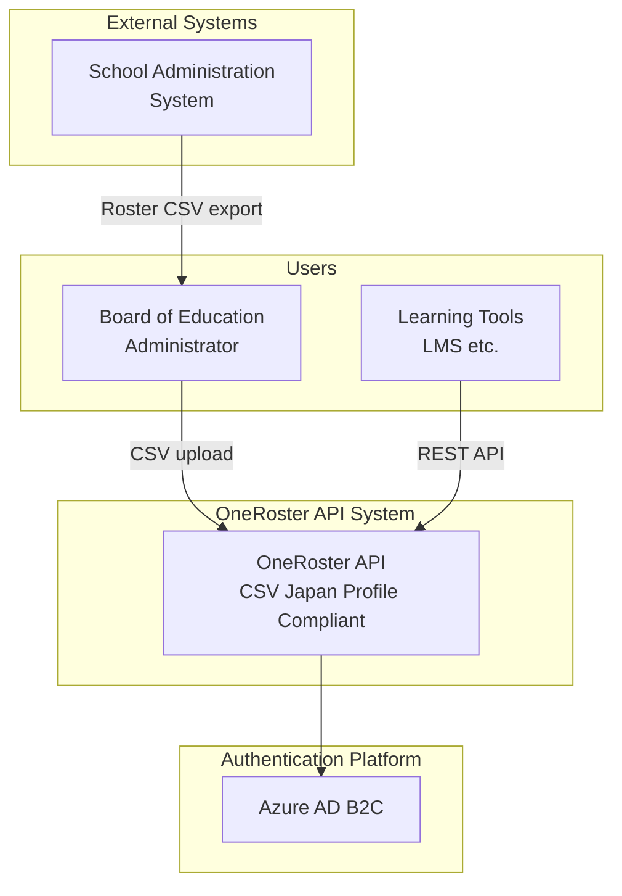

# [MUSUBI v6.1.2] Just Talk to Your AI in Natural Language! The Complete Guide to Specification Driven Development

## Introduction

**MUSUBI SDD v6.1.2** is a framework that enables Specification Driven Development (SDD) **simply by talking to your AI coding assistant in natural language**.

There are no commands to memorize. Just tell the AI "what you want to do," and you can move through a consistent workflow from requirements definition to design, implementation, and validation.

---

## 🆕 What's New in v6.1.2

### Improved Test Reliability

- **WebSocket test fix**: Added creation of the `storage/archive` directory, improving CI stability

### Changes in v6.1.2

- **Unified directory structure**: Flattened into `storage/specs/`
- **Interactive requirements definition**: One question at a time + MECE analysis

---

## 🚀 Getting Started with SDD in Natural Language (Start in 5 Minutes)

### Step 1: Install MUSUBI

```bash
npx musubi-sdd init --copilot
```

Select the AI platform you use, and setup is performed automatically.

### Step 2: Start Developing Just by Talking to the AI

Once initialization is complete, Specification Driven Development begins **simply by talking to the AI in natural language**.

---

## 💬 Examples of Working in Natural Language

### 🎯 I want to create a requirements definition

Tell the AI the following.

> **"Create a requirements definition for the user authentication feature"**

The AI starts a dialogue in a one-question-at-a-time format.

```
AI: What is the "real problem" you want this feature to solve?

You: Many users forget their passwords, and support inquiries are increasing

AI: Who needs this feature the most?

You: The customer support team, and users who log in frequently

AI: If this feature worked perfectly, what would change?

You: Inquiries would drop by 80%, and users could log in smoothly
...
```

When the dialogue is complete, the AI defines comprehensive requirements using MECE analysis and saves them to `storage/specs/user-auth-requirements.md`.

---

### 📐 I want to create a design

> **"Create a design for the user authentication feature using the C4 model"**

The AI creates design diagrams using the C4 model (Context, Container, Component, Code).

---

### 📋 I want to break it down into tasks

> **"Break the user authentication feature down into implementation tasks"**

The AI breaks down implementation tasks with P-label priorities (P0 to P3).

---

### ⚙️ I want to proceed with implementation

> **"Start implementing, beginning with the P0 tasks"**

The AI implements tasks in priority order.

---

### ✅ I want to validate

> **"Validate the consistency between requirements and implementation"**

The AI runs traceability validation and reports omissions and inconsistencies.

---

### 🔄 I want to change existing code

> **"Create a change proposal to add OAuth authentication to the login screen"**

The AI performs a change impact analysis and creates a delta specification (Delta Spec).

---

## 🤖 Supported AI Platforms (7)

| Platform | Setup | Usage |
|-----------------|-------------|--------|
| **Claude Code** | `npx musubi-sdd init --claude` | Converse in natural language |
| **GitHub Copilot** | `npx musubi-sdd init --copilot` | Converse in natural language |
| **Cursor IDE** | `npx musubi-sdd init --cursor` | Converse in natural language |
| **Gemini CLI** | `npx musubi-sdd init --gemini` | Converse in natural language |
| **Codex CLI** | `npx musubi-sdd init --codex` | Converse in natural language |
| **Qwen Code** | `npx musubi-sdd init --qwen` | Converse in natural language |
| **Windsurf** | `npx musubi-sdd init --windsurf` | Converse in natural language |

On every platform, you can work through **natural-language conversation**.

---

## 📋 27 Specialized AI Agents

MUSUBI comes with 27 specialized agents. When you make a request in natural language, the appropriate agent responds automatically.

### Core Workflow (9)

| What you can do | Example of how to ask |
|-----------|-----------|
| Project setup | "Set up the project architecture" |
| Requirements definition | "Define the requirements for the XX feature" |
| System design | "Create a design for the XX feature using the C4 model" |
| Task breakdown | "Break the XX feature down into implementation tasks" |
| Implementation | "Implement the P0 tasks" |
| Validation | "Validate the consistency between requirements and implementation" |
| Change analysis | "Analyze the impact of adding XX" |
| Change application | "Apply the change proposal" |
| Archive | "Archive the completed changes" |

### Quality Assurance (6)

| What you can do | Example of how to ask |
|-----------|-----------|
| Test design | "Design tests for the XX feature" |
| Code review | "Review this code" |
| Security audit | "Check for security vulnerabilities" |
| Performance optimization | "Optimize this process" |
| Quality management | "Check the quality metrics" |
| Governance validation | "Check compliance with the constitutional articles" |

### Specialized Domains (12)

| What you can do | Example of how to ask |
|-----------|-----------|
| API design | "Design a REST API" |
| Database design | "Design the schema for the users table" |
| Database operations | "Optimize the queries" |
| UI/UX design | "Design the UI for the login screen" |
| DevOps | "Build a CI/CD pipeline" |
| Cloud design | "Design an AWS architecture" |
| AI/ML implementation | "Implement a recommendation system" |
| Documentation | "Create API documentation" |
| Release management | "Create release notes" |
| SRE | "Configure alert settings" |
| Bug investigation | "Investigate the cause of this error" |
| Issue resolution | "Resolve this issue" |

---

## 🏛️ 9 Constitutional Articles That Protect Quality

MUSUBI guarantees quality through a "constitution." The AI checks compliance automatically, so you don't need to think about it.

| Article | Principle | Meaning |
|------|------|------|
| I | Library-First | Implement as reusable libraries |
| II | CLI Interface | Provide a CLI for every feature |
| III | Test-First | Write tests first |
| IV | EARS Format | Write requirements in a standard format |
| V | Traceability | Trace requirements ↔ design ↔ code ↔ tests |
| VI | Project Memory | Refer to project settings |
| VII | Simplicity Gate | Prevent excessive complexity |
| VIII | Anti-Abstraction | Avoid unnecessary abstraction |
| IX | Integration-First | Integration tests in real environments |

---

## 📁 Project Structure

A project initialized with MUSUBI:

```
your-project/
├── AGENTS.md                    # AI agent definitions
├── steering/
│   ├── structure.md             # Architecture
│   ├── tech.md                  # Technology stack
│   ├── product.md               # Product information
│   └── rules/
│       ├── constitution.md      # Constitutional articles
│       ├── workflow.md          # Workflow
│       └── ears-format.md       # EARS format
├── storage/
│   ├── specs/                   # Specifications
│   ├── changes/                 # Change management
│   └── archive/                 # Archive
└── [Platform-specific files]
```

---

## 🔄 Typical Development Flow

### New Feature Development

```
1. "Define the requirements for the XX feature"
   → One-question-at-a-time dialogue → MECE analysis → Requirements complete

2. "Create a design based on these requirements"
   → C4 model design → ADR (design decisions)

3. "Break it down into tasks"
   → Tasks organized by P-label priority

4. "Implement starting from P0"
   → Sequential implementation → Test creation

5. "Validate it"
   → Traceability check → Done
```

### Changing an Existing Feature

```
1. "Analyze the impact of adding XX"
   → Identify the scope of impact

2. "Create a change proposal"
   → Create Delta Spec

3. "Apply the change"
   → Safe change execution

4. "Archive the change"
   → Save history
```

---

## 📖 Practical Example: OneRoster API Project

Here is the requirements definition flow from a real project that used MUSUBI.

### Project Overview

Building a system that provides roster data compliant with the **OneRoster CSV Japan profile** via an API.

### Step 1: One-Question-at-a-Time Interview

When you tell the AI "Create a requirements definition for a project that uploads OneRoster CSV via an API and provides a Roster API," a dialogue like the following begins.

#### Q1: Identifying the Problem
```
AI: What is the "real problem" you want this feature to solve?

Answer: We copy CSVs manually, and it hasn't been automated
```

#### Q2: Identifying Stakeholders
```
AI: Who needs this feature the most?

Answer: Boards of education, school administration system operators, learning tool operators
      Learning tools (LMS, etc.) call the API
      CSV uploads are done by board of education administrators or school administration system operators
```

#### Q3: Defining Success Criteria
```
AI: If this feature worked perfectly, what would change?

Answer: It could be automated without human intervention
      Up-to-date rosters could be synchronized in real time
      Learning tools (LMS, etc.) could retrieve rosters correctly
```

#### Q4: Confirming Constraints
```
AI: Are there any constraints or assumptions?

Answer: Built on Azure, using Python + FastAPI
      OAuth 2.0 (OpenAPI compliant), compliant with the Act on the Protection of Personal Information
      99.9% availability
      Providing the OneRoster REST API is also required
```

### Step 2: MECE Analysis and Organizing Requirements

After the interview, the AI organizes the requirements into the following categories according to the MECE (Mutually Exclusive, Collectively Exhaustive) principle.

| Category | Example requirements |
|---------|--------|
| **CSV upload feature** | File upload, validation, import, error handling |
| **OneRoster REST API** | Orgs, Users, Classes, Enrollments, AcademicSessions, Courses |
| **Authentication/authorization** | OAuth 2.0, scope-based authorization, API key authentication |
| **Data management** | Data retention period, audit logs |
| **Non-functional requirements** | Performance, availability (99.9%), security |

### Step 3: Writing Requirements in EARS Format

Each requirement is written in EARS (Easy Approach to Requirements Syntax) format.

```markdown
#### REQ-CSV-001: CSV File Upload
**WHEN** an administrator uploads a ZIP file compliant with the OneRoster CSV Japan profile,
**the system SHALL** receive the file and start the validation process.

**Acceptance criteria**:
- [ ] Can receive ZIP files (up to 100MB)
- [ ] Confirms that manifest.csv exists
- [ ] Returns the processing status after the upload completes
```

### Step 4: Deliverables

When requirements definition is complete, a specification containing the following is generated at `storage/specs/roster-api-requirements.md`.

- Overview (background, vision, stakeholders)
- Functional requirements (EARS format, 24 items)
- Non-functional requirements (performance, availability, security)
- Technical constraints
- Glossary
- Traceability matrix

### Key Points

1. **One question at a time**: Don't ask many questions at once; dig deeper in an orderly way
2. **MECE analysis**: Organize requirements with no gaps and no overlaps
3. **EARS format**: Unambiguous, testable requirement statements
4. **Traceability**: Prepare to trace requirements → design → implementation → tests

### Step 5: Design with the C4 Model

After requirements definition, when you say "Create a design for the OneRoster API using the C4 model," the AI creates four levels of design diagrams.

#### Level 1: System Context

Defines the relationship between the system and external actors (people and systems).



#### Level 2: Container

Defines the executable units that make up the system.

| Container | Technology | Responsibility |
|---------|------|------|
| Web Application | FastAPI | OneRoster REST API, admin API |
| CSV Processor | Python | CSV validation, data import |
| PostgreSQL | Azure DB | Roster data persistence |
| Redis Cache | Azure Cache | API response caching |
| Blob Storage | Azure Blob | Temporary storage of CSV files |

#### Level 3: Component

Defines the component structure within each container.

| Layer | Component | Responsibility |
|---------|---------------|------|
| API Layer | OneRoster Router | REST API endpoints |
| Service Layer | Roster Service | Business logic |
| Domain Layer | Org, User, Class | Domain models |
| Repository Layer | *Repository | Data access |

#### Level 4: Code

Detailed design of the domain models and API endpoints.

### Step 6: ADR (Architecture Decision Records)

Important design decisions are recorded as ADRs.

| ADR | Decision | Reason |
|-----|------|------|
| ADR-001 | Adopt FastAPI | Automatic OpenAPI generation, type safety, high performance |
| ADR-002 | Azure Container Apps | Serverless, reduced operational burden |
| ADR-003 | PostgreSQL | ACID compliance, support for complex queries |
| ADR-004 | OAuth 2.0 | Recommended by the OneRoster specification, industry standard |
| ADR-005 | Asynchronous CSV import | Handles large data volumes, better UX |

### Design Phase Deliverables

When design is complete, the following is generated at `storage/design/roster-api-design.md`.

- C4 model (four levels of design diagrams)
- Database design (ER diagram, table definitions)
- ADRs (architecture decision records)
- Non-functional design (scalability, availability, security)
- Traceability (mapping requirements → design elements)

### Step 7: Task Breakdown (P-Label Priorities)

After design is complete, when you say "Break the OneRoster API down into implementation tasks," the AI organizes the tasks by P-label priority.

#### P-Label Priority Definitions

| Priority | Meaning | Example |
|--------|------|-----|
| **P0** | MVP required - needed for the system's basic operation | DB design, basic API |
| **P1** | Important - needed to complete the main features | Authentication, CSV validation |
| **P2** | Desirable - improves quality and operability | Caching, audit logs |
| **P3** | Nice to have - additional features and optimizations | Admin screen, rate limiting |

#### Task Examples (OneRoster API)

**P0 tasks (8)**:
| Task ID | Task name | Estimate |
|----------|---------|---------|
| P0-001 | Project initialization | 2h |
| P0-002 | DB schema design and migration | 4h |
| P0-003 | Repository layer implementation | 4h |
| P0-004 | Organizations API | 4h |
| P0-005 | OAuth 2.0 authentication implementation | 3h |
| P0-006 | CSV validation service | 4h |
| P0-007 | CSV import service | 4h |
| P0-008 | E2E tests | 3h |

**P1 tasks (4)**: Pagination, filtering, sorting, batch optimization

**P2 tasks (5)**: Redis caching, audit logs, health checks, Azure Bicep, CI/CD

**P3 tasks (4)**: Asynchronous queue, expanded OpenAPI documentation, rate limiting, admin API

**P4 tasks (4)**: Monitoring and alerts, structured logging, performance settings, completed API documentation

### Step 9: Implementation Results

In the OneRoster API project, the following was completed by following the MUSUBI workflow.

#### P0 (MVP) Completed

| Task | Deliverables |
|--------|--------|
| P0-001 | Project structure, Docker Compose, pyproject.toml |
| P0-002 | SQLAlchemy models (Org, User, Class, Enrollment, AcademicSession, Course) |
| P0-003 | Repository layer (BaseRepository + 6 entities) |
| P0-004 | OneRoster REST API (all 6 entities, 22 endpoints) |
| P0-005 | OAuth 2.0 Client Credentials (JWT, scope-based authorization) |
| P0-006 | CSV validation service (manifest.csv, supports 14 files, ~500 lines) |
| P0-007 | CSV import service (supports batch processing) |
| P0-008 | E2E tests (authentication, API, CSV validation, upload) |

#### P1 (Quality Improvement) Completed

| Task | Deliverables |
|--------|--------|
| P1-001 to 003 | OneRoster filtering/sorting (`status='active'`, `familyName asc`) |
| P1-004 | Bulk insert optimization (1,000 records/batch) |

**Generated code**: About 5,000 lines (including tests)
**Tests**: 50+, all passing ✅

#### P2 (Operational Readiness) Completed

| Task | Deliverables |
|--------|--------|
| P2-001 | Redis cache (`core/cache.py`, TTL management, key invalidation) |
| P2-002 | Audit logs (`services/audit_service.py`, AuditLog model) |
| P2-003 | Health checks (`api/v1/health.py`, /health, /ready, /live, /metrics) |
| P2-004 | Azure Bicep (`infra/main.bicep`, Container Apps/PostgreSQL/Redis) |
| P2-005 | CI/CD (`.github/workflows/ci.yml`, lint→test→build→deploy) |

#### P3 (Extended Features) Completed

| Task | Deliverables |
|--------|--------|
| P3-001 | Asynchronous task queue (`core/task_queue.py`, asyncio + Redis) |
| P3-002 | Expanded OpenAPI documentation (`api/openapi.py`, tags/examples/security) |
| P3-003 | Rate limiting (`core/rate_limit.py`, token bucket, middleware) |
| P3-004 | Admin API (extended `api/v1/admin.py`, clients/uploads/audit-logs/tasks/stats) |

**Generated code**: About 8,000 lines (including tests)
**Tests**: 80+, all passing ✅

#### P4 (Production Readiness) Completed

| Task | Deliverables |
|--------|--------|
| P4-001 | Monitoring and alerts (`core/monitoring.py`, metrics collection, alert rules) |
| P4-002 | Structured logging (`core/logging.py`, JSON output, request context) |
| P4-003 | Performance settings (`core/performance.py`, connection pool, batching, TTL) |
| P4-004 | Completed API documentation (expanded README.md, quick reference) |

**Final code size**: About 9,200 lines (including tests)
**Completion date**: 2025-12-25

#### Implementation Roadmap

```
Phase 1 (MVP): Week 1-2
  P0-001 → P0-002 → P0-003 → P0-004 to P0-008 ✅

Phase 2 (Quality improvement): Week 3
  P1-001 → P1-002 → P1-003 → P1-004 ✅

Phase 3 (Operational readiness): Week 4
  P2-001 to P2-005 ✅

Phase 4 (Extended features): Week 5
  P3-001 to P3-004 ✅

Phase 5 (Production operation): Week 6+
  P4-001 to P4-004 ✅ (monitoring and alerts, log aggregation, performance tuning, completed documentation)
```

### 🎉 Project Completion Summary

The OneRoster API project was completed in 5 phases following the MUSUBI SDD workflow.

| Phase | Number of tasks | Main deliverables |
|---------|---------|-----------|
| P0 (MVP) | 8 | Basic API, DB, OAuth, CSV processing |
| P1 (Quality improvement) | 4 | Filtering/sorting, batch optimization |
| P2 (Operational readiness) | 5 | Redis, audit logs, health checks, IaC, CI/CD |
| P3 (Extended features) | 4 | Asynchronous queue, OpenAPI, rate limiting, admin API |
| P4 (Production operation) | 4 | Monitoring, structured logging, performance, documentation |

**Total tasks**: 25
**Total code**: About 9,200 lines (including tests)
**Conventional estimate**: Equivalent to about 6 weeks (118 hours)
**Actual development time**: About 2 hours (MUSUBI + AI assistance)
**Efficiency gain**: About 60x

### Task Breakdown Phase Deliverables

When task breakdown is complete, the following is generated at `storage/tasks/roster-api-tasks.md`.

- Full task list (25 tasks) with P-label classification
- Details for each task (purpose, task content, deliverables, estimate, dependencies)
- Implementation roadmap (divided into phases)
- Estimate summary (118 hours total)
- Traceability (mapping requirements → tasks)

### Step 8: Implementation Phase

After task breakdown, when you say "Start implementing, beginning with the P0 tasks," the AI proceeds with implementation in an orderly way.

#### P0-001: Project Initialization

The AI automatically generates the following project structure.

```
roster-api/
├── pyproject.toml          # Project settings, dependencies
├── Dockerfile              # Container definition
├── docker-compose.yml      # Development environment configuration
├── .pre-commit-config.yaml # Code quality checks
├── .env.example            # Environment variable template
├── README.md               # Project description
├── src/
│   └── roster_api/
│       ├── __init__.py
│       ├── main.py         # FastAPI entry point
│       ├── core/
│       │   ├── config.py   # Configuration management
│       │   └── database.py # DB connection
│       ├── api/
│       │   ├── router.py   # Routing
│       │   └── v1/
│       │       ├── oneroster.py  # OneRoster API
│       │       ├── admin.py      # Admin API
│       │       └── auth.py       # Authentication API
│       ├── schemas/
│       │   ├── oneroster.py  # Pydantic schemas
│       │   ├── admin.py
│       │   └── auth.py
│       ├── services/         # Business logic
│       ├── models/           # SQLAlchemy models
│       └── repositories/     # Data access layer
└── tests/
    ├── conftest.py         # Test configuration
    └── test_health.py      # Health check tests
```

#### Characteristics of the Generated Code

1. **Full type hints**: Makes use of Python 3.11+ type hints
2. **Asynchronous support**: I/O optimization with async/await
3. **Configuration management**: Environment variable management with pydantic-settings
4. **Layer separation**: Clear separation of responsibilities between Repository, Service, and API
5. **Test readiness**: Test scaffolding compatible with pytest-asyncio

#### docker-compose.yml Configuration

```yaml
services:
  api:           # FastAPI application
  postgres:      # PostgreSQL 16 (with health check)
  redis:         # Redis 7 (cache)
  adminer:       # DB management GUI
```

#### How to Start

```bash
cd roster-api
docker compose up -d
# API: http://localhost:8000/docs
# DB management: http://localhost:8080
```

### Key Points of the Implementation Phase

1. **Implement from stubs**: The service layer is stubbed with NotImplementedError
2. **Sequential implementation**: Models in P0-002, repositories in P0-003
3. **Test-driven**: Tests are added alongside each task
4. **Respect dependencies**: Implement in order according to the dependencies between tasks

---

## 🌐 Multilingual Support (8 Languages)

```bash
# Initialize with Japanese templates
npx musubi-sdd init --locale ja
```

Supported languages: English, 日本語, 中文, 한국어, Deutsch, Français, Español, Bahasa Indonesia

---

## 🛠️ Troubleshooting

### Q: The AI asks multiple questions at once during requirements definition

This has been fixed in v6.1.1 and later. Please use the latest version:

```bash
npx musubi-sdd@latest init
```

### Q: npx musubi-sdd cannot be found

```bash
npx clear-npx-cache
npx musubi-sdd@latest --version
```

### Q: I want to upgrade an existing project

```bash
# Automatic analysis and setup of an existing project
npx musubi-sdd onboard
```

---

## 📚 Related Resources

- **GitHub**: [nahisaho/musubi](https://github.com/nahisaho/MUSUBI)
- **npm**: [musubi-sdd](https://www.npmjs.com/package/musubi-sdd)
- **Documentation**: [docs/USER-GUIDE.ja.md](https://github.com/nahisaho/MUSUBI/blob/main/docs/USER-GUIDE.ja.md)

---

## Summary

With MUSUBI v6.1.2, you can do Specification Driven Development **just by talking in natural language**.

1. ✅ **No commands needed**: Just make requests in natural language
2. ✅ **Interactive requirements definition**: Uncover the true purpose one question at a time
3. ✅ **27 agents**: Specialized AIs respond automatically
4. ✅ **7 platforms**: Supports all major AI tools
5. ✅ **Quality assurance**: Automatic validation with 9 constitutional articles
6. ✅ **8 languages**: For global teams

### Results from the Practical Example (OneRoster API)

In the OneRoster API project built as the practical example for this guide:

- **25 tasks** were systematically broken down and implemented with P0 to P4 priorities
- **About 9,200 lines** of production-ready code were generated
- **Actual development time: just 2 hours** (conventional estimate of 118 hours → about 60x more efficient)
- **Fully equipped for operations**: monitoring, logging, caching, CI/CD, IaC

> 💡 By combining MUSUBI SDD with an AI coding assistant,
> we were able to build a high-quality system at astonishing speed, from requirements definition to production readiness.

---

## Appendix A: Command Reference

If you can't express something in natural language, or want to run directly from the CLI, you can use the following commands.

### Initialization Commands

```bash
npx musubi-sdd init [options]
  --claude      For Claude Code
  --copilot     For GitHub Copilot
  --cursor      For Cursor IDE
  --gemini      For Gemini CLI
  --codex       For Codex CLI
  --qwen        For Qwen Code
  --windsurf    For Windsurf
  --locale <code>  Language (ja, en, zh, etc.)
```

### Specification Driven Development Commands

```bash
npx musubi-requirements "<feature description>"  # Requirements definition
npx musubi-design <feature-name>       # Design
npx musubi-tasks <feature-name>        # Task breakdown
npx musubi-validate [all|requirements|design|traceability]  # Validation
npx musubi-trace <feature-name>        # Traceability
npx musubi-gaps <feature-name>         # Gap analysis
```

### Change Management Commands

```bash
npx musubi-change init <change-name>      # Create change proposal
npx musubi-change apply <change-name>     # Apply change
npx musubi-change archive <change-name>   # Archive
```

### Other Commands

```bash
npx musubi-orchestrate <pattern> <feature>  # Orchestration
npx musubi-costs                            # Cost tracking
npx musubi-release [--dry-run]              # Release
npx musubi-analyze <path>                   # Analysis
npx musubi-sync                             # Sync
npx musubi-onboard                          # Existing project analysis
```

---

## Appendix B: Command Formats by AI Platform

Formats for running commands directly on each platform:

| Platform | Command format | Example |
|-----------------|-------------|-----|
| Claude Code | `/sdd-*` | `/sdd-requirements authentication feature` |
| GitHub Copilot | `/sdd-*` | `/sdd-requirements authentication feature` |
| Cursor IDE | Natural language | "Create a requirements definition" |
| Gemini CLI | `/sdd-*` | `/sdd-requirements authentication feature` |
| Codex CLI | `/sdd-*` | `/sdd-requirements authentication feature` |
| Qwen Code | `/sdd-*` | `/sdd-requirements authentication feature` |
| Windsurf | Natural language | "Create a requirements definition" |

### Commands Available in GitHub Copilot

| Command | Purpose |
|---------|------|
| `/sdd-steering` | Project settings and memory management |
| `/sdd-requirements <feature>` | Create requirements definition |
| `/sdd-design <feature>` | Create C4 model design |
| `/sdd-tasks <feature>` | Task breakdown |
| `/sdd-implement <feature>` | Run implementation |
| `/sdd-validate` | Run validation |
| `/sdd-change-init <name>` | Create change proposal |
| `/sdd-change-apply <name>` | Apply change |
| `/sdd-change-archive <name>` | Archive change |

---

**Tags**: `MUSUBI` `SDD` `SpecificationDrivenDevelopment` `AICoding` `NaturalLanguage` `GitHubCopilot` `ClaudeCode` `DevTools`
