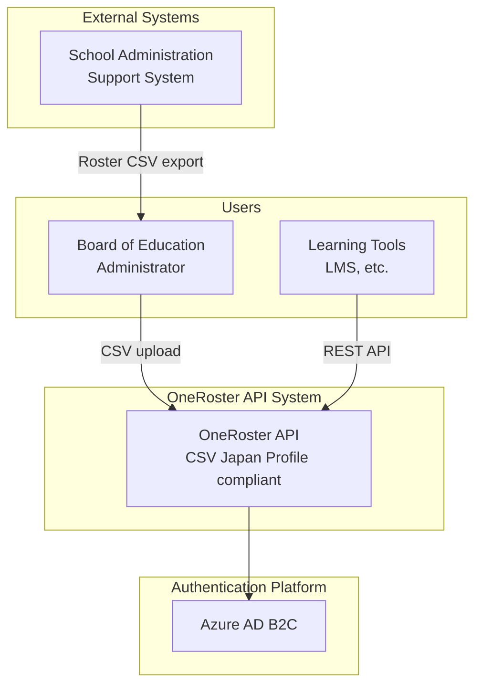

# [MUSUBI v6.1.2] Just Talk to Your AI in Natural Language! The Complete Guide to Specification Driven Development

## Introduction

**MUSUBI SDD v6.1.2** is a framework that enables Specification Driven Development (SDD) by **simply talking to your AI coding assistant in natural language**.

There is no need to memorize commands. Just tell the AI what you want to do, and you can proceed through a consistent workflow from requirements definition to design, implementation, and validation.

---

## 🆕 What's New in v6.1.2

### Improved Test Reliability

- **WebSocket test fix**: Added creation of the `storage/archive` directory, improving CI stability

### What's Changed in v6.1.2

- **Unified directory structure**: Flattened to `storage/specs/`
- **Interactive requirements definition**: One question at a time + MECE analysis

---

## 🚀 Getting Started with SDD in Natural Language (Start in 5 Minutes)

### Step 1: Install MUSUBI

```bash
npx musubi-sdd init --copilot
```

Select your AI platform and the setup is done automatically.

### Step 2: Start Developing by Just Talking to the AI

Once initialization is complete, Specification Driven Development begins when you **simply talk to the AI in natural language**.

---

## 💬 Examples of Working in Natural Language

### 🎯 Want to Create Requirements

Tell the AI the following.

> **"Create requirements for the user authentication feature"**

The AI starts a dialogue, asking one question at a time.

```
AI: What is the "real problem" you want this feature to solve?

You: Many users forget their passwords, and support inquiries are increasing

AI: Who needs this feature the most?

You: The customer support team and users who log in frequently

AI: If this feature worked perfectly, what would change?

You: Inquiries would drop by 80%, and users could log in smoothly
...
```

When the dialogue is complete, the AI defines comprehensive requirements using MECE analysis and saves them to `storage/specs/user-auth-requirements.md`.

---

### 📐 Want to Create a Design

> **"Create a design for the user authentication feature using the C4 model"**

The AI creates design diagrams using the C4 model (Context, Container, Component, Code).

---

### 📋 Want to Break Down into Tasks

> **"Break down the user authentication feature into implementation tasks"**

The AI breaks down the implementation tasks with P-label priorities (P0-P3).

---

### ⚙️ Want to Proceed with Implementation

> **"Start implementing from the P0 tasks"**

The AI implements the tasks in priority order.

---

### ✅ Want to Validate

> **"Validate the consistency between requirements and implementation"**

The AI runs traceability validation and reports gaps and inconsistencies.

---

### 🔄 Want to Change Existing Code

> **"Create a change proposal to add OAuth authentication to the login screen"**

The AI performs change impact analysis and creates a delta specification (Delta Spec).

---

## 🤖 Supported AI Platforms (7 Types)

| Platform | Setup | Usage |
|-----------------|-------------|--------|
| **Claude Code** | `npx musubi-sdd init --claude` | Converse in natural language |
| **GitHub Copilot** | `npx musubi-sdd init --copilot` | Converse in natural language |
| **Cursor IDE** | `npx musubi-sdd init --cursor` | Converse in natural language |
| **Gemini CLI** | `npx musubi-sdd init --gemini` | Converse in natural language |
| **Codex CLI** | `npx musubi-sdd init --codex` | Converse in natural language |
| **Qwen Code** | `npx musubi-sdd init --qwen` | Converse in natural language |
| **Windsurf** | `npx musubi-sdd init --windsurf` | Converse in natural language |

On all platforms, you can work through **conversation in natural language**.

---

## 📋 27 Specialized AI Agents

MUSUBI ships with 27 specialized agents. Just ask in natural language, and the appropriate agent responds automatically.

### Core Workflow (9)

| What You Can Do | Example Phrasing |
|-----------|-----------|
| Project setup | "Set up the project architecture" |
| Requirements definition | "Define requirements for the XX feature" |
| System design | "Create a design for the XX feature using the C4 model" |
| Task breakdown | "Break down the XX feature into implementation tasks" |
| Implementation | "Implement the P0 tasks" |
| Validation | "Validate the consistency between requirements and implementation" |
| Change analysis | "Analyze the impact of adding XX" |
| Change application | "Apply the change proposal" |
| Archive | "Archive the completed changes" |

### Quality Assurance (6)

| What You Can Do | Example Phrasing |
|-----------|-----------|
| Test design | "Design tests for the XX feature" |
| Code review | "Review this code" |
| Security audit | "Check for security vulnerabilities" |
| Performance optimization | "Optimize this process" |
| Quality management | "Check the quality metrics" |
| Governance validation | "Check compliance with the Constitutional Articles" |

### Specialized Areas (12)

| What You Can Do | Example Phrasing |
|-----------|-----------|
| API design | "Design a REST API" |
| Database design | "Design the schema for the users table" |
| Database operations | "Optimize the query" |
| UI/UX design | "Design the UI for the login screen" |
| DevOps | "Build a CI/CD pipeline" |
| Cloud design | "Design an AWS architecture" |
| AI/ML implementation | "Implement a recommendation system" |
| Documentation | "Create API documentation" |
| Release management | "Create release notes" |
| SRE | "Configure alert settings" |
| Bug investigation | "Investigate the cause of this error" |
| Issue resolution | "Resolve this Issue" |

---

## 🏛️ Nine Constitutional Articles That Protect Quality

MUSUBI guarantees quality through a "Constitution". The AI checks compliance automatically, so you do not need to think about it.

| Article | Principle | Meaning |
|------|------|------|
| I | Library-First | Implement as a reusable library |
| II | CLI Interface | Provide a CLI for every feature |
| III | Test-First | Write tests first |
| IV | EARS Format | Write requirements in a standard format |
| V | Traceability | Track requirements <-> design <-> code <-> tests |
| VI | Project Memory | Refer to project settings |
| VII | Simplicity Gate | Prevent excessive complexity |
| VIII | Anti-Abstraction | Avoid unnecessary abstractions |
| IX | Integration-First | Integration tests in real environments |

---

## 📁 Project Structure

A project initialized with MUSUBI:

```
your-project/
├── AGENTS.md                    # AI agent definitions
├── steering/
│   ├── structure.md             # Architecture
│   ├── tech.md                  # Technology stack
│   ├── product.md               # Product information
│   └── rules/
│       ├── constitution.md      # Constitutional Articles
│       ├── workflow.md          # Workflow
│       └── ears-format.md       # EARS format
├── storage/
│   ├── specs/                   # Specifications
│   ├── changes/                 # Change management
│   └── archive/                 # Archive
└── [platform-specific files]
```

---

## 🔄 Typical Development Flow

### New Feature Development

```
1. "Define requirements for the XX feature"
   → One-question-at-a-time dialogue → MECE analysis → Requirements complete

2. "Create a design from these requirements"
   → C4 model design → ADR (Architecture Decision Record)

3. "Break it down into tasks"
   → Create tasks with P-label priorities

4. "Implement from P0"
   → Sequential implementation → Test creation

5. "Validate"
   → Traceability check → Complete
```

### Changing Existing Features

```
1. "Analyze the impact of adding XX"
   → Identify the scope of impact

2. "Create a change proposal"
   → Create Delta Spec

3. "Apply the change"
   → Safe change execution

4. "Archive the change"
   → Save history
```

---

## 📖 Practical Example: OneRoster API Project

Here is the flow of requirements definition using MUSUBI in a real project.

### Project Overview

Building a system that provides roster data compliant with the **OneRoster CSV Japan Profile** via an API.

### Step 1: One-Question-at-a-Time Interview

When you tell the AI "Create requirements for a project that uploads OneRoster CSV via API and provides a Roster API", a dialogue like the following begins.

#### Q1: Identify the Problem
```
AI: What is the "real problem" you want this feature to solve?

Answer: CSVs are being copied manually, and automation has not been achieved
```

#### Q2: Identify Stakeholders
```
AI: Who needs this feature the most?

Answer: Boards of education, operators of school administration support systems, operators of learning tools
      The API is called by learning tools (LMS, etc.)
      CSV uploads are done by board of education administrators or school administration support system operators
```

#### Q3: Define Success Criteria
```
AI: If this feature worked perfectly, what would change?

Answer: It can be automated without human intervention
      Up-to-date roster synchronization is possible in real time
      Learning tools (LMS, etc.) can retrieve rosters correctly
```

#### Q4: Confirm Constraints
```
AI: Are there any constraints or prerequisites?

Answer: Built on Azure, using Python + FastAPI
      OAuth 2.0 (OpenAPI compliant), compliance with the Act on the Protection of Personal Information
      99.9% availability
      Providing the OneRoster REST API is also required
```

### Step 2: MECE Analysis and Requirements Organization

After the interview is complete, the AI organizes the requirements into the following categories according to the MECE (Mutually Exclusive, Collectively Exhaustive) principle.

| Category | Example Requirements |
|---------|--------|
| **CSV upload feature** | File upload, validation, import, error handling |
| **OneRoster REST API** | Orgs, Users, Classes, Enrollments, AcademicSessions, Courses |
| **Authentication and authorization** | OAuth 2.0, scope-based authorization, API key authentication |
| **Data management** | Data retention period, audit logs |
| **Non-functional requirements** | Performance, availability (99.9%), security |

### Step 3: Writing Requirements in EARS Format

Each requirement is written in EARS (Easy Approach to Requirements Syntax) format.

```markdown
#### REQ-CSV-001: CSV File Upload
**WHEN** an administrator uploads a ZIP file compliant with the OneRoster CSV Japan Profile,
**the system SHALL** receive the file and start validation processing.

**Acceptance Criteria**:
- [ ] Can receive ZIP files (up to 100MB)
- [ ] Verifies the existence of manifest.csv
- [ ] Returns the processing status after the upload is complete
```

### Step 4: Deliverables

When requirements definition is complete, a specification containing the following is generated at `storage/specs/roster-api-requirements.md`.

- Overview (background, vision, stakeholders)
- Functional requirements (EARS format, 24 items)
- Non-functional requirements (performance, availability, security)
- Technical constraints
- Glossary
- Traceability matrix

### Key Points

1. **One question at a time**: Do not ask many questions at once; dig deeper in order
2. **MECE analysis**: Organize requirements with no gaps and no overlaps
3. **EARS format**: Unambiguous, testable requirement statements
4. **Traceability**: Prepare to trace requirements -> design -> implementation -> tests

### Step 5: Design with the C4 Model

After requirements definition is complete, tell the AI "Create a design for the OneRoster API using the C4 model", and it will create design diagrams at 4 levels.

#### Level 1: System Context

Defines the relationships between the system and external actors (people and systems).



#### Level 2: Container

Defines the executable units that make up the system.

| Container | Technology | Responsibility |
|---------|------|------|
| Web Application | FastAPI | OneRoster REST API, admin API |
| CSV Processor | Python | CSV validation, data import |
| PostgreSQL | Azure DB | Roster data persistence |
| Redis Cache | Azure Cache | API response cache |
| Blob Storage | Azure Blob | Temporary CSV file storage |

#### Level 3: Component

Defines the component structure within each container.

| Layer | Component | Responsibility |
|---------|---------------|------|
| API Layer | OneRoster Router | REST API endpoints |
| Service Layer | Roster Service | Business logic |
| Domain Layer | Org, User, Class | Domain model |
| Repository Layer | *Repository | Data access |

#### Level 4: Code

Provides detailed design of the domain model and API endpoints.

### Step 6: ADR (Architecture Decision Record)

Important design decisions are recorded as ADRs.

| ADR | Decision | Reason |
|-----|------|------|
| ADR-001 | Adopt FastAPI | Automatic OpenAPI generation, type safety, high performance |
| ADR-002 | Azure Container Apps | Serverless, reduced operational burden |
| ADR-003 | PostgreSQL | ACID compliance, support for complex queries |
| ADR-004 | OAuth 2.0 | Recommended by the OneRoster specification, industry standard |
| ADR-005 | Asynchronous CSV import | Handles large data volumes, improved UX |

### Deliverables of the Design Phase

When the design is complete, the following is generated at `storage/design/roster-api-design.md`.

- C4 model (design diagrams at 4 levels)
- Database design (ER diagram, table definitions)
- ADR (Architecture Decision Records)
- Non-functional design (scalability, availability, security)
- Traceability (mapping of requirements to design elements)

### Step 7: Task Breakdown (P-Label Priorities)

After the design is complete, tell the AI "Break down the OneRoster API into implementation tasks", and it will organize tasks with P-label priorities.

#### Definition of P-Label Priorities

| Priority | Meaning | Example |
|--------|------|-----|
| **P0** | MVP required - needed for basic system operation | DB design, basic API |
| **P1** | Important - needed to complete the main features | Authentication, CSV validation |
| **P2** | Desirable - improves quality and operability | Cache, audit logs |
| **P3** | Nice to have - additional features and optimization | Admin UI, rate limiting |

#### Example Tasks (OneRoster API)

**P0 Tasks (8)**:
| Task ID | Task Name | Estimate |
|----------|---------|---------|
| P0-001 | Project initialization | 2h |
| P0-002 | DB schema design and migration | 4h |
| P0-003 | Repository layer implementation | 4h |
| P0-004 | Organizations API | 4h |
| P0-005 | OAuth 2.0 authentication implementation | 3h |
| P0-006 | CSV validation service | 4h |
| P0-007 | CSV import service | 4h |
| P0-008 | E2E tests | 3h |

**P1 Tasks (4)**: Pagination, filtering, sorting, batch optimization

**P2 Tasks (5)**: Redis cache, audit logs, health checks, Azure Bicep, CI/CD

**P3 Tasks (4)**: Async queue, expanded OpenAPI documentation, rate limiting, admin API

**P4 Tasks (4)**: Monitoring and alerts, structured logging, performance settings, API documentation completion

### Step 9: Implementation Results

In the OneRoster API project, the following was completed by following the MUSUBI workflow.

#### P0 (MVP) Complete

| Task | Deliverables |
|--------|--------|
| P0-001 | Project structure, Docker Compose, pyproject.toml |
| P0-002 | SQLAlchemy models (Org, User, Class, Enrollment, AcademicSession, Course) |
| P0-003 | Repository layer (BaseRepository + 6 entities) |
| P0-004 | OneRoster REST API (all 6 entities, 22 endpoints) |
| P0-005 | OAuth 2.0 Client Credentials (JWT, scope-based authorization) |
| P0-006 | CSV validation service (manifest.csv, supports 14 files, ~500 lines) |
| P0-007 | CSV import service (supports batch processing) |
| P0-008 | E2E tests (authentication, API, CSV validation, upload) |

#### P1 (Quality Improvement) Complete

| Task | Deliverables |
|--------|--------|
| P1-001~003 | OneRoster filter/sort (`status='active'`, `familyName asc`) |
| P1-004 | Bulk insert optimization (1000 records/batch) |

**Generated code volume**: About 5,000 lines (including tests)
**Tests**: 50+, all passing ✅

#### P2 (Operations Readiness) Complete

| Task | Deliverables |
|--------|--------|
| P2-001 | Redis cache (`core/cache.py`, TTL management, key invalidation) |
| P2-002 | Audit logs (`services/audit_service.py`, AuditLog model) |
| P2-003 | Health checks (`api/v1/health.py`, /health, /ready, /live, /metrics) |
| P2-004 | Azure Bicep (`infra/main.bicep`, Container Apps/PostgreSQL/Redis) |
| P2-005 | CI/CD (`.github/workflows/ci.yml`, lint→test→build→deploy) |

#### P3 (Extended Features) Complete

| Task | Deliverables |
|--------|--------|
| P3-001 | Async task queue (`core/task_queue.py`, asyncio + Redis) |
| P3-002 | Expanded OpenAPI documentation (`api/openapi.py`, tags/examples/security) |
| P3-003 | Rate limiting (`core/rate_limit.py`, token bucket, middleware) |
| P3-004 | Admin API (extended `api/v1/admin.py`, clients/uploads/audit-logs/tasks/stats) |

**Generated code volume**: About 8,000 lines (including tests)
**Tests**: 80+, all passing ✅

#### P4 (Production Readiness) Complete

| Task | Deliverables |
|--------|--------|
| P4-001 | Monitoring and alerts (`core/monitoring.py`, metrics collection, alert rules) |
| P4-002 | Structured logging (`core/logging.py`, JSON output, request context) |
| P4-003 | Performance settings (`core/performance.py`, connection pool, batch, TTL) |
| P4-004 | API documentation completion (expanded README.md, quick reference) |

**Final code volume**: About 9,200 lines (including tests)
**Completion date**: 2025-12-25

#### Implementation Roadmap

```
Phase 1 (MVP): Week 1-2
  P0-001 → P0-002 → P0-003 → P0-004 ~ P0-008 ✅

Phase 2 (Quality Improvement): Week 3
  P1-001 → P1-002 → P1-003 → P1-004 ✅

Phase 3 (Operations Readiness): Week 4
  P2-001 ~ P2-005 ✅

Phase 4 (Extended Features): Week 5
  P3-001 ~ P3-004 ✅

Phase 5 (Production Operations): Week 6+
  P4-001 ~ P4-004 ✅ (monitoring and alerts, log aggregation, performance tuning, documentation completion)
```

### 🎉 Project Completion Summary

The OneRoster API project was completed in 5 phases by following the MUSUBI SDD workflow.

| Phase | Number of Tasks | Main Deliverables |
|---------|---------|-----------|
| P0 (MVP) | 8 | Basic API, DB, OAuth, CSV processing |
| P1 (Quality Improvement) | 4 | Filter/sort, batch optimization |
| P2 (Operations Readiness) | 5 | Redis, audit logs, health checks, IaC, CI/CD |
| P3 (Extended Features) | 4 | Async queue, OpenAPI, rate limiting, admin API |
| P4 (Production Operations) | 4 | Monitoring, structured logging, performance, documentation |

**Total tasks**: 25
**Total code volume**: About 9,200 lines (including tests)
**Traditional estimate**: About 6 weeks (118 hours) equivalent
**Actual development time**: About 2 hours (MUSUBI + AI assistance)
**Efficiency gain**: About 60x

### Deliverables of the Task Breakdown Phase

When the task breakdown is complete, the following is generated at `storage/tasks/roster-api-tasks.md`.

- Complete task list (25 tasks) and P-label classification
- Details of each task (purpose, task content, deliverables, estimate, dependencies)
- Implementation roadmap (phases)
- Estimate summary (118 hours total)
- Traceability (mapping of requirements to tasks)

### Step 8: Implementation Phase

After the task breakdown, tell the AI "Start implementing from the P0 tasks", and it will proceed with implementation in order.

#### P0-001: Project Initialization

The AI automatically generates the following project structure.

```
roster-api/
├── pyproject.toml          # Project settings, dependencies
├── Dockerfile              # Container definition
├── docker-compose.yml      # Development environment configuration
├── .pre-commit-config.yaml # Code quality checks
├── .env.example            # Environment variable template
├── README.md               # Project description
├── src/
│   └── roster_api/
│       ├── __init__.py
│       ├── main.py         # FastAPI entry point
│       ├── core/
│       │   ├── config.py   # Configuration management
│       │   └── database.py # DB connection
│       ├── api/
│       │   ├── router.py   # Routing
│       │   └── v1/
│       │       ├── oneroster.py  # OneRoster API
│       │       ├── admin.py      # Admin API
│       │       └── auth.py       # Authentication API
│       ├── schemas/
│       │   ├── oneroster.py  # Pydantic schemas
│       │   ├── admin.py
│       │   └── auth.py
│       ├── services/         # Business logic
│       ├── models/           # SQLAlchemy models
│       └── repositories/     # Data access layer
└── tests/
    ├── conftest.py         # Test configuration
    └── test_health.py      # Health check tests
```

#### Characteristics of the Generated Code

1. **Complete type hints**: Leverages Python 3.11+ type hints
2. **Async support**: I/O optimization with async/await
3. **Configuration management**: Environment variable management with pydantic-settings
4. **Layer separation**: Clear separation of responsibilities among Repository, Service, and API
5. **Test readiness**: Test scaffolding compatible with pytest-asyncio

#### docker-compose.yml Configuration

```yaml
services:
  api:           # FastAPI application
  postgres:      # PostgreSQL 16 (with health check)
  redis:         # Redis 7 (cache)
  adminer:       # DB management GUI
```

#### How to Start

```bash
cd roster-api
docker compose up -d
# API: http://localhost:8000/docs
# DB management: http://localhost:8080
```

### Key Points of the Implementation Phase

1. **Implement from stubs**: The service layer is stubbed with NotImplementedError
2. **Sequential implementation**: Implement models in P0-002 and repositories in P0-003
3. **Test-driven**: Add tests at the same time in each task
4. **Respect dependencies**: Implement in order following the dependencies between tasks

---

## 🌐 Multilingual Support (8 Languages)

```bash
# Initialize with Japanese templates
npx musubi-sdd init --locale ja
```

Supported languages: English, Japanese, Chinese, Korean, German, French, Spanish, Indonesian

---

## 🛠️ Troubleshooting

### Q: The AI asks multiple questions at once during requirements definition

This has been fixed in v6.1.1 and later. Please use the latest version:

```bash
npx musubi-sdd@latest init
```

### Q: npx musubi-sdd is not found

```bash
npx clear-npx-cache
npx musubi-sdd@latest --version
```

### Q: I want to upgrade an existing project

```bash
# Automatic analysis and setup of an existing project
npx musubi-sdd onboard
```

---

## 📚 Related Resources

- **GitHub**: [nahisaho/musubi](https://github.com/nahisaho/MUSUBI)
- **npm**: [musubi-sdd](https://www.npmjs.com/package/musubi-sdd)
- **Documentation**: [docs/USER-GUIDE.ja.md](https://github.com/nahisaho/MUSUBI/blob/main/docs/USER-GUIDE.ja.md)

---

## Summary

With MUSUBI v6.1.2, you can do Specification Driven Development by **simply talking to the AI in natural language**.

1. ✅ **No commands needed**: Just ask in natural language
2. ✅ **Interactive requirements definition**: Uncover the true goal one question at a time
3. ✅ **27 agents**: Specialized AIs respond automatically
4. ✅ **7 platforms**: Supports all major AI tools
5. ✅ **Quality assurance**: Automatic validation with the 9 Constitutional Articles
6. ✅ **8 languages supported**: For global teams

### Results from the Practical Example (OneRoster API)

The OneRoster API project built as the practical example in this guide achieved the following:

- **25 tasks** systematically broken down and implemented with P0-P4 priorities
- **About 9,200 lines** of production-ready code generated
- **Actual development time: just 2 hours** (traditional estimate of 118 hours → about 60x efficiency gain)
- **Complete operational features**: monitoring, logging, caching, CI/CD, IaC

> 💡 By combining MUSUBI SDD with an AI coding assistant,
> we were able to build a high-quality system at astonishing speed, from requirements definition to production readiness.

---

## Appendix A: Command Reference

If you cannot express something in natural language, or want to run it directly from the CLI, you can use the following commands.

### Initialization Commands

```bash
npx musubi-sdd init [options]
  --claude      For Claude Code
  --copilot     For GitHub Copilot
  --cursor      For Cursor IDE
  --gemini      For Gemini CLI
  --codex       For Codex CLI
  --qwen        For Qwen Code
  --windsurf    For Windsurf
  --locale <code>  Specify language (ja, en, zh, etc.)
```

### Specification Driven Development Commands

```bash
npx musubi-requirements "<feature description>"  # Requirements definition
npx musubi-design <feature-name>       # Design
npx musubi-tasks <feature-name>        # Task breakdown
npx musubi-validate [all|requirements|design|traceability]  # Validation
npx musubi-trace <feature-name>        # Traceability
npx musubi-gaps <feature-name>         # Gap analysis
```

### Change Management Commands

```bash
npx musubi-change init <change-name>      # Create change proposal
npx musubi-change apply <change-name>     # Apply change
npx musubi-change archive <change-name>   # Archive
```

### Other Commands

```bash
npx musubi-orchestrate <pattern> <feature>  # Orchestration
npx musubi-costs                            # Cost tracking
npx musubi-release [--dry-run]              # Release
npx musubi-analyze <path>                   # Analysis
npx musubi-sync                             # Sync
npx musubi-onboard                          # Analyze existing project
```

---

## Appendix B: Command Formats by AI Platform

Formats for running commands directly on each platform:

| Platform | Command Format | Example |
|-----------------|-------------|-----|
| Claude Code | `/sdd-*` | `/sdd-requirements authentication feature` |
| GitHub Copilot | `/sdd-*` | `/sdd-requirements authentication feature` |
| Cursor IDE | Natural language | "Create requirements" |
| Gemini CLI | `/sdd-*` | `/sdd-requirements authentication feature` |
| Codex CLI | `/sdd-*` | `/sdd-requirements authentication feature` |
| Qwen Code | `/sdd-*` | `/sdd-requirements authentication feature` |
| Windsurf | Natural language | "Create requirements" |

### Commands Available in GitHub Copilot

| Command | Purpose |
|---------|------|
| `/sdd-steering` | Project settings and memory management |
| `/sdd-requirements <feature>` | Create requirements |
| `/sdd-design <feature>` | Create C4 model design |
| `/sdd-tasks <feature>` | Task breakdown |
| `/sdd-implement <feature>` | Run implementation |
| `/sdd-validate` | Run validation |
| `/sdd-change-init <name>` | Create change proposal |
| `/sdd-change-apply <name>` | Apply change |
| `/sdd-change-archive <name>` | Archive change |

---

**Tags**: `MUSUBI` `SDD` `Specification Driven Development` `AI Coding` `Natural Language` `GitHubCopilot` `ClaudeCode` `Development Tools`
