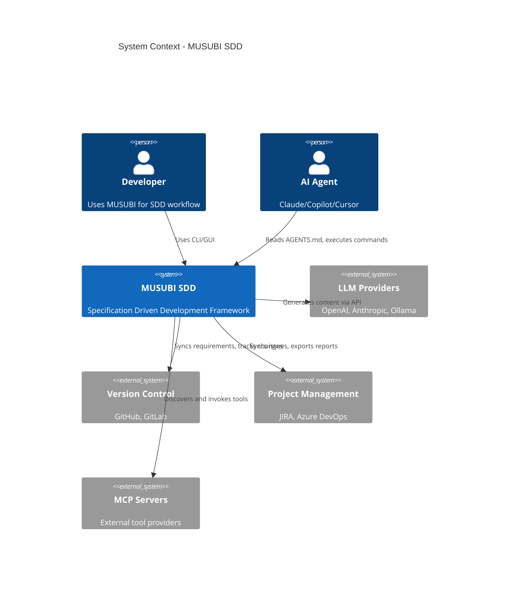
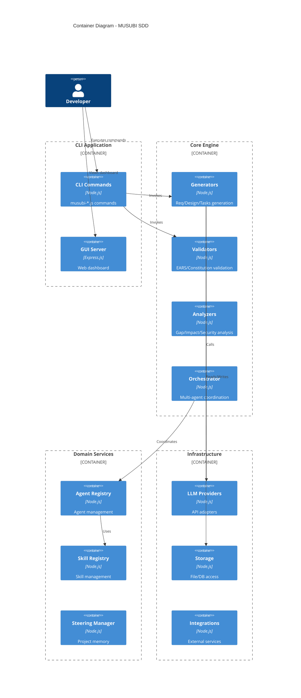
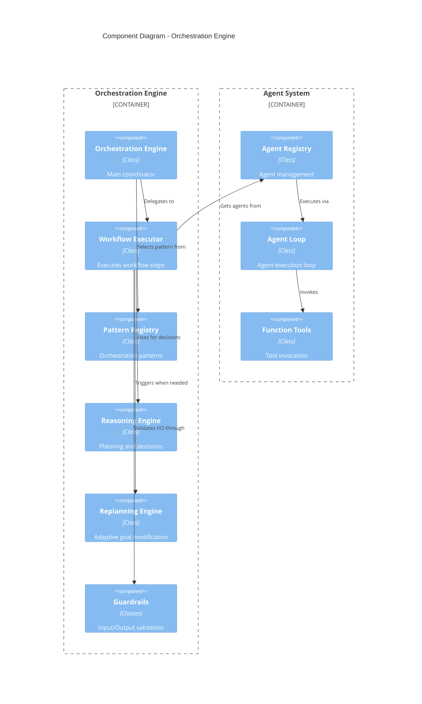

# MUSUBI Architecture Deep Dive

A detailed guide to the internal architecture and design philosophy of MUSUBI SDD.

---

## 📖 Table of Contents

1. [System Overview](#system-overview)
2. [Core Architecture](#core-architecture)
3. [Module Structure](#module-structure)
4. [Data Flow](#data-flow)
5. [Orchestration Engine](#orchestration-engine)
6. [Extension Points](#extension-points)
7. [Architecture Decision Records (ADR)](#architecture-decision-records-adr)

---

## System Overview

### High-Level Architecture

```
┌─────────────────────────────────────────────────────────────────────────────┐
│                              MUSUBI SDD v5.x                                │
├─────────────────────────────────────────────────────────────────────────────┤
│                                                                             │
│  ┌─────────────────────────────────────────────────────────────────────┐    │
│  │                        Presentation Layer                           │    │
│  │  ┌─────────┐  ┌─────────┐  ┌─────────┐  ┌─────────┐  ┌─────────┐   │    │
│  │  │   CLI   │  │   GUI   │  │  VSCode │  │   API   │  │   MCP   │   │    │
│  │  │ Commands│  │Dashboard│  │Extension│  │  Server │  │ Server  │   │    │
│  │  └─────────┘  └─────────┘  └─────────┘  └─────────┘  └─────────┘   │    │
│  └─────────────────────────────────────────────────────────────────────┘    │
│                                    │                                        │
│  ┌─────────────────────────────────▼───────────────────────────────────┐    │
│  │                        Application Layer                            │    │
│  │  ┌──────────────┐  ┌──────────────┐  ┌──────────────┐               │    │
│  │  │  Generators  │  │  Validators  │  │  Analyzers   │               │    │
│  │  │ (Req/Design/ │  │ (Constitution│  │ (Gap/Impact/ │               │    │
│  │  │  Tasks)      │  │  /EARS/Trace)│  │  Security)   │               │    │
│  │  └──────────────┘  └──────────────┘  └──────────────┘               │    │
│  │                                                                      │    │
│  │  ┌──────────────┐  ┌──────────────┐  ┌──────────────┐               │    │
│  │  │ Orchestration│  │  Replanning  │  │  Monitoring  │               │    │
│  │  │   Engine     │  │   Engine     │  │   & Costs    │               │    │
│  │  └──────────────┘  └──────────────┘  └──────────────┘               │    │
│  └─────────────────────────────────────────────────────────────────────┘    │
│                                    │                                        │
│  ┌─────────────────────────────────▼───────────────────────────────────┐    │
│  │                         Domain Layer                                │    │
│  │  ┌──────────────┐  ┌──────────────┐  ┌──────────────┐               │    │
│  │  │   Steering   │  │    Agents    │  │    Skills    │               │    │
│  │  │   (Memory)   │  │  (Registry)  │  │  (Registry)  │               │    │
│  │  └──────────────┘  └──────────────┘  └──────────────┘               │    │
│  │                                                                      │    │
│  │  ┌──────────────┐  ┌──────────────┐  ┌──────────────┐               │    │
│  │  │  Guardrails  │  │  Reasoning   │  │  Patterns    │               │    │
│  │  │ (Input/Output│  │ (Self-Correct│  │ (Sequential/ │               │    │
│  │  │  /Safety)    │  │  /Planning)  │  │  Triage/...)│               │    │
│  │  └──────────────┘  └──────────────┘  └──────────────┘               │    │
│  └─────────────────────────────────────────────────────────────────────┘    │
│                                    │                                        │
│  ┌─────────────────────────────────▼───────────────────────────────────┐    │
│  │                      Infrastructure Layer                           │    │
│  │  ┌──────────────┐  ┌──────────────┐  ┌──────────────┐               │    │
│  │  │ LLM Providers│  │  Integrations│  │  Performance │               │    │
│  │  │ (OpenAI/     │  │  (GitHub/    │  │  (Cache/     │               │    │
│  │  │  Anthropic)  │  │   JIRA/MCP)  │  │   Memory)    │               │    │
│  │  └──────────────┘  └──────────────┘  └──────────────┘               │    │
│  │                                                                      │    │
│  │  ┌──────────────┐  ┌──────────────┐  ┌──────────────┐               │    │
│  │  │   Storage    │  │   Converters │  │  Enterprise  │               │    │
│  │  │  (File/DB)   │  │  (IR/Parsers)│  │ (Multi-Tenant│               │    │
│  │  └──────────────┘  └──────────────┘  └──────────────┘               │    │
│  └─────────────────────────────────────────────────────────────────────┘    │
│                                                                             │
└─────────────────────────────────────────────────────────────────────────────┘
```

### Design Principles

| Principle | Description | Implementation Example |
|------|------|--------|
| **Separation of Concerns** | Each layer has independent responsibilities | Generators / Validators / Analyzers |
| **Dependency Inversion** | Upper layers depend on abstractions | LLM Provider Interface |
| **Open-Closed** | Open for extension, closed for modification | Plugin Architecture |
| **Single Responsibility** | One responsibility per class | Each Skill has a single function |
| **Interface Segregation** | Expose only the necessary interfaces | Public API vs Internal |

---

## Core Architecture

### C4 Context Diagram



### C4 Container Diagram



### C4 Component Diagram (Orchestration)



---

## Module Structure

### Directory Structure

```
src/
├── index.js                    # Public API entry point
├── phase4-integration.js       # Phase 4 integration
├── phase5-integration.js       # Phase 5 integration
│
├── agents/                     # Agent system
│   ├── index.js               # Agent module exports
│   ├── agent-loop.js          # Agent execution loop
│   ├── function-tool.js       # Tool invocation abstraction
│   ├── registry.js            # Agent registry
│   ├── schema-generator.js    # JSON schema generation
│   ├── agentic/               # Agentic pattern implementations
│   │   ├── code-generator.js  # Code generation agent
│   │   └── code-reviewer.js   # Code review agent
│   └── browser/               # Browser agent
│       ├── action-executor.js # Browser action execution
│       ├── ai-comparator.js   # AI-based comparison
│       ├── context-manager.js # Context management
│       └── ...
│
├── ai/                         # AI features
│   ├── index.js               # AI module exports
│   └── advanced-ai.js         # Advanced AI features
│       ├── ModelRegistry      # Model registry
│       ├── ModelRouter        # Task-based routing
│       ├── ContextWindowManager # Context window management
│       ├── SemanticChunker    # Semantic chunking
│       ├── CodeVectorStore    # Code vector store
│       └── RAGPipeline        # RAG pipeline
│
├── analyzers/                  # Analysis engine
│   ├── ast-extractor.js       # AST extraction
│   ├── codegraph-auto-update.js # Code graph auto-update
│   ├── complexity-analyzer.js # Complexity analysis
│   ├── context-optimizer.js   # Context optimization
│   ├── gap-detector.js        # Gap detection
│   ├── impact-analyzer.js     # Impact analysis
│   ├── large-project-analyzer.js # Large project analysis
│   ├── repository-map.js      # Repository mapping
│   ├── security-analyzer.js   # Security analysis
│   ├── stuck-detector.js      # Stuck detection
│   └── traceability.js        # Traceability analysis
│
├── converters/                 # Specification conversion
│   ├── index.js               # Converter exports
│   ├── ir/                    # Intermediate representation
│   │   └── types.js           # IR type definitions
│   ├── parsers/               # Parsers
│   │   ├── musubi-parser.js   # MUSUBI format
│   │   ├── openapi-parser.js  # OpenAPI
│   │   └── speckit-parser.js  # SpecKit
│   └── writers/               # Writers
│       ├── musubi-writer.js   # MUSUBI output
│       └── speckit-writer.js  # SpecKit output
│
├── enterprise/                 # Enterprise features
│   ├── index.js               # Enterprise exports
│   └── multi-tenant.js        # Multi-tenant
│       ├── TenantContext      # Tenant context
│       ├── TenantIsolation    # Data isolation
│       ├── RBACManager        # Role-based access
│       ├── UsageQuota         # Usage quota
│       └── AuditLogger        # Audit log
│
├── generators/                 # Document generation
│   ├── design.js              # Design generation
│   ├── requirements.js        # Requirements generation
│   ├── rust-migration-generator.js # Rust migration
│   └── tasks.js               # Task generation
│
├── gui/                        # Web GUI
│   ├── server.js              # Express server
│   ├── public/                # Static files
│   │   └── index.html         # SPA entry
│   └── services/              # GUI services
│       ├── file-watcher.js    # File watching
│       ├── project-scanner.js # Project scanning
│       ├── replanning-service.js # Replanning
│       ├── traceability-service.js # Traceability
│       └── workflow-service.js # Workflow
│
├── integrations/               # External integrations
│   ├── index.js               # Integration exports
│   ├── cicd.js                # CI/CD integration
│   ├── codegraph-mcp.js       # CodeGraph MCP
│   ├── documentation.js       # Documentation integration
│   ├── enterprise-integrations.js # Enterprise integrations
│   │   ├── JiraIntegration    # JIRA
│   │   ├── AzureDevOpsIntegration # Azure DevOps
│   │   ├── GitLabIntegration  # GitLab
│   │   ├── SlackIntegration   # Slack
│   │   ├── TeamsIntegration   # Teams
│   │   └── SSOIntegration     # SSO
│   ├── examples.js            # Sample integrations
│   ├── github-client.js       # GitHub client
│   ├── mcp-connector.js       # MCP connection
│   ├── mcp/                   # MCP submodules
│   │   ├── mcp-context-provider.js
│   │   ├── mcp-discovery.js
│   │   └── mcp-tool-registry.js
│   ├── platforms.js           # Platform integration
│   └── tool-discovery.js      # Tool discovery
│
├── llm-providers/              # LLM providers
│   ├── index.js               # Provider exports
│   ├── base-provider.js       # Base class
│   ├── anthropic-provider.js  # Anthropic
│   ├── copilot-provider.js    # GitHub Copilot
│   ├── ollama-provider.js     # Ollama
│   └── openai-provider.js     # OpenAI
│
├── managers/                   # Managers
│   ├── index.js               # Manager exports
│   ├── agent-memory.js        # Agent memory
│   ├── change.js              # Change management
│   ├── checkpoint-manager.js  # Checkpoints
│   ├── delta-spec.js          # Delta specs
│   ├── memory-condenser.js    # Memory condensation
│   ├── repo-skill-manager.js  # Repository skills
│   ├── skill-loader.js        # Skill loader
│   ├── skill-tools.js         # Skill tools
│   └── workflow.js            # Workflow management
│
├── monitoring/                 # Monitoring
│   ├── index.js               # Monitoring exports
│   ├── cost-tracker.js        # Cost tracking
│   ├── incident-manager.js    # Incident management
│   ├── observability.js       # Observability
│   ├── quality-dashboard.js   # Quality dashboard
│   └── release-manager.js     # Release management
│
├── orchestration/              # Orchestration
│   ├── index.js               # Orchestration exports
│   ├── orchestration-engine.js # Main engine
│   ├── workflow-executor.js   # Workflow execution
│   ├── workflow-orchestrator.js # Orchestrator
│   ├── skill-executor.js      # Skill execution
│   ├── skill-registry.js      # Skill registry
│   ├── pattern-registry.js    # Pattern registry
│   ├── mcp-tool-adapters.js   # MCP tool adapters
│   ├── agent-skill-binding.js # Agent-skill binding
│   ├── error-handler.js       # Error handling
│   ├── workflow-examples.js   # Workflow examples
│   ├── guardrails/            # Guardrails
│   │   ├── base-guardrail.js  # Base guardrail
│   │   ├── guardrail-rules.js # Rule definitions
│   │   ├── input-guardrail.js # Input guardrail
│   │   ├── output-guardrail.js # Output guardrail
│   │   └── safety-check.js    # Safety check
│   ├── patterns/              # Orchestration patterns
│   │   ├── auto.js            # Automatic selection
│   │   ├── group-chat.js      # Group chat
│   │   ├── handoff.js         # Handoff
│   │   ├── human-in-loop.js   # Human-in-the-Loop
│   │   ├── nested.js          # Nested
│   │   ├── sequential.js      # Sequential
│   │   ├── swarm.js           # Swarm
│   │   └── triage.js          # Triage
│   ├── reasoning/             # Reasoning engine
│   │   ├── planning-engine.js # Planning
│   │   ├── reasoning-engine.js # Reasoning
│   │   └── self-correction.js # Self-correction
│   └── replanning/            # Replanning
│       ├── adaptive-goal-modifier.js # Adaptive goal modification
│       ├── alternative-generator.js # Alternative generation
│       ├── config.js          # Configuration
│       ├── goal-progress-tracker.js # Goal progress tracking
│       ├── plan-evaluator.js  # Plan evaluation
│       ├── plan-monitor.js    # Plan monitoring
│       ├── proactive-path-optimizer.js # Proactive optimization
│       ├── replan-history.js  # Replan history
│       └── replanning-engine.js # Replanning engine
│
├── performance/                # Performance optimization
│   ├── index.js               # Performance exports
│   ├── cache-manager.js       # Cache management
│   ├── lazy-loader.js         # Lazy loading
│   ├── memory-optimizer.js    # Memory optimization
│   └── startup-optimizer.js   # Startup optimization
│
├── reporters/                  # Report generation
│   ├── coverage-report.js     # Coverage report
│   ├── hierarchical-reporter.js # Hierarchical report
│   └── traceability-matrix-report.js # Traceability matrix
│
├── resolvers/                  # Issue resolution
│   └── issue-resolver.js      # Issue resolver
│
├── steering/                   # Steering (project memory)
│   ├── index.js               # Steering exports
│   ├── advanced-validation.js # Advanced validation
│   ├── auto-updater.js        # Auto-update
│   ├── quality-metrics.js     # Quality metrics
│   ├── steering-auto-update.js # Steering auto-update
│   ├── steering-validator.js  # Steering validation
│   └── template-constraints.js # Template constraints
│
├── templates/                  # Templates
│   ├── index.js               # Template exports
│   ├── locale-manager.js      # Multilingual management
│   ├── template-constraints.js # Constraint definitions
│   ├── agents/                # Agent templates
│   │   ├── claude-code/       # Claude Code
│   │   ├── codex/             # Codex
│   │   ├── cursor/            # Cursor
│   │   ├── gemini-cli/        # Gemini CLI
│   │   ├── github-copilot/    # GitHub Copilot
│   │   ├── qwen-code/         # Qwen Code
│   │   ├── shared/            # Shared
│   │   └── windsurf/          # Windsurf
│   ├── architectures/         # Architecture templates
│   ├── memories/              # Memory templates
│   ├── shared/                # Shared templates
│   └── skills/                # Skill templates
│
└── validators/                 # Validation engine
    ├── advanced-validation.js # Advanced validation
    ├── constitution.js        # Constitution validation
    ├── constitutional-validator.js # Constitutional validator
    ├── critic-system.js       # Critic system
    ├── delta-format.js        # Delta format validation
    └── traceability-validator.js # Traceability validation
```

### Module Dependencies

```
                    ┌──────────────┐
                    │   bin/*.js   │ ← CLI entry point
                    └──────┬───────┘
                           │
                           ▼
                    ┌──────────────┐
                    │  src/index   │ ← Public API
                    └──────┬───────┘
                           │
           ┌───────────────┼───────────────┐
           │               │               │
           ▼               ▼               ▼
    ┌──────────┐    ┌──────────┐    ┌──────────┐
    │generators│    │validators│    │analyzers │
    └────┬─────┘    └────┬─────┘    └────┬─────┘
         │               │               │
         └───────────────┴───────────────┘
                         │
                         ▼
                  ┌─────────────┐
                  │orchestration│ ← Central coordination
                  └──────┬──────┘
                         │
         ┌───────────────┼───────────────┐
         │               │               │
         ▼               ▼               ▼
    ┌──────────┐    ┌──────────┐    ┌──────────┐
    │  agents  │    │  skills  │    │ patterns │
    └────┬─────┘    └────┬─────┘    └────┬─────┘
         │               │               │
         └───────────────┴───────────────┘
                         │
                         ▼
    ┌────────────────────────────────────────────┐
    │              Infrastructure                 │
    │  ┌─────────┐  ┌──────────┐  ┌──────────┐   │
    │  │   llm   │  │integrations│  │performance│   │
    │  │providers│  │          │  │          │   │
    │  └─────────┘  └──────────┘  └──────────┘   │
    └────────────────────────────────────────────┘
```

---

## Data Flow

### SDD Workflow

```
┌─────────────────────────────────────────────────────────────────────────────┐
│                         SDD Workflow Data Flow                              │
├─────────────────────────────────────────────────────────────────────────────┤
│                                                                             │
│  1. REQUIREMENTS PHASE                                                      │
│  ───────────────────                                                        │
│                                                                             │
│  User Input ─────► Requirements ─────► EARS Validator ─────► storage/      │
│  "User auth"       Generator          (Constitution)        features/      │
│                         │                   │               req.md         │
│                         │                   │                              │
│                    ┌────▼────┐         ┌────▼────┐                         │
│                    │   LLM   │         │ Steering │                        │
│                    │ Provider│         │  Memory  │                        │
│                    └─────────┘         └─────────┘                         │
│                                                                             │
│  2. DESIGN PHASE                                                           │
│  ──────────────                                                            │
│                                                                             │
│  Requirements ─────► Design ─────► C4 Validator ─────► storage/            │
│  (REQ-*.md)         Generator     (Architecture)       features/           │
│                         │              │               design.md           │
│                         │              │                                   │
│                    ┌────▼────┐    ┌────▼────┐                              │
│                    │   LLM   │    │   ADR   │                              │
│                    │ Provider│    │Generator│                              │
│                    └─────────┘    └─────────┘                              │
│                                                                             │
│  3. TASKS PHASE                                                            │
│  ─────────────                                                             │
│                                                                             │
│  Design ─────► Task ─────► Traceability ─────► storage/                    │
│  (design.md)  Generator    Validator           features/                   │
│                   │            │               tasks.md                    │
│                   │            │                                           │
│              ┌────▼────┐  ┌────▼────┐                                      │
│              │   LLM   │  │ Trace   │                                      │
│              │ Provider│  │ Matrix  │                                      │
│              └─────────┘  └─────────┘                                      │
│                                                                             │
│  4. IMPLEMENTATION PHASE                                                   │
│  ──────────────────────                                                    │
│                                                                             │
│  Tasks ─────► Orchestrator ─────► Agent Loop ─────► Code Files             │
│  (TASK-*)        │                    │                │                   │
│                  │                    │                │                   │
│             ┌────▼────┐          ┌────▼────┐     ┌────▼────┐               │
│             │ Pattern │          │  Skill  │     │ Guardrails│              │
│             │Selection│          │Executor │     │(I/O Check)│              │
│             └─────────┘          └─────────┘     └──────────┘              │
│                                                                             │
│  5. VALIDATION PHASE                                                       │
│  ──────────────────                                                        │
│                                                                             │
│  All Artifacts ─────► Validator ─────► Traceability ─────► Report          │
│                          │             Matrix              │               │
│                          │                │                │               │
│                     ┌────▼────┐      ┌────▼────┐      ┌────▼────┐          │
│                     │Constitution│    │Coverage │      │ Gap     │          │
│                     │ Checker   │    │ Report  │      │Detector │          │
│                     └──────────┘    └─────────┘      └─────────┘          │
│                                                                             │
└─────────────────────────────────────────────────────────────────────────────┘
```

### Data Transformation Flow

```
                    Input (Natural Language)
                              │
                              ▼
                    ┌─────────────────┐
                    │  Context Loader │ ← Steering files
                    └────────┬────────┘
                              │
                              ▼
                    ┌─────────────────┐
                    │   LLM Request   │ ← Prompt + Context
                    └────────┬────────┘
                              │
                              ▼
                    ┌─────────────────┐
                    │  LLM Response   │ ← Generated content
                    └────────┬────────┘
                              │
                              ▼
                    ┌─────────────────┐
                    │     Parser      │ ← Extract structure
                    └────────┬────────┘
                              │
                              ▼
                    ┌─────────────────┐
                    │    Validator    │ ← EARS/Constitution
                    └────────┬────────┘
                              │
                    ┌────────┴────────┐
                    │                 │
                    ▼                 ▼
              ✅ Valid           ❌ Invalid
                    │                 │
                    ▼                 ▼
              ┌──────────┐    ┌──────────┐
              │  Storage │    │   Self   │
              │   Write  │    │Correction│
              └──────────┘    └────┬─────┘
                                   │
                                   └────► Retry
```

---

## Orchestration Engine

### Pattern Selection Logic

```javascript
// src/orchestration/pattern-registry.js (conceptual sketch)

class PatternSelector {
  selectPattern(task, context) {
    const analysis = this.analyzeTask(task);
    
    // Selection based on complexity
    if (analysis.complexity === 'high' && analysis.requiresExpertise) {
      return 'triage';  // Router dispatches to specialist agents
    }
    
    if (analysis.parallelizable && analysis.independentSubtasks > 3) {
      return 'swarm';   // Parallel execution
    }
    
    if (analysis.requiresHumanApproval) {
      return 'human-in-loop';  // Insert human approval
    }
    
    if (analysis.steps && analysis.steps.length > 1) {
      return 'sequential';  // Sequential execution
    }
    
    return 'auto';  // Automatic selection
  }
}
```

### Agent Loop

```
┌─────────────────────────────────────────────────────────────────┐
│                       Agent Loop                                │
├─────────────────────────────────────────────────────────────────┤
│                                                                 │
│  ┌──────────┐    ┌──────────┐    ┌──────────┐    ┌──────────┐  │
│  │  Start   │───►│  Think   │───►│   Act    │───►│ Observe  │  │
│  └──────────┘    └────┬─────┘    └────┬─────┘    └────┬─────┘  │
│                       │               │               │         │
│                       │               │               │         │
│                  ┌────▼────┐     ┌────▼────┐     ┌────▼────┐   │
│                  │Reasoning│     │  Tool   │     │ Result  │   │
│                  │ Engine  │     │Execution│     │ Parser  │   │
│                  └─────────┘     └─────────┘     └─────────┘   │
│                       │               │               │         │
│                       └───────────────┴───────────────┘         │
│                                       │                         │
│                                       ▼                         │
│                              ┌────────────────┐                 │
│                              │  Goal Check    │                 │
│                              │ (Complete?)    │                 │
│                              └───────┬────────┘                 │
│                                      │                          │
│                           ┌──────────┴──────────┐               │
│                           │                     │               │
│                           ▼                     ▼               │
│                     ┌──────────┐          ┌──────────┐          │
│                     │  Done    │          │  Loop    │          │
│                     │ (Return) │          │ (Retry)  │          │
│                     └──────────┘          └──────────┘          │
│                                                                 │
└─────────────────────────────────────────────────────────────────┘
```

### Guardrail Architecture

```
                         Input
                           │
                           ▼
              ┌────────────────────────┐
              │    Input Guardrail     │
              │  ┌──────────────────┐  │
              │  │ • Prompt Injection │  │
              │  │ • PII Detection   │  │
              │  │ • Rate Limiting   │  │
              │  └──────────────────┘  │
              └───────────┬────────────┘
                          │
                          ▼
              ┌────────────────────────┐
              │     Agent Execution    │
              └───────────┬────────────┘
                          │
                          ▼
              ┌────────────────────────┐
              │   Output Guardrail     │
              │  ┌──────────────────┐  │
              │  │ • Content Safety  │  │
              │  │ • Schema Valid.   │  │
              │  │ • Constitution    │  │
              │  └──────────────────┘  │
              └───────────┬────────────┘
                          │
                          ▼
                       Output
```

---

## Extension Points

### 1. LLM Provider Extensions

```javascript
// src/llm-providers/base-provider.js
class BaseLLMProvider {
  // Required methods
  async complete(prompt, options) { throw new Error('Not implemented'); }
  async chat(messages, options) { throw new Error('Not implemented'); }
  async embed(text) { throw new Error('Not implemented'); }
  
  // Optional methods
  async stream(prompt, options) { /* ... */ }
  getTokenCount(text) { /* ... */ }
}

// Custom provider example
class MyCustomProvider extends BaseLLMProvider {
  async complete(prompt, options) {
    const response = await fetch('https://my-llm-api.com/complete', {
      method: 'POST',
      body: JSON.stringify({ prompt, ...options })
    });
    return response.json();
  }
}
```

### 2. Validator Extensions

```javascript
// Add a custom validator
const { ValidatorRegistry } = require('musubi-sdd');

ValidatorRegistry.register('my-custom-validator', {
  name: 'My Custom Validator',
  targetTypes: ['requirements', 'design'],
  
  async validate(content, context) {
    const errors = [];
    
    // Custom validation logic
    if (!content.includes('required keyword')) {
      errors.push({
        code: 'MISSING_KEYWORD',
        message: 'Required keyword not found',
        severity: 'error'
      });
    }
    
    return { valid: errors.length === 0, errors };
  }
});
```

### 3. Orchestration Pattern Extensions

```javascript
// Add a custom pattern
const { PatternRegistry } = require('musubi-sdd');

PatternRegistry.register('my-custom-pattern', {
  name: 'My Custom Pattern',
  description: 'A custom orchestration pattern',
  
  async execute(task, agents, context) {
    // Custom orchestration logic
    const results = [];
    
    for (const agent of agents) {
      const result = await agent.execute(task, context);
      results.push(result);
      
      // Hand off on a custom condition
      if (result.needsExpert) {
        const expert = context.findExpert(result.expertType);
        const expertResult = await expert.execute(task, context);
        results.push(expertResult);
      }
    }
    
    return this.aggregateResults(results);
  }
});
```

### 4. Skill Extensions

```javascript
// Add a custom skill
const { SkillRegistry } = require('musubi-sdd');

SkillRegistry.register('my-custom-skill', {
  name: 'My Custom Skill',
  triggers: ['my-keyword', 'custom-task'],
  
  context: `
    ## My Custom Skill
    
    This skill provides custom functionality for...
    
    ### Capabilities
    - Capability 1
    - Capability 2
  `,
  
  actions: {
    'my-action': {
      description: 'Perform my custom action',
      async execute(params, context) {
        // Action logic
        return { success: true, result: 'Action completed' };
      }
    }
  }
});
```

---

## Architecture Decision Records (ADR)

### ADR-001: Modular Architecture

**Status**: Accepted  
**Date**: 2024-01-01  

**Context**:  
MUSUBI needs to support a variety of use cases (CLI, GUI, VSCode extension, MCP server).

**Decision**:  
Adopt a layered architecture and implement each layer as an independent module.

**Consequences**:
- ✅ Each component can be tested independently
- ✅ New interfaces (API, VSCode, etc.) can be added easily
- ✅ Clear dependencies and high maintainability
- ⚠️ Interface definitions are required for inter-module collaboration

---

### ADR-002: LLM Provider Abstraction

**Status**: Accepted  
**Date**: 2024-01-15  

**Context**:  
We want to support multiple LLMs (OpenAI, Anthropic, Ollama) and also accommodate new models in the future.

**Decision**:  
Define a `BaseLLMProvider` abstract class; each provider inherits from it and implements it.

**Consequences**:
- ✅ New LLM providers can be added easily
- ✅ Users can switch providers just by changing configuration
- ✅ Provider-specific features are also supported via `options`
- ⚠️ Overhead of absorbing API differences between providers

---

### ADR-003: Guardrail System

**Status**: Accepted  
**Date**: 2024-03-01  

**Context**:  
The quality and safety of LLM output must be ensured. Protection against prompt injection is also needed.

**Decision**:  
Place guardrails on both input and output. Make Constitution-based validation mandatory.

**Consequences**:
- ✅ Blocks invalid input
- ✅ Guarantees that output complies with the Constitution
- ✅ Reduces the risk of PII leakage
- ⚠️ Slight latency increase due to guardrail processing

---

### ADR-004: Replanning Engine

**Status**: Accepted  
**Date**: 2024-06-01  

**Context**:  
A mechanism is needed to handle problems automatically when they occur during long-running autonomous execution.

**Decision**:  
Introduce `ReplanningEngine` and implement goal progress tracking, alternative generation, and adaptive goal modification.

**Consequences**:
- ✅ Automatic recovery when errors occur
- ✅ Minimizes human intervention
- ✅ Improved completion rate even for complex tasks
- ⚠️ Increased complexity of the replanning logic

---

### ADR-005: Multi-Tenant Support

**Status**: Accepted  
**Date**: 2025-12-01  

**Context**:  
Enterprise customers require data isolation between tenants and RBAC.

**Decision**:  
Inject `TenantContext` at request scope to achieve tenant isolation across all services.

**Consequences**:
- ✅ Complete data isolation between tenants
- ✅ Fine-grained access control via RBAC
- ✅ Usage quotas and audit logs
- ⚠️ Cost of propagating tenant context

---

## 📚 Related Documents

- [API Reference](../API-REFERENCE.md)
- [Interactive Tutorials](./INTERACTIVE-TUTORIALS.md)
- [Plugin Development Guide](./PLUGIN-DEVELOPMENT.md)
- [Quickstart Guide](../QUICKSTART.md)

---

*© 2025 MUSUBI SDD - Architecture Deep Dive*
