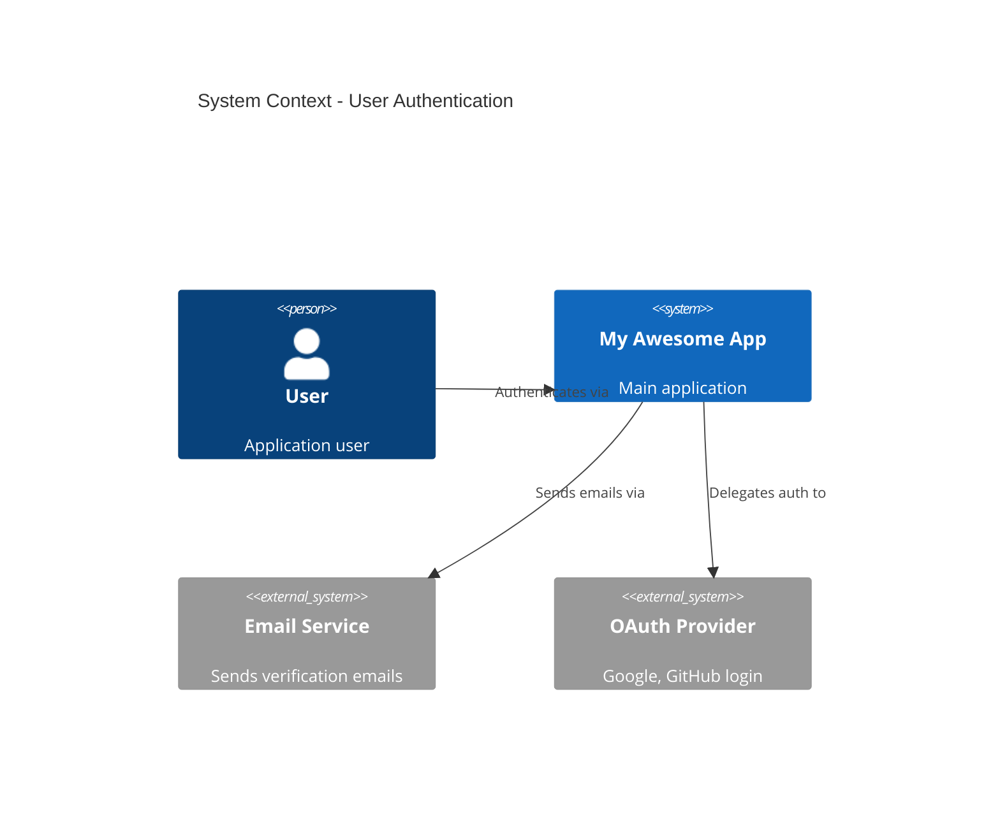
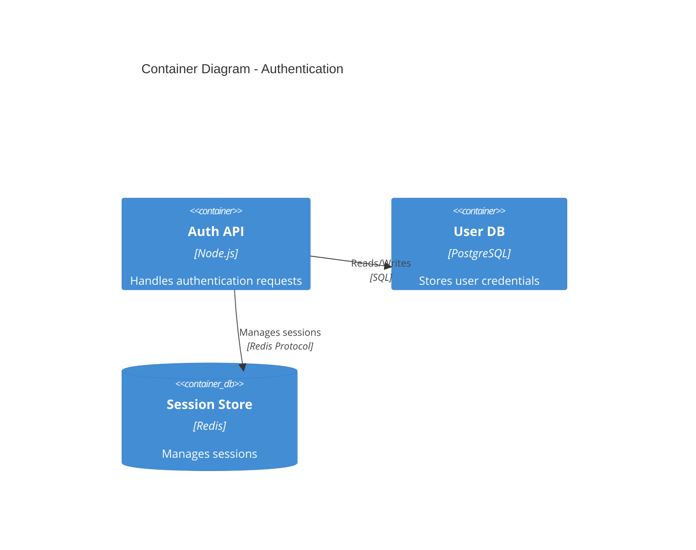

# MUSUBI Interactive Tutorials

Master MUSUBI SDD with guided onboarding.

---

## 🎯 Tutorial List

| Level | Tutorial | Duration | What You'll Learn |
|--------|---------------|---------|-----------|
| 🟢 Beginner | [1. Your First Project](#tutorial-1-your-first-project) | 15 min | Basic setup |
| 🟢 Beginner | [2. Requirements Basics](#tutorial-2-requirements-basics) | 20 min | EARS format |
| 🟡 Intermediate | [3. Design Document Generation](#tutorial-3-design-document-generation) | 25 min | C4 model, ADR |
| 🟡 Intermediate | [4. Task Breakdown and Traceability](#tutorial-4-task-breakdown-and-traceability) | 30 min | Task generation, tracking |
| 🔴 Advanced | [5. Multi-Agent Collaboration](#tutorial-5-multi-agent-collaboration) | 45 min | Orchestration |
| 🔴 Advanced | [6. Enterprise Integration](#tutorial-6-enterprise-integration) | 60 min | JIRA, CI/CD integration |

---

## Tutorial 1: Your First Project

### 🎯 Learning Objectives
- Install and initialize MUSUBI
- Understand project memory
- Run basic commands

### Step 1: Installation

```bash
# Global installation
npm install -g 'github:Improve-To-Grow/MUSUBI#ITG-adjustments'

# Check version
musubi --version
```

### Step 2: Project Initialization

```bash
# Create a new project directory
mkdir my-first-musubi-project
cd my-first-musubi-project

# Initialize MUSUBI (interactive mode)
musubi init
```

**Questions during initialization:**
```
? Select your AI coding agent: (Use arrow keys)
❯ GitHub Copilot
  Claude Code
  Cursor
  Windsurf
  Codex CLI
  
? Select project language: 
❯ TypeScript
  JavaScript
  Python
  Go
  Rust
  
? Documentation language: (Use arrow keys)
❯ English
  Japanese
  ...
```

> Keep **English** as the documentation language. Bilingual output (an extra translated copy of
> every document) is enabled separately — see [BILINGUAL-IMPLEMENTATION.md](../../BILINGUAL-IMPLEMENTATION.md).

### Step 3: Check Generated Files

```
my-first-musubi-project/
├── steering/
│   ├── product.md      # Product context
│   ├── structure.md    # Architecture structure
│   ├── tech.md         # Technology stack
│   └── rules/
│       ├── constitution.md  # 9-article constitution
│       └── workflow.md      # SDD workflow
├── storage/
│   └── features/       # Feature spec storage
└── AGENTS.md           # Agent configuration
```

### Step 4: Customize Steering Files

Open and edit `steering/product.md`:

```markdown
# Product Context

## Project Name
My Awesome App

## Vision
A task management app that makes users 10x more productive

## Target Users
- Freelance developers
- Small teams

## Success Metrics
- DAU 1,000+
- Task completion rate 80%+
```

### ✅ Checkpoint

```bash
# Validate configuration
musubi validate

# Expected output:
# ✅ Constitution: Valid
# ✅ Steering files: Complete
# ✅ Ready for SDD workflow
```

### 📝 Exercises

1. Open `steering/tech.md` and describe the technology stack you will use
2. Run `musubi validate` and confirm there are no errors

---

## Tutorial 2: Requirements Basics

### 🎯 Learning Objectives
- Writing requirements in EARS format
- Automatic requirements validation
- Managing requirement IDs

### What is EARS format?

**E**asy **A**pproach to **R**equirements **S**yntax - a structured format for writing unambiguous requirements.

| Pattern | Template | Example |
|----------|-------------|-----|
| Ubiquitous | The [system] shall [action] | The system shall display error messages in red |
| Event-Driven | When [trigger], the [system] shall [action] | When user clicks login, the system shall validate credentials |
| State-Driven | While [state], the [system] shall [action] | While offline, the system shall queue pending requests |
| Optional | Where [condition], the [system] shall [action] | Where user is admin, the system shall show settings panel |
| Unwanted | If [condition], then the [system] shall [action] | If password is incorrect, then the system shall log the attempt |

### Step 1: Generate Requirements

```bash
# Generate requirements for a feature
musubi requirements "User authentication feature"
```

**Generated output (`storage/specs/user-authentication-requirements.md`):**

```markdown
# User Authentication Requirements

## REQ-AUTH-001: Login Capability
**Type**: Functional  
**Priority**: Must Have  
**EARS**: When a user submits valid credentials, the system shall 
authenticate the user and create a session token.

### Acceptance Criteria
- [ ] AC-001: Valid email/password combination grants access
- [ ] AC-002: Session token expires after 24 hours
- [ ] AC-003: Failed login attempts are logged

## REQ-AUTH-002: Password Security
**Type**: Non-Functional  
**Priority**: Must Have  
**EARS**: The system shall hash passwords using bcrypt with 
a minimum cost factor of 12.
```

### Step 2: Validate Requirements

```bash
# Validate EARS format
musubi validate --requirements storage/specs/user-authentication-requirements.md
```

**Validation results:**
```
📋 Requirements Validation Report
━━━━━━━━━━━━━━━━━━━━━━━━━━━━━━━━

✅ REQ-AUTH-001: Valid EARS format (Event-Driven)
✅ REQ-AUTH-002: Valid EARS format (Ubiquitous)
⚠️  REQ-AUTH-003: Missing acceptance criteria

Summary: 2/3 requirements valid
```

### Step 3: Requirements Traceability

```bash
# Generate traceability matrix
musubi trace --requirements
```

**Output:**
```
📊 Traceability Matrix
━━━━━━━━━━━━━━━━━━━━━━━

| Requirement   | Design      | Tasks       | Tests       |
|--------------|-------------|-------------|-------------|
| REQ-AUTH-001 | ⏳ Pending  | ⏳ Pending  | ⏳ Pending  |
| REQ-AUTH-002 | ⏳ Pending  | ⏳ Pending  | ⏳ Pending  |

Coverage: 0% → Next step: Generate design documents
```

### 📝 Exercises

1. Write 3 requirements in EARS format for a "product search" feature
2. Run `musubi validate` to confirm the requirements are correct

---

## Tutorial 3: Design Document Generation

### 🎯 Learning Objectives
- Architecture design using the C4 model
- Creating ADRs (Architecture Decision Records)
- Linking design to requirements

### Step 1: Generate Design

```bash
# Generate design from requirements
musubi design "User authentication feature"
```

**Generated output (`storage/design/user-authentication-design.md`):**

```markdown
# User Authentication Design

## C4 Context Diagram



## C4 Container Diagram



## Architecture Decision Records

### ADR-001: Session Storage Strategy

**Status**: Accepted  
**Context**: Need to store user sessions with fast access  
**Decision**: Use Redis for session storage  
**Consequences**:
- ✅ Fast read/write operations
- ✅ Built-in TTL support
- ⚠️ Additional infrastructure to manage
```

### Step 2: Design Review

```bash
# Check design validity
musubi validate --design storage/design/user-authentication-design.md
```

### Step 3: Update Traceability

```bash
# Check traceability again
musubi trace --all
```

**Output:**
```
📊 Traceability Matrix
━━━━━━━━━━━━━━━━━━━━━━━

| Requirement   | Design      | Tasks       | Tests       |
|--------------|-------------|-------------|-------------|
| REQ-AUTH-001 | ✅ Linked   | ⏳ Pending  | ⏳ Pending  |
| REQ-AUTH-002 | ✅ Linked   | ⏳ Pending  | ⏳ Pending  |

Coverage: 33% → Next step: Generate tasks
```

### 📝 Exercises

1. Review the generated C4 diagrams in a Mermaid preview
2. Add one ADR (e.g., the rationale for choosing a database)

---

## Tutorial 4: Task Breakdown and Traceability

### 🎯 Learning Objectives
- Breaking down design into tasks
- Deciding implementation priorities
- Achieving complete traceability

### Step 1: Generate Tasks

```bash
# Generate tasks from design
musubi tasks "User authentication feature"
```

**Generated output (`storage/tasks/user-authentication-tasks.md`):**

```markdown
# User Authentication Tasks

## Phase 1: Core Infrastructure

### TASK-AUTH-001: Set up authentication database schema
**Traces to**: REQ-AUTH-001, REQ-AUTH-002  
**Estimated**: 2 hours  
**Priority**: P0  

**Subtasks**:
- [ ] Create users table with email, password_hash columns
- [ ] Add indexes for email lookup
- [ ] Set up migrations

### TASK-AUTH-002: Implement password hashing service
**Traces to**: REQ-AUTH-002  
**Estimated**: 1 hour  
**Priority**: P0  

**Subtasks**:
- [ ] Install bcrypt library
- [ ] Create hash() and verify() functions
- [ ] Add unit tests

## Phase 2: API Endpoints

### TASK-AUTH-003: Create login endpoint
**Traces to**: REQ-AUTH-001  
**Estimated**: 3 hours  
**Priority**: P0  

**Subtasks**:
- [ ] POST /api/auth/login route
- [ ] Request validation middleware
- [ ] Session creation logic
- [ ] Error handling
```

### Step 2: Start Implementation

```bash
# Implement a specific task
musubi implement TASK-AUTH-001
```

**Instructions for the agent are generated:**
```markdown
## Implementation Task: TASK-AUTH-001

### Context
You are implementing the database schema for user authentication.

### Requirements Traced
- REQ-AUTH-001: Login capability
- REQ-AUTH-002: Password security (bcrypt)

### Design Reference
- See: storage/design/user-authentication-design.md
- Database: PostgreSQL
- Schema conventions: snake_case

### Expected Deliverables
1. Migration file: `migrations/001_create_users_table.sql`
2. Type definitions: `src/types/user.ts`
3. Unit tests: `tests/models/user.test.ts`

### Acceptance Criteria
- [ ] Table created with all required columns
- [ ] Indexes added for email lookup
- [ ] Migration is reversible
```

### Step 3: Mark as Complete

After completing the task:

```bash
# Mark the task as complete
musubi trace --complete TASK-AUTH-001
```

**Traceability update:**
```
📊 Traceability Matrix (Updated)
━━━━━━━━━━━━━━━━━━━━━━━━━━━━━━━━

| Requirement   | Design      | Tasks       | Tests       |
|--------------|-------------|-------------|-------------|
| REQ-AUTH-001 | ✅ Linked   | 🟡 1/2 Done | ⏳ Pending  |
| REQ-AUTH-002 | ✅ Linked   | ✅ Done     | ⏳ Pending  |

Coverage: 58%
```

---

## Tutorial 5: Multi-Agent Collaboration

### 🎯 Learning Objectives
- Understanding orchestration patterns
- Coordinated operation of multiple agents
- Automatic replanning

### Orchestration Patterns

```
┌─────────────────────────────────────────────────────────────┐
│                    Orchestration Patterns                   │
├─────────────────────────────────────────────────────────────┤
│                                                             │
│  Sequential      Triage         Swarm          Handoff      │
│  ─────────       ──────         ─────          ──────       │
│  A → B → C       Router         Parallel       Expert       │
│                    │            Workers        Transfer     │
│                  ┌─┼─┐          ┌─┬─┐                       │
│                  │ │ │          │ │ │          A ──► B      │
│                  A B C          A B C                       │
│                                                             │
└─────────────────────────────────────────────────────────────┘
```

### Step 1: Start Orchestration

```bash
# Execute a task with multiple agents
musubi orchestrate "Full implementation of the user authentication feature" --pattern triage
```

**Orchestration flow:**
```
🎭 Orchestration Started
━━━━━━━━━━━━━━━━━━━━━━━━━━

Pattern: Triage (Router-based)

Agent Assignment:
├── 📋 Requirements Analyst → REQ validation
├── 🏗️ System Architect → Design review
├── 💻 Software Developer → Implementation
├── 🧪 Test Engineer → Test generation
└── 🔍 Code Reviewer → Quality check

Progress:
[████████░░░░░░░░░░░░] 40%

Current: Software Developer implementing TASK-AUTH-003
```

### Step 2: Real-Time Monitoring

```bash
# Monitor orchestration in the GUI
musubi gui start --port 3000
```

Open `http://localhost:3000` in your browser:

```
┌─────────────────────────────────────────────────────────────┐
│  MUSUBI Orchestration Dashboard                             │
├─────────────────────────────────────────────────────────────┤
│                                                             │
│  Active Agents: 3/5                                         │
│  ┌─────────────┬─────────────┬─────────────┐                │
│  │ Architect   │ Developer   │ Tester      │                │
│  │ ✅ Complete │ 🔄 Working  │ ⏳ Waiting  │                │
│  └─────────────┴─────────────┴─────────────┘                │
│                                                             │
│  Token Usage: 45,230 / 100,000                              │
│  Estimated Cost: $0.45                                      │
│  Elapsed: 12:34                                             │
│                                                             │
└─────────────────────────────────────────────────────────────┘
```

### Step 3: Automatic Replanning

Automatic handling when problems occur:

```
⚠️ Issue Detected
━━━━━━━━━━━━━━━━━━

Problem: Database connection timeout during TASK-AUTH-003
Impact: 2 dependent tasks blocked

🔄 Replanning in progress...

New Plan:
1. ✅ Switch to in-memory mock DB for development
2. 🔄 Continue implementation with mock
3. ⏳ Add real DB integration as separate task
4. ⏳ Run integration tests later

Approve replan? [Y/n]
```

---

## Tutorial 6: Enterprise Integration

### 🎯 Learning Objectives
- Bidirectional sync with JIRA
- CI/CD pipeline integration
- Team notification settings

### Step 1: JIRA Integration Setup

```javascript
// .musubi/integrations.js
module.exports = {
  jira: {
    baseUrl: 'https://your-company.atlassian.net',
    projectKey: 'MYAPP',
    auth: {
      type: 'api-token',
      email: process.env.JIRA_EMAIL,
      token: process.env.JIRA_API_TOKEN
    },
    sync: {
      requirements: true,    // REQ → JIRA Epic
      tasks: true,           // TASK → JIRA Story
      bidirectional: true    // Bidirectional sync
    }
  }
};
```

### Step 2: CI/CD Integration

**GitHub Actions configuration (`.github/workflows/musubi-validate.yml`):**

```yaml
name: MUSUBI Validation

on:
  pull_request:
    paths:
      - 'storage/specs/**'
      - 'steering/**'

jobs:
  validate:
    runs-on: ubuntu-latest
    steps:
      - uses: actions/checkout@v4
      
      - name: Setup Node.js
        uses: actions/setup-node@v4
        with:
          node-version: '20'
          
      - name: Install MUSUBI
        run: npm install -g 'github:Improve-To-Grow/MUSUBI#ITG-adjustments'
        
      - name: Validate Constitution
        run: musubi validate --constitution
        
      - name: Check Traceability
        run: musubi trace --coverage --min 80
        
      - name: Security Audit
        run: musubi analyze --security
```

### Step 3: Slack Notifications

```javascript
// .musubi/notifications.js
module.exports = {
  slack: {
    webhookUrl: process.env.SLACK_WEBHOOK_URL,
    channel: '#dev-notifications',
    events: {
      'orchestration.complete': true,
      'validation.failed': true,
      'replan.required': true
    },
    template: {
      'orchestration.complete': {
        text: '✅ Orchestration complete for {{feature}}',
        blocks: [
          {
            type: 'section',
            text: {
              type: 'mrkdwn',
              text: '*Feature*: {{feature}}\n*Duration*: {{duration}}\n*Cost*: {{cost}}'
            }
          }
        ]
      }
    }
  }
};
```

### Step 4: SSO Setup (SAML)

```javascript
// .musubi/auth.js
module.exports = {
  sso: {
    type: 'saml',
    entryPoint: 'https://idp.your-company.com/sso/saml',
    issuer: 'musubi-sdd',
    cert: process.env.SAML_CERT,
    callbackUrl: 'https://musubi.your-company.com/auth/callback'
  },
  rbac: {
    roles: {
      admin: ['*'],
      developer: ['read', 'write', 'orchestrate'],
      viewer: ['read']
    }
  }
};
```

---

## 🏆 Certification Checklist

After completing all tutorials, self-check with the following:

### Beginner Certification 🟢
- [ ] Can install MUSUBI and initialize a project
- [ ] Can write requirements in EARS format
- [ ] Can resolve errors with `musubi validate`

### Intermediate Certification 🟡
- [ ] Can express a design with the C4 model
- [ ] Can record ADRs appropriately
- [ ] Can maintain task breakdown and traceability

### Advanced Certification 🔴
- [ ] Can select and run orchestration patterns
- [ ] Understand and handle replanning
- [ ] Can configure enterprise integrations

---

## 📚 Next Steps

- [Plugin Development Guide](./PLUGIN-DEVELOPMENT.md) - Create your own extensions
- [Architecture Deep Dive](./ARCHITECTURE-DEEP-DIVE.md) - Understand the internal design
- [API Reference](../API-REFERENCE.md) - Complete API documentation

---

*© 2025 MUSUBI SDD - Ultimate Specification Driven Development*
