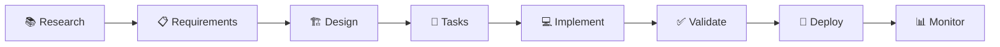

# 🚀 MUSUBI 5-Minute Quick Start

**MUSUBI v3.5.1** | Last updated: 2025-12-08

> Get started with MUSUBI in 5 minutes and create your first SDD specification!

---

## 📋 Table of Contents

1. [Prerequisites](#1-prerequisites)
2. [Installation](#2-installation)
3. [Project Initialization](#3-project-initialization)
4. [First Requirements Definition](#4-first-requirements-definition)
5. [Next Steps](#5-next-steps)

---

## 1. Prerequisites

| Item | Requirement |
|------|------|
| **Node.js** | v18.0.0 or later |
| **AI Coding Agent** | Any of the following |

### Supported AI Agents

| Agent | Supported | Initialization Command |
|-------------|------|----------------|
| Claude Code | ✅ Skills API | `musubi init --claude-code` |
| GitHub Copilot | ✅ AGENTS.md | `musubi init --copilot` |
| Cursor | ✅ AGENTS.md | `musubi init --cursor` |
| Gemini CLI | ✅ GEMINI.md | `musubi init --gemini` |
| Codex CLI | ✅ AGENTS.md | `musubi init --codex` |
| Qwen Code | ✅ QWEN.md | `musubi init --qwen` |
| Windsurf | ✅ AGENTS.md | `musubi init --windsurf` |

---

## 2. Installation

### Option A: npx (Recommended, No Installation Required)

```bash
npx musubi-sdd init
```

### Option B: Global Installation

```bash
npm install -g musubi-sdd
musubi init
```

### Option C: Project-Local

```bash
npm install --save-dev musubi-sdd
npx musubi init
```

---

## 3. Project Initialization

### 3.1 New Project (Greenfield)

```bash
# Create a new project directory
mkdir my-project && cd my-project

# Initialize MUSUBI (for GitHub Copilot)
npx musubi-sdd init --copilot
```

**Generated file structure:**

```
my-project/
├── AGENTS.md              # AI agent settings
├── steering/
│   ├── structure.md       # Architecture patterns
│   ├── tech.md            # Technology stack
│   ├── product.md         # Product context
│   ├── project.yml        # Project settings
│   └── rules/
│       ├── constitution.md # The 9-Article Constitution
│       └── workflow.md     # SDD workflow
└── storage/
    ├── features/          # Feature specifications
    ├── specs/             # Detailed specifications
    └── changes/           # Change history
```

### 3.2 Existing Project (Brownfield)

```bash
cd existing-project

# Automatically analyze and generate steering docs
npx musubi-sdd onboard
```

**Automatically detected items:**
- 📦 Technologies used (package.json, requirements.txt, etc.)
- 📁 Directory structure
- 🔧 Build tools and frameworks

---

## 4. First Requirements Definition

### 4.1 Run a Command in an AI Agent

| Platform | Command Format |
|-----------------|-------------|
| Claude Code | `/sdd-requirements login feature` |
| GitHub Copilot | `#sdd-requirements login feature` |
| Cursor | `@sdd-requirements login feature` |

### 4.2 Generate Requirements with the CLI

```bash
npx musubi-sdd requirements --feature login --output storage/specs/
```

### 4.3 Generated Requirements Document (EARS Format)

```markdown
# Feature: Login Function
## Version: 1.0.0

### REQ-LOGIN-001: Basic Login
**Type**: Ubiquitous
**Pattern**: The system shall [action]
**Statement**: The system shall authenticate users with email and password.

### REQ-LOGIN-002: Session Management
**Type**: Event-Driven  
**Pattern**: When [trigger], the system shall [action]
**Statement**: When a user successfully logs in, the system shall create a session token valid for 24 hours.

### REQ-LOGIN-003: Failed Attempts
**Type**: State-Driven
**Pattern**: While [state], the system shall [action]
**Statement**: While login attempts exceed 5 failures, the system shall lock the account for 15 minutes.
```

---

## 5. Next Steps

### 📚 The 8 Stages of the SDD Workflow



### 🎯 Frequently Used Commands

| Stage | CLI | AI Command |
|---------|-----|-----------|
| Requirements | `musubi requirements` | `/sdd-requirements` |
| Design | `musubi design` | `/sdd-design` |
| Task Breakdown | `musubi tasks` | `/sdd-tasks` |
| Implementation | `musubi workflow` | `/sdd-implement` |
| Validation | `musubi validate` | `/sdd-validate` |

### 📖 Additional Resources

- [Complete CLI Reference](./cli-reference.md)
- [Hands-On Tutorial: Building a ToDo App](./tutorial-todo-app.md)
- [Platform-Specific Setup](./platform-setup.md)
- [Troubleshooting](./troubleshooting.md)
- [EARS Requirements Format Details](./ears-format.md)

---

## 💡 Tips

### Tip 1: Update Project Memory

When the codebase changes, update the steering docs:

```bash
npx musubi-sdd remember --auto
```

### Tip 2: Gap Analysis

Check the differences between requirements and implementation:

```bash
npx musubi-sdd gaps
```

### Tip 3: Change Impact Analysis

Visualize the scope of a change's impact:

```bash
npx musubi-sdd analyze --changes
```

---

**🎉 Congratulations! You are ready to start SDD development with MUSUBI!**

---

*Documentation generated by MUSUBI v3.5.1*
