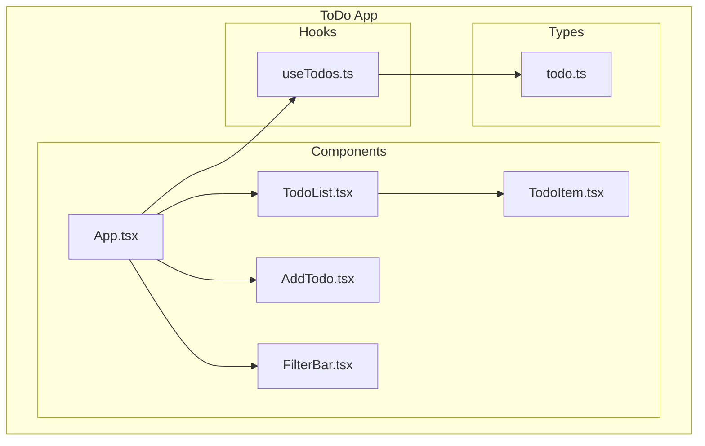

# 📱 Hands-on Tutorial: Building a ToDo App

**MUSUBI v3.5.1** | Last updated: 2025-12-08

> A practical guide to developing a ToDo app from requirements definition through implementation using MUSUBI's SDD workflow

---

## 📋 Table of Contents

1. [Overview](#1-overview)
2. [Stage 0: Research](#2-stage-0-research)
3. [Stage 1: Requirements](#3-stage-1-requirements)
4. [Stage 2: Design](#4-stage-2-design)
5. [Stage 3: Tasks](#5-stage-3-tasks)
6. [Stage 4: Implement](#6-stage-4-implement)
7. [Stage 5: Validate](#7-stage-5-validate)
8. [Summary](#8-summary)

---

## 1. Overview

### 🎯 What You Will Learn in This Tutorial

- Practical use of the SDD workflow
- Defining requirements in EARS format
- Design with the C4 model
- Maintaining traceability
- Development that complies with the Constitution

### 🛠️ The App You Will Build

**ToDo App** (a simple task management app)

| Feature | Description |
|------|------|
| Add task | Add a new ToDo |
| Task list | Display the ToDo list |
| Complete task | Mark a ToDo as completed |
| Delete task | Delete a ToDo |
| Filter | Filter by completed/incomplete |

### 📁 Final Project Structure

```
todo-app/
├── AGENTS.md
├── steering/
│   ├── structure.md
│   ├── tech.md
│   ├── product.md
│   ├── project.yml
│   └── rules/
│       ├── constitution.md
│       └── workflow.md
├── storage/
│   ├── features/
│   │   └── todo-management.md
│   ├── specs/
│   │   └── design-todo.md
│   └── changes/
├── src/
│   ├── components/
│   │   ├── TodoList.tsx
│   │   ├── TodoItem.tsx
│   │   └── AddTodo.tsx
│   ├── hooks/
│   │   └── useTodos.ts
│   └── types/
│       └── todo.ts
└── tests/
    └── todo.test.ts
```

---

## 2. Stage 0: Research

### 2.1 Initialize the Project

```bash
# Create the directory
mkdir todo-app && cd todo-app

# Initialize MUSUBI (for GitHub Copilot)
npx musubi-sdd init --copilot
```

### 2.2 Decide on the Tech Stack

Edit `steering/tech.md`:

```markdown
# Tech Stack

## Frontend
- **Framework**: React 18
- **Language**: TypeScript 5
- **Styling**: Tailwind CSS

## State Management
- **Local State**: React useState

## Build Tools
- **Bundler**: Vite
- **Package Manager**: npm

## Testing
- **Framework**: Vitest
- **Testing Library**: React Testing Library
```

### 2.3 Product Context

Edit `steering/product.md`:

```markdown
# Product Context

## Vision
A simple, easy-to-use task management application

## Target Users
- People who want to manage their tasks individually
- People who prefer a simple interface

## Key Features
1. Adding and deleting tasks
2. Toggling between completed/incomplete
3. Filtering

## Success Metrics
- Adding a task takes 3 clicks or fewer
- Page load time < 1 second
```

---

## 3. Stage 1: Requirements

### 3.1 Generate Requirements with an AI Agent

**For GitHub Copilot:**
```
#sdd-requirements Task management feature for a ToDo app
```

**For Claude Code:**
```
/sdd-requirements Task management feature for a ToDo app
```

### 3.2 Generate Requirements with the CLI

```bash
npx musubi-sdd requirements --feature todo-management --output storage/specs/
```

### 3.3 The Generated Requirements Document

`storage/specs/todo-management.md`:

```markdown
# Feature: ToDo Management
**Version**: 1.0.0
**Status**: Draft
**Created**: 2025-12-08

---

## Overview

Task management feature of the ToDo application. Users can add, view, complete, and delete tasks.

---

## Requirements

### REQ-TODO-001: Add Task
**Type**: Event-Driven
**Priority**: Must Have
**Pattern**: When [trigger], the system shall [action]

**Statement**: 
When a user submits a new task with title, the system shall add the task to the list with status "incomplete".

**Acceptance Criteria**:
- [ ] AC-001: An empty title is rejected
- [ ] AC-002: The input field is cleared after adding
- [ ] AC-003: The new task appears at the end of the list

---

### REQ-TODO-002: Display Tasks
**Type**: Ubiquitous
**Priority**: Must Have
**Pattern**: The system shall [action]

**Statement**:
The system shall display all tasks with their title and completion status.

**Acceptance Criteria**:
- [ ] AC-001: Tasks are displayed as a list
- [ ] AC-002: Each task shows a completion checkbox
- [ ] AC-003: An empty-state message is displayed when there are no tasks

---

### REQ-TODO-003: Complete Task
**Type**: Event-Driven
**Priority**: Must Have
**Pattern**: When [trigger], the system shall [action]

**Statement**:
When a user clicks the checkbox of a task, the system shall toggle the completion status.

**Acceptance Criteria**:
- [ ] AC-001: Can change from incomplete to completed
- [ ] AC-002: Can change from completed to incomplete
- [ ] AC-003: Completed tasks are shown with a strikethrough

---

### REQ-TODO-004: Delete Task
**Type**: Event-Driven
**Priority**: Must Have
**Pattern**: When [trigger], the system shall [action]

**Statement**:
When a user clicks the delete button of a task, the system shall remove the task from the list.

**Acceptance Criteria**:
- [ ] AC-001: After deletion, the task disappears from the list
- [ ] AC-002: Deletion cannot be undone (no confirmation dialog)

---

### REQ-TODO-005: Filter Tasks
**Type**: State-Driven
**Priority**: Should Have
**Pattern**: While [state], the system shall [action]

**Statement**:
While a filter is active, the system shall display only tasks matching the filter condition (All/Active/Completed).

**Acceptance Criteria**:
- [ ] AC-001: "All" shows all tasks
- [ ] AC-002: "Active" shows only incomplete tasks
- [ ] AC-003: "Completed" shows only completed tasks

---

## Traceability

| Requirement | Design | Implementation | Test |
|-------------|--------|----------------|------|
| REQ-TODO-001 | DES-TODO-001 | AddTodo.tsx | todo.test.ts |
| REQ-TODO-002 | DES-TODO-002 | TodoList.tsx | todo.test.ts |
| REQ-TODO-003 | DES-TODO-003 | TodoItem.tsx | todo.test.ts |
| REQ-TODO-004 | DES-TODO-004 | TodoItem.tsx | todo.test.ts |
| REQ-TODO-005 | DES-TODO-005 | TodoList.tsx | todo.test.ts |
```

---

## 4. Stage 2: Design

### 4.1 Generate the Design

```bash
npx musubi-sdd design --feature todo-management --output storage/specs/
```

### 4.2 C4 Component Diagram



### 4.3 Data Model

```typescript
// src/types/todo.ts
interface Todo {
  id: string;
  title: string;
  completed: boolean;
  createdAt: Date;
}

type FilterType = 'all' | 'active' | 'completed';
```

### 4.4 ADR (Architecture Decision Record)

`storage/specs/adr-001-state-management.md`:

```markdown
# ADR-001: State Management

## Status
Accepted

## Context
We need to decide how to manage state in the ToDo app.

## Decision
Adopt local state management using React useState.

## Rationale
- The app is small and simple
- External libraries (such as Redux) would be over-engineering
- Can migrate to the Context API when extending in the future

## Consequences
- ✅ Low learning cost
- ✅ Small bundle size
- ⚠️ Not suited to complex state management
```

---

## 5. Stage 3: Tasks

### 5.1 Generate Tasks

```bash
npx musubi-sdd tasks --feature todo-management
```

### 5.2 Task List

```markdown
# Tasks: ToDo Management

## TASK-001: Setup Project Structure
**Estimate**: 30min
**Dependencies**: None
**Requirements**: All

1. Create a Vite + React + TypeScript project
2. Configure Tailwind CSS
3. Create the directory structure

---

## TASK-002: Implement Todo Type (RED→GREEN)
**Estimate**: 15min
**Dependencies**: TASK-001
**Requirements**: REQ-TODO-001, REQ-TODO-002

1. ❌ Write tests: todo.test.ts (RED)
2. ✅ Type definitions: src/types/todo.ts (GREEN)

---

## TASK-003: Implement useTodos Hook (RED→GREEN)
**Estimate**: 45min
**Dependencies**: TASK-002
**Requirements**: REQ-TODO-001, REQ-TODO-003, REQ-TODO-004

1. ❌ Write tests: useTodos.test.ts (RED)
2. ✅ Implement the hook: src/hooks/useTodos.ts (GREEN)
   - addTodo()
   - toggleTodo()
   - deleteTodo()

---

## TASK-004: Implement AddTodo Component
**Estimate**: 30min
**Dependencies**: TASK-003
**Requirements**: REQ-TODO-001

1. ❌ Write tests (RED)
2. ✅ Implement the component (GREEN)

---

## TASK-005: Implement TodoItem Component
**Estimate**: 30min
**Dependencies**: TASK-003
**Requirements**: REQ-TODO-002, REQ-TODO-003, REQ-TODO-004

1. ❌ Write tests (RED)
2. ✅ Implement the component (GREEN)

---

## TASK-006: Implement TodoList Component
**Estimate**: 30min
**Dependencies**: TASK-004, TASK-005
**Requirements**: REQ-TODO-002, REQ-TODO-005

1. ❌ Write tests (RED)
2. ✅ Implement the component (GREEN)

---

## TASK-007: Implement Filter Feature
**Estimate**: 30min
**Dependencies**: TASK-006
**Requirements**: REQ-TODO-005

1. ❌ Write tests (RED)
2. ✅ Implement the filter (GREEN)

---

## Summary

| Task | Estimate | Status |
|------|----------|--------|
| TASK-001 | 30min | ⬜ |
| TASK-002 | 15min | ⬜ |
| TASK-003 | 45min | ⬜ |
| TASK-004 | 30min | ⬜ |
| TASK-005 | 30min | ⬜ |
| TASK-006 | 30min | ⬜ |
| TASK-007 | 30min | ⬜ |
| **Total** | **3.5h** | |
```

---

## 6. Stage 4: Implement

### 6.1 Project Setup (TASK-001)

```bash
npm create vite@latest . -- --template react-ts
npm install
npm install -D tailwindcss postcss autoprefixer
npx tailwindcss init -p
```

### 6.2 Type Definitions (TASK-002)

```typescript
// src/types/todo.ts
export interface Todo {
  id: string;
  title: string;
  completed: boolean;
  createdAt: Date;
}

export type FilterType = 'all' | 'active' | 'completed';
```

### 6.3 useTodos Hook (TASK-003)

```typescript
// src/hooks/useTodos.ts
import { useState, useCallback } from 'react';
import { Todo, FilterType } from '../types/todo';

export function useTodos() {
  const [todos, setTodos] = useState<Todo[]>([]);
  const [filter, setFilter] = useState<FilterType>('all');

  // REQ-TODO-001: Add Task
  const addTodo = useCallback((title: string) => {
    if (!title.trim()) return;
    
    const newTodo: Todo = {
      id: crypto.randomUUID(),
      title: title.trim(),
      completed: false,
      createdAt: new Date(),
    };
    
    setTodos(prev => [...prev, newTodo]);
  }, []);

  // REQ-TODO-003: Complete Task
  const toggleTodo = useCallback((id: string) => {
    setTodos(prev =>
      prev.map(todo =>
        todo.id === id ? { ...todo, completed: !todo.completed } : todo
      )
    );
  }, []);

  // REQ-TODO-004: Delete Task
  const deleteTodo = useCallback((id: string) => {
    setTodos(prev => prev.filter(todo => todo.id !== id));
  }, []);

  // REQ-TODO-005: Filter Tasks
  const filteredTodos = todos.filter(todo => {
    if (filter === 'active') return !todo.completed;
    if (filter === 'completed') return todo.completed;
    return true;
  });

  return {
    todos: filteredTodos,
    allTodos: todos,
    filter,
    setFilter,
    addTodo,
    toggleTodo,
    deleteTodo,
  };
}
```

### 6.4 Component Implementation

```typescript
// src/components/AddTodo.tsx
import { useState, FormEvent } from 'react';

interface AddTodoProps {
  onAdd: (title: string) => void;
}

export function AddTodo({ onAdd }: AddTodoProps) {
  const [title, setTitle] = useState('');

  const handleSubmit = (e: FormEvent) => {
    e.preventDefault();
    onAdd(title);
    setTitle(''); // AC-002: Clear the input field
  };

  return (
    <form onSubmit={handleSubmit} className="flex gap-2 mb-4">
      <input
        type="text"
        value={title}
        onChange={(e) => setTitle(e.target.value)}
        placeholder="Add a new task..."
        className="flex-1 px-4 py-2 border rounded"
      />
      <button
        type="submit"
        className="px-4 py-2 bg-blue-500 text-white rounded hover:bg-blue-600"
      >
        Add
      </button>
    </form>
  );
}
```

```typescript
// src/components/TodoItem.tsx
import { Todo } from '../types/todo';

interface TodoItemProps {
  todo: Todo;
  onToggle: (id: string) => void;
  onDelete: (id: string) => void;
}

export function TodoItem({ todo, onToggle, onDelete }: TodoItemProps) {
  return (
    <li className="flex items-center gap-2 p-2 border-b">
      <input
        type="checkbox"
        checked={todo.completed}
        onChange={() => onToggle(todo.id)}
        className="w-5 h-5"
      />
      <span className={`flex-1 ${todo.completed ? 'line-through text-gray-400' : ''}`}>
        {todo.title}
      </span>
      <button
        onClick={() => onDelete(todo.id)}
        className="px-2 py-1 text-red-500 hover:bg-red-100 rounded"
      >
        Delete
      </button>
    </li>
  );
}
```

```typescript
// src/components/TodoList.tsx
import { Todo } from '../types/todo';
import { TodoItem } from './TodoItem';

interface TodoListProps {
  todos: Todo[];
  onToggle: (id: string) => void;
  onDelete: (id: string) => void;
}

export function TodoList({ todos, onToggle, onDelete }: TodoListProps) {
  if (todos.length === 0) {
    return (
      <p className="text-center text-gray-500 py-4">
        No tasks yet. Add one above!
      </p>
    );
  }

  return (
    <ul className="border rounded">
      {todos.map(todo => (
        <TodoItem
          key={todo.id}
          todo={todo}
          onToggle={onToggle}
          onDelete={onDelete}
        />
      ))}
    </ul>
  );
}
```

---

## 7. Stage 5: Validate

### 7.1 Run Tests

```bash
npm test
```

### 7.2 Verify Traceability

```bash
npx musubi-sdd trace --feature todo-management
```

### 7.3 Check Requirements Coverage

```bash
npx musubi-sdd validate --feature todo-management
```

**Example output:**
```
✅ REQ-TODO-001: Add Task - Covered (AddTodo.tsx, useTodos.ts)
✅ REQ-TODO-002: Display Tasks - Covered (TodoList.tsx)
✅ REQ-TODO-003: Complete Task - Covered (TodoItem.tsx, useTodos.ts)
✅ REQ-TODO-004: Delete Task - Covered (TodoItem.tsx, useTodos.ts)
✅ REQ-TODO-005: Filter Tasks - Covered (useTodos.ts)

Coverage: 5/5 (100%)
```

---

## 8. Summary

### 📊 Completed SDD Workflow

| Stage | Deliverables | Status |
|-------|--------|------|
| 0. Research | tech.md, product.md | ✅ |
| 1. Requirements | todo-management.md (5 REQs) | ✅ |
| 2. Design | C4 Diagram, ADR-001 | ✅ |
| 3. Tasks | 7 Tasks (3.5h) | ✅ |
| 4. Implement | 5 Components, 1 Hook, 1 Type | ✅ |
| 5. Validate | 100% Coverage | ✅ |

### 🔗 Traceability Matrix

```
REQ-TODO-001 ─→ DES-TODO-001 ─→ AddTodo.tsx ─→ addTodo.test.ts
REQ-TODO-002 ─→ DES-TODO-002 ─→ TodoList.tsx ─→ todoList.test.ts
REQ-TODO-003 ─→ DES-TODO-003 ─→ TodoItem.tsx ─→ toggle.test.ts
REQ-TODO-004 ─→ DES-TODO-004 ─→ TodoItem.tsx ─→ delete.test.ts
REQ-TODO-005 ─→ DES-TODO-005 ─→ useTodos.ts ─→ filter.test.ts
```

### 💡 What You Learned

1. **EARS format** - Unambiguous requirements definition
2. **Red-Green-Refactor** - Test-first implementation
3. **Traceability** - Tracking requirements → design → code → tests
4. **Constitutional compliance** - Consistent quality standards

### 📚 Next Steps

- [Adding persistence (LocalStorage)](./tutorial-todo-advanced.md)
- [Adding authentication](./tutorial-auth.md)
- [Deployment (Vercel)](./tutorial-deploy.md)

---

*Document generated by: MUSUBI v3.5.1*
