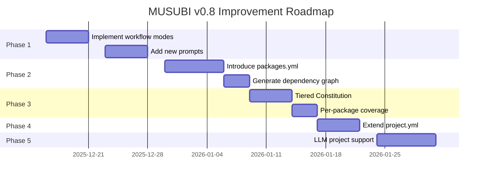

# MUSUBI Improvement Plan v0.8

**Created**: 2025-12-12
**Source**: References/requirements/requirement-cobol2java-20251212.md
**Status**: ✅ Phases 1-4 implemented

---

## Implementation Status

| Phase | Scope | Status | Completed |
|-------|------|----------|--------|
| Phase 1 | Workflow flexibility + prompts | ✅ Done | 2025-12-12 |
| Phase 2 | Stronger monorepo support | ✅ Done | 2025-12-12 |
| Phase 3 | Tiered Constitution | ✅ Done | 2025-12-12 |
| Phase 4 | project.yml extensions | ✅ Done | 2025-12-12 |
| Phase 5 | LLM project support | ⏳ Not started | - |

### Files Created

**Phase 1: Workflow flexibility**
- `steering/rules/workflow-modes.yml` - Workflow mode definitions
- `src/managers/workflow-mode-manager.js` - Mode manager class
- `src/generators/changelog-generator.js` - CHANGELOG generation
- `bin/musubi-release.js` - Release CLI command
- `tests/workflow-modes.test.js` - Tests

**Phase 2: Monorepo support**
- `steering/packages.yml` - Package configuration
- `src/managers/package-manager.js` - Package manager class
- `tests/package-manager.test.js` - Tests

**Phase 3: Tiered Constitution**
- `steering/rules/constitution-levels.yml` - Level definitions
- `src/validators/constitution-level-manager.js` - Level manager class
- `tests/constitution-levels.test.js` - Tests
- `src/validators/constitutional-validator.js` (updated) - Level support

**Phase 4: project.yml extensions**
- `src/schemas/project-schema.json` - JSON schema (v2.0)
- `src/validators/project-validator.js` - Validator
- `bin/musubi-config.js` - Configuration CLI command
- `tests/project-validator.test.js` - Tests

---

## Executive Summary

Based on improvement requirements discovered through hands-on use in the COBOL2Java project, this document lays out the improvement plan for the next version of the MUSUBI framework (v0.8).

### Key Improvement Areas

1. **Workflow flexibility** - A lightweight mode scaled to feature size
2. **Stronger monorepo support** - Support for modern package layouts
3. **Prompt extensions** - Release, benchmark, and security support
4. **Tiered Constitutional Governance** - Enforcement by level
5. **project.yml extensions** - Richer machine-readable configuration
6. **LLM project support** - Addressing AI/ML-specific needs

---

## Phase 1: Workflow and Prompt Improvements (Priority: High)

### 1.1 Lightweight Workflow Modes

**Problem**: The 8-stage workflow is overkill for small features

**Improvement**:

```yaml
# steering/rules/workflow-modes.yml
workflow_modes:
  small:
    description: "1-2 hours of work (bug fixes, small features)"
    stages:
      - requirements   # Simplified requirements definition
      - implement      # Implementation
      - validate       # Validation
    skip_artifacts:
      - design.md
      - tasks.md
    coverage_threshold: 60%
    
  medium:
    description: "1-2 days of work (medium-sized features)"
    stages:
      - requirements
      - design
      - tasks
      - implement
      - validate
    coverage_threshold: 70%
    
  large:
    description: "1 week or more (large features, new modules)"
    stages:
      - steering       # Update project memory
      - requirements
      - design
      - tasks
      - implement
      - validate
      - review
    coverage_threshold: 80%
```

**Implementation tasks**:

| Task | File | Effort |
|--------|----------|------|
| Define workflow modes | `steering/rules/workflow-modes.yml` | 2h |
| Update workflow agent | `src/agents/workflow-navigator.js` | 4h |
| Extend prompts | `packages/vscode-extension/src/prompts/` | 2h |
| Update documentation | `docs/USER-GUIDE.md` | 2h |
| Add tests | `tests/workflow-modes.test.js` | 3h |

### 1.2 New Prompts

**Problem**: There is no release, security, or benchmark process

**Prompts to add**:

| Prompt | Purpose | Implementation priority |
|-----------|------|------------|
| `#sdd-release` | npm/Docker publishing, CHANGELOG update, tagging | 🔴 High |
| `#sdd-implement-test` | Implement tests only (TDD Red Phase) | 🔴 High |
| `#sdd-implement-code` | Implement code only (TDD Green Phase) | 🔴 High |
| `#sdd-security` | Security audit | 🟡 Medium |
| `#sdd-benchmark` | Performance benchmarking | 🟡 Medium |
| `#sdd-migrate` | Migrations for breaking changes | 🟢 Low |

**#sdd-release prompt specification**:

```markdown
## #sdd-release

### Usage
#sdd-release <version-type>

### Parameters
- version-type: patch | minor | major | <specific-version>

### What it does
1. Bump the version number (package.json, project.yml)
2. Auto-generate CHANGELOG.md
3. Run npm publish / Docker push
4. Create and push a Git tag
5. Create a GitHub Release (optional)

### Prerequisites
- All tests pass
- Coverage thresholds are met
- No uncommitted changes
```

**Implementation tasks**:

| Task | File | Effort |
|--------|----------|------|
| Implement release prompt | `src/agents/release-manager.js` | 6h |
| Split implement-test/code | `src/agents/software-developer.js` | 4h |
| CHANGELOG generation logic | `src/generators/changelog-generator.js` | 4h |
| Add tests | `tests/release.test.js` | 3h |

---

## Phase 2: Stronger Monorepo Support (Priority: High)

### 2.1 Introducing packages.yml

**Problem**: The fixed `lib/{feature}/` path does not fit modern monorepos

**Improvement**:

```yaml
# steering/packages.yml
schema_version: "1.0"

package_manager: pnpm  # npm | yarn | pnpm
workspace_config: pnpm-workspace.yaml

packages:
  - name: "@musubi/core"
    path: packages/core
    type: library
    publishable: true
    coverage_target: 90%
    entry_points:
      main: src/index.js
      types: src/index.d.ts
    dependencies: []
    
  - name: "@musubi/cli"
    path: packages/cli
    type: cli
    publishable: true
    coverage_target: 70%
    entry_points:
      bin: bin/musubi.js
    dependencies:
      - "@musubi/core"
    
  - name: "@musubi/vscode"
    path: packages/vscode-extension
    type: extension
    publishable: true
    coverage_target: 60%
    dependencies:
      - "@musubi/core"
      
  - name: "@musubi/web"
    path: packages/webapp
    type: application
    publishable: false
    coverage_target: 50%
    dependencies:
      - "@musubi/core"

# Auto-generate the inter-package dependency graph
dependency_graph:
  enabled: true
  output: docs/architecture/dependency-graph.md
```

**Implementation tasks**:

| Task | File | Effort |
|--------|----------|------|
| Define packages.yml schema | `src/schemas/packages-schema.json` | 2h |
| Package loader | `src/managers/package-manager.js` | 6h |
| Dependency graph generation | `src/analyzers/dependency-graph.js` | 4h |
| Coverage aggregation | `src/validators/coverage-validator.js` | 4h |
| Add tests | `tests/packages.test.js` | 3h |

### 2.2 Templates by Package Type

**New templates**:

```
steering/templates/packages/
├── library/           # Library template
│   ├── package.json
│   ├── tsconfig.json
│   └── jest.config.js
├── cli/               # CLI template
│   ├── package.json
│   └── bin/
├── application/       # Application template
│   └── package.json
└── extension/         # VSCode extension template
    └── package.json
```

---

## Phase 3: Tiered Constitutional Governance (Priority: Medium)

### 3.1 Constitution Levels

**Problem**: Checking all 9 articles all the time is heavy, and Article IX (no mocks) is too strict

**Improvement**:

```yaml
# steering/rules/constitution-levels.yml
constitution:
  levels:
    critical:
      description: "Block on violation (mandatory)"
      enforcement: block
      articles:
        - name: Article I - Library-First Principle
          id: CONST-001
          required: true
        - name: Article III - Test-First Imperative
          id: CONST-003
          required: true
        - name: Article V - Traceability Mandate
          id: CONST-005
          required: true
          
    advisory:
      description: "Warn only on violation"
      enforcement: warn
      articles:
        - name: Article II - CLI Interface Mandate
          id: CONST-002
          reason: "Internal libraries may not need a CLI"
        - name: Article IX - Real Service Testing
          id: CONST-009
          reason: "Mocking LLM/external API calls is allowed"
          
    flexible:
      description: "Can be overridden in project settings"
      enforcement: configurable
      settings:
        coverage_threshold:
          default: 80
          min: 50
          max: 100
          per_package: true  # Configurable per package
        mock_allowed:
          default: false
          exceptions:
            - llm_providers
            - external_apis
            - payment_services

# Per-project overrides
project_overrides:
  # Can be overridden in steering/project.yml
  example:
    coverage_threshold: 70
    mock_allowed:
      - "@openai/api"
      - "@anthropic/sdk"
```

### 3.2 Coverage Thresholds by Package Type

| Package type | Default threshold | Rationale |
|------------------|----------------|------|
| `library` (core) | 90% | Reliability of business logic matters most |
| `cli` | 70% | I/O-heavy, hard to test completely |
| `application` (web) | 60% | Testing the UI is costly |
| `infrastructure` | 50% | Many external dependencies |
| `extension` | 60% | Depends on IDE APIs |

**Implementation tasks**:

| Task | File | Effort |
|--------|----------|------|
| Level definition file | `steering/rules/constitution-levels.yml` | 2h |
| Update enforcer | `src/validators/constitution-enforcer.js` | 6h |
| Per-package coverage | `src/validators/coverage-validator.js` | 3h |
| Add tests | `tests/constitution-levels.test.js` | 3h |

---

## Phase 4: project.yml Extensions (Priority: Medium)

### 4.1 Extended Schema

**Current**:
```yaml
name: MUSUBI
description: Ultimate SDD Tool
locale: ja
version: "0.7.0"
```

**Extended version**:

```yaml
# steering/project.yml
schema_version: "2.0"

# Basic information
name: MUSUBI
description: Ultimate SDD Tool with 27 Agents
locale: ja
version: "0.7.0"

# Repository information
repository:
  type: monorepo
  manager: pnpm
  url: https://github.com/nahisaho/MUSUBI

# Package layout (reference to packages.yml)
packages: ./packages.yml

# Release settings
release:
  registry: npm
  strategy: independent  # or synchronized
  changelog:
    file: CHANGELOG.md
    format: keep-a-changelog
  versioning:
    scheme: semver
    prerelease_tags: [alpha, beta, rc]

# Integration settings
integrations:
  ci:
    provider: github-actions
    workflows:
      - ci.yml
      - release.yml
  container:
    enabled: true
    registry: ghcr.io/nahisaho/musubi
  ide:
    extensions:
      - packages/vscode-extension
  documentation:
    generator: typedoc
    output: docs/api

# Workflow settings
workflow:
  default_mode: medium  # small | medium | large
  constitution_level: advisory  # strict | advisory | relaxed
  
# LLM project settings (optional)
llm:
  enabled: false
  config: ./llm-config.yml
```

### 4.2 project.yml Validator

**Implementation tasks**:

| Task | File | Effort |
|--------|----------|------|
| Schema definition | `src/schemas/project-schema.json` | 2h |
| Validator implementation | `src/validators/project-validator.js` | 4h |
| Migration tool | `bin/musubi-migrate-config.js` | 3h |
| Add tests | `tests/project-config.test.js` | 2h |

---

## Phase 5: LLM Project Support (Priority: Low)

### 5.1 LLM Configuration Template

```yaml
# steering/llm-config.yml
schema_version: "1.0"

providers:
  - name: openai
    env_var: OPENAI_API_KEY
    models:
      - id: gpt-4o
        type: chat
        default: true
      - id: gpt-4o-mini
        type: chat
    rate_limit:
      requests_per_minute: 60
      tokens_per_minute: 90000
      
  - name: anthropic
    env_var: ANTHROPIC_API_KEY
    models:
      - id: claude-3-5-sonnet-20241022
        type: chat
      - id: claude-3-5-haiku-20241022
        type: chat
        
  - name: ollama
    local: true
    base_url: http://localhost:11434
    models:
      - id: llama3.2
        type: chat
      - id: codellama
        type: code

testing:
  mock_layer:
    enabled: true
    directory: storage/llm-mocks/
    record_mode: false  # Record real responses
  fixtures:
    directory: tests/fixtures/llm/
    
prompts:
  directory: steering/prompts/
  versioning: true
  
benchmarks:
  enabled: true
  directory: storage/benchmarks/
  datasets:
    - name: general
      path: tests/fixtures/benchmark/
```

### 5.2 LLM Mock Layer

```javascript
// src/testing/llm-mock-layer.js
class LLMMockLayer {
  constructor(options = {}) {
    this.recordMode = options.recordMode || false;
    this.mockDirectory = options.mockDirectory || 'storage/llm-mocks/';
  }
  
  async call(provider, model, messages) {
    if (this.recordMode) {
      const response = await this.realCall(provider, model, messages);
      await this.saveFixture(provider, model, messages, response);
      return response;
    }
    return this.loadFixture(provider, model, messages);
  }
}
```

---

## Implementation Roadmap



---

## Effort Summary

| Phase | Scope | Estimated effort | Priority |
|-------|------|----------|--------|
| Phase 1 | Workflow and prompt improvements | 30h | 🔴 High |
| Phase 2 | Monorepo support | 22h | 🔴 High |
| Phase 3 | Tiered Constitution | 14h | 🟡 Medium |
| Phase 4 | project.yml extensions | 11h | 🟡 Medium |
| Phase 5 | LLM project support | 20h | 🟢 Low |
| **Total** | | **97h** | |

---

## Success Metrics

| Metric | Current | Target |
|------|------|------|
| Development time for small features | 4h (all stages required) | 1h (light mode) |
| Monorepo setup time | Manual configuration | Automatic detection and setup |
| False positives for Constitution violations | Frequent | 10% or less |
| Release process time | 30 min manual | 5 min automated |
| LLM test coverage | 0% (mocks not allowed) | 70% (mocks allowed) |

---

## Next Steps

1. **Review**: Go over this plan with stakeholders
2. **Confirm priorities**: Implement Phases 1-2 first
3. **Start implementation**: Begin requirements definition with `#sdd-requirements musubi-v0.8-phase1`

---

## References

- [COBOL2Java Improvement Requirements](../../References/requirements/requirement-cobol2java-20251212.md)
- [Constitutional Governance](../../steering/rules/constitution.md)
- [8-Stage SDD Workflow](../../steering/rules/workflow.md)
- [MUSUBI Documentation](../../README.md)

---

*Generated by MUSUBI Orchestrator on 2025-12-12*
