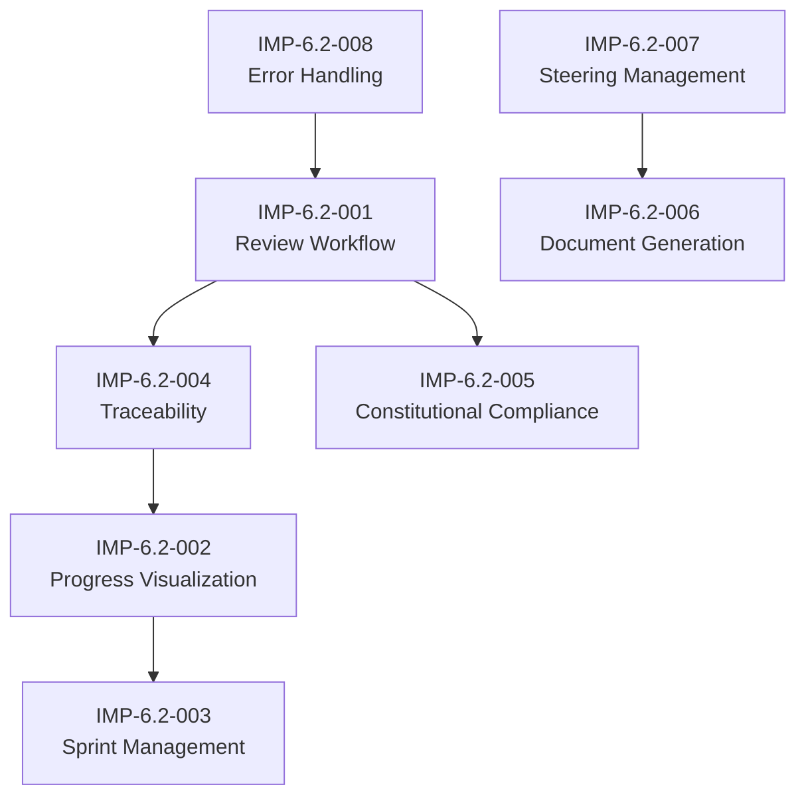

# MUSUBI SDD Improvement Requirements

**Document Type**: Improvement Requirements Specification
**Format**: EARS (Easy Approach to Requirements Syntax)
**Version**: 1.1.0
**Created**: 2025-12-31
**Last Updated**: 2025-12-31
**Author**: Based on YAGOKORO v5.0.0 development experience
**Requirement ID Prefix**: IMP-6.2

---

## Glossary

| Term | Definition |
|------|------|
| **Review Gate** | A quality checkpoint placed between workflow phases. It determines whether progression to the next phase is allowed |
| **Phase -1 Gate** | A special review triggered upon violations of Article VII (Simplicity) / Article VIII (Anti-Abstraction). See [steering/rules/constitution.md](../../steering/rules/constitution.md) |
| **Traceability Matrix** | A bidirectional tracking table showing the correspondence between requirements, design, implementation, and tests |
| **EARS** | Easy Approach to Requirements Syntax - A natural-language-based requirements description pattern |
| **Constitutional Articles** | The 9 fundamental principles of MUSUBI SDD. Defined in [constitution.md](../../steering/rules/constitution.md) |
| **Steering Files** | A group of memory files that maintain project context (tech.md, structure.md, product.md) |

---

## Overview

This document defines improvement requirements for the MUSUBI SDD (Specification Driven Development) framework, identified through development of the YAGOKORO project (v1.0.0 to v5.0.0).

### Background

YAGOKORO implemented the following across five major versions:
- v1.0.0: Foundation (domain model, Neo4j/Qdrant integration)
- v2.0.0: GraphRAG (LazyGraphRAG, basic MCP tools)
- v3.0.0: Automation (LLM-less relation extraction, automatic paper ingestion)
- v4.0.0: Time series and researchers (time series analysis, researcher network)
- v5.0.0: Multilingual (multilingual NER, translation, cross-lingual linking)

This process revealed missing features and areas for improvement in the MUSUBI workflow.

---

## Stakeholder Identification

| Stakeholder | Role | Review Authority |
|------------------|------|-------------|
| **Human Developer** | Final approver, design decisions | All phases |
| **AI Agent (Copilot)** | Automated validation, draft generation | Automated checks |
| **System Architect** | Architecture decisions | Phase -1 Gate |
| **Project Manager** | Progress management, prioritization | Sprint planning |

---

## Requirement Dependencies



---

## Constitutional Articles Mapping

| Requirement Category | Related Articles | Reason |
|--------------|-------------|------|
| IMP-6.2-001 (Review) | II, VII, VIII | Quality assurance, simplicity verification |
| IMP-6.2-002 (Visualization) | III | Ensuring transparency |
| IMP-6.2-003 (Sprint) | IV, V | Planning, consistency |
| IMP-6.2-004 (Traceability) | I, VI | Specification compliance, change tracking |
| IMP-6.2-005 (Constitutional) | VII, VIII | Simplicity, Anti-Abstraction |
| IMP-6.2-006 (Documentation) | III, IX | Transparency, documentation |
| IMP-6.2-007 (Steering) | I | Specification consistency |
| IMP-6.2-008 (Error Handling) | II | Quality assurance |

---

## Category 1: Adding a Review Workflow

### IMP-6.2-001: Integrating Review Stages into the Workflow

**Current problem**:
The current MUSUBI SDD workflow has no explicit review stage, and no review gates are defined between phases (Requirements, Design, Tasks, Implement, Validate).

#### IMP-6.2-001-01: Requirements Review Gate

**EARS Pattern**: Event-driven

```
WHEN requirements document is created,
the MUSUBI system SHALL trigger a requirements review gate
that validates EARS format compliance, stakeholder coverage, and acceptance criteria completeness
BEFORE proceeding to design phase.
```

**Acceptance Criteria**:
- [x] A review gate is automatically triggered after a requirements document is created
- [x] EARS format syntax check is executed
- [x] Stakeholder coverage is verified
- [x] Completeness of acceptance criteria is checked
- [x] Review results are recorded

#### IMP-6.2-001-02: Design Review Gate

**EARS Pattern**: Event-driven

```
WHEN design document is created,
the MUSUBI system SHALL trigger a design review gate
that validates C4 model compliance, ADR documentation, and constitutional article adherence
BEFORE proceeding to task breakdown phase.
```

**Acceptance Criteria**:
- [x] A review gate is triggered after a design document is created
- [x] Completeness of the C4 model (Context, Container, Component, Code) is verified
- [x] Existence and quality of ADRs (Architecture Decision Records) are checked
- [x] Compliance with Constitutional Articles (especially I, II, VII, VIII) is verified

#### IMP-6.2-001-03: Implementation Review Gate

**EARS Pattern**: Event-driven

```
WHEN implementation sprint is completed,
the MUSUBI system SHALL trigger an implementation review gate
that validates test coverage, traceability, and code quality
BEFORE marking the sprint as complete.
```

**Configuration Parameters**:
| Parameter | Default Value | Description |
|-----------|-------------|------|
| `MIN_TEST_COVERAGE` | 80% | Minimum test coverage threshold |
| `COVERAGE_TYPE` | line | Coverage type (line/branch/function) |
| `LINT_STRICT` | true | Whether to block on lint errors |

**Acceptance Criteria**:
- [x] An implementation review is triggered when a Sprint completes
- [x] Verify that test coverage meets or exceeds the configured threshold (default: 80%)
- [x] Traceability across requirements -> design -> code -> tests is verified
- [x] Confirm that code quality metrics (lint, type check) pass

#### IMP-6.2-001-04: Adding Review Prompts

**EARS Pattern**: Ubiquitous

```
The MUSUBI system SHALL provide dedicated review prompts:
- #sdd-review-requirements <feature> - Review requirements
- #sdd-review-design <feature> - Review design
- #sdd-review-implementation <feature> - Review implementation
- #sdd-review-all <feature> - Full review cycle
```

**Acceptance Criteria**:
- [x] Each review prompt is defined in AGENTS.md
- [x] An appropriate review checklist is generated when a prompt is executed
- [x] Review results are saved in the storage/reviews/ directory

---

## Category 2: Workflow Visualization and Progress Tracking

### IMP-6.2-002: Visualizing Stage Progress

#### IMP-6.2-002-01: Workflow Dashboard

**EARS Pattern**: State-driven

```
WHILE a feature is in development,
the MUSUBI system SHALL maintain a workflow dashboard
that displays current stage, completion percentage, blockers, and next actions.
```

**Acceptance Criteria**:
- [x] The workflow stage of each feature is visualized
- [x] Completion rate (%) is calculated and displayed
- [x] Blockers are explicitly displayed
- [x] Next actions are suggested

#### IMP-6.2-002-02: Recording Stage Transitions

**EARS Pattern**: Event-driven

```
WHEN workflow transitions from one stage to another,
the MUSUBI system SHALL record the transition
with timestamp, reviewer, and approval status.
```

**Acceptance Criteria**:
- [x] Stage transitions are recorded automatically
- [x] Timestamps are attached
- [x] The approver (human or AI) is recorded
- [x] Approval status is saved

---

## Category 3: Enhanced Sprint Management

### IMP-6.2-003: Sprint Definition and Tracking

#### IMP-6.2-003-01: Sprint Planning Template

**EARS Pattern**: Ubiquitous

```
The MUSUBI system SHALL provide a sprint planning template
that includes sprint goals, task breakdown, effort estimation, and dependency mapping.
```

**Acceptance Criteria**:
- [x] A sprint planning template is provided
- [x] Sprint goals can be clearly defined
- [x] Task breakdown can be traced to requirements
- [x] Effort estimates can be recorded
- [x] Dependencies can be mapped

#### IMP-6.2-003-02: Automatic Sprint Completion Report Generation

**EARS Pattern**: Event-driven

```
WHEN a sprint is marked as complete,
the MUSUBI system SHALL automatically generate a sprint completion report
that includes delivered features, test results, metrics, and lessons learned.
```

**Acceptance Criteria**:
- [x] A report is generated automatically when a sprint completes
- [x] A list of delivered features is included
- [x] Test results (pass/fail/skip) are included
- [x] Performance metrics are included
- [x] A Lessons Learned (retrospective) section is included

---

## Category 4: Traceability Automation

### IMP-6.2-004: Bidirectional Traceability Matrix

**Dependencies**: Requires IMP-6.2-001 (Review Workflow)

#### IMP-6.2-004-01: Automatic Traceability Extraction

**EARS Pattern**: Ubiquitous

```
The MUSUBI system SHALL automatically extract traceability links
from requirement IDs in code comments, test descriptions, and commit messages.
```

**Acceptance Criteria**:
- [x] Automatically extract REQ-XXX-NNN patterns from code comments
- [x] Automatically extract REQ-XXX-NNN patterns from test descriptions
- [x] Automatically extract REQ-XXX-NNN patterns from commit messages
- [x] Extraction results are reflected in the traceability matrix

#### IMP-6.2-004-02: Traceability Gap Detection

**EARS Pattern**: State-driven

```
WHILE requirements exist without implementation or tests,
the MUSUBI system SHALL flag traceability gaps
and suggest required actions to close the gaps.
```

**Acceptance Criteria**:
- [x] Requirements without implementation are detected
- [x] Requirements without tests are detected
- [x] Gaps are displayed as warnings
- [x] Actions to close the gaps are suggested

---

## Category 5: Strengthening Constitutional Compliance

### IMP-6.2-005: Automated Verification of Constitution Compliance

**Reference**: [steering/rules/constitution.md](../../steering/rules/constitution.md)

#### IMP-6.2-005-01: Article Compliance Checker

**EARS Pattern**: Event-driven

```
WHEN code is committed or pull request is created,
the MUSUBI system SHALL validate compliance with Constitutional Articles
and block merge if violations are detected.
```

**Acceptance Criteria**:
- [x] Article compliance is checked at commit time
- [x] Article compliance is verified before PR merge
- [x] Merge is blocked if there are violations
- [x] Violation details and remediation steps are presented

#### IMP-6.2-005-02: Automatic Triggering of the Phase -1 Gate

**EARS Pattern**: Event-driven

**Phase -1 Gate definition**: A special review process triggered when a change violating Article VII (Simplicity) or Article VIII (Anti-Abstraction) is detected. For details, see [constitution.md Section 7-8](../../steering/rules/constitution.md).

```
WHEN Article VII (Simplicity) or Article VIII (Anti-Abstraction) violation is detected,
the MUSUBI system SHALL automatically trigger a Phase -1 Gate review process
and notify required reviewers.
```

**Required Reviewers**:
- System Architect (required)
- Project Manager (optional)
- Human Developer (final approval)

**Acceptance Criteria**:
- [x] Article VII/VIII violations are detected automatically
- [x] A Phase -1 Gate review is triggered automatically
- [x] Required reviewers (system-architect, project-manager, etc.) are notified
- [x] An approval/rejection workflow is provided

---

## Category 6: Document Generation Automation

### IMP-6.2-006: Automatic Experiment Report Generation

#### IMP-6.2-006-01: Generating Experiment Reports from Test Results

**EARS Pattern**: Event-driven

```
WHEN test suite execution completes,
the MUSUBI system SHALL generate an experiment report
that includes test summary, performance metrics, and experimental observations.
```

**Acceptance Criteria**:
- [x] An experiment report is generated automatically after tests run
- [x] A test summary (pass/fail/skip) is included
- [x] Performance metrics (execution time, memory, etc.) are included
- [x] An experiment Observations section is included

#### IMP-6.2-006-02: Technical Article Template Generation

> **Withdrawn by CHANGE-002 (2026-10-07)**: the technical-article generator and its article sources were removed; MUSUBI is English only. The requirement is kept for the v6.2 record.

**EARS Pattern**: Optional (WHERE) - Triggered by user request

```
WHERE user requests technical article generation,
the MUSUBI system SHALL generate a publication-ready article
following specified format guidelines (e.g., Qiita, Zenn, Medium).
```

**Supported Platforms**:
| Platform | Format | Special Handling |
|-----------------|-------------|----------|
| Qiita | Markdown + Qiita extensions | Tags, organizations |
| Zenn | Markdown + Zenn extensions | Book/scrap support |
| Medium | Rich Text conversion | Code block optimization |
| Dev.to | Markdown | Front Matter |

**Acceptance Criteria**:
- [x] A technical article template is generated
- [x] Supports the specified platform formats (Qiita, Zenn, Medium)
- [x] Code samples, diagrams, and benchmark results are included
- [x] A draft of publishable quality is generated

---

## Category 7: Steering File Management

### IMP-6.2-007: Automatic Steering Synchronization

#### IMP-6.2-007-01: Automatic Steering Update on Version Updates

**EARS Pattern**: Event-driven

```
WHEN a new version is released,
the MUSUBI system SHALL automatically update steering files
to reflect current version, features, and status.
```

**Acceptance Criteria**:
- [x] steering/*.md is updated automatically upon version release
- [x] product.md/tech.md/structure.md are synchronized
- [x] Version number, feature list, and status are updated
- [x] The updates are committed

#### IMP-6.2-007-02: Steering Consistency Check

**EARS Pattern**: Ubiquitous

```
The MUSUBI system SHALL validate consistency between steering files
and ensure tech.md, structure.md, and product.md are synchronized.
```

**Acceptance Criteria**:
- [x] Consistency among steering/*.md files is checked
- [x] A warning is issued when inconsistencies are detected
- [x] Automatic fixes are suggested

---

## Category 8: Error Handling and Recovery

### IMP-6.2-008: Handling Workflow Failures

**Priority reassessment**: Priority raised to Medium in consideration of operational importance

#### IMP-6.2-008-01: Recovering from Failed Stages

**EARS Pattern**: Unwanted behavior (IF-THEN)

```
IF a workflow stage fails (test failure, validation error, etc.),
THEN the MUSUBI system SHALL provide recovery guidance
including root cause analysis and remediation steps.
```

**Acceptance Criteria**:
- [x] Failure analysis is performed automatically when a stage fails
- [x] The root cause is identified
- [x] Remediation steps are suggested
- [x] Failure history is recorded

#### IMP-6.2-008-02: Rollback Feature

**EARS Pattern**: Optional (WHERE)

```
WHERE a workflow stage produces incorrect results,
the MUSUBI system SHALL support rollback to previous state
with cleanup of partial changes.
```

**Rollback granularity definition**:
| Granularity Level | Target | Description |
|-----------|------|------|
| **File-level** | Individual files | Revert only specific files to the previous version |
| **Commit-level** | Git commits | Revert up to the specified commit |
| **Stage-level** | Workflow stages | Roll back per Requirements/Design/Tasks/Implement unit |
| **Sprint-level** | Entire sprint | Roll back to the start of the sprint |

**Acceptance Criteria**:
- [x] Rollback to a previous stage state is possible (granularity selectable)
- [x] Partial changes are cleaned up
- [x] Rollback history is recorded
- [x] A confirmation prompt is displayed before rollback

---

## Priority Matrix

| Category | Requirement ID | Priority | Impact | Implementation Difficulty | Dependencies |
|---------|--------|--------|--------|------------|----------|
| Review Workflow | IMP-6.2-001-01 to 04 | **Critical** | High | Medium | None |
| Progress Visualization | IMP-6.2-002-01 to 02 | High | Medium | Low | IMP-6.2-004 |
| Sprint Management | IMP-6.2-003-01 to 02 | High | Medium | Low | IMP-6.2-002 |
| Traceability | IMP-6.2-004-01 to 02 | High | High | Medium | IMP-6.2-001 |
| Constitutional | IMP-6.2-005-01 to 02 | Medium | High | High | IMP-6.2-001 |
| Document Generation | IMP-6.2-006-01 to 02 | Medium | Medium | Medium | IMP-6.2-007 |
| Steering Management | IMP-6.2-007-01 to 02 | Medium | Medium | Low | None |
| Error Handling | IMP-6.2-008-01 to 02 | **Medium** | Medium | High | IMP-6.2-001 |

---

## Implementation Proposal

### Phase 1: Review Workflow (Top Priority)

1. Add review prompts to AGENTS.md
2. Define review stages in steering/rules/workflow.md
3. Create review checklist templates
4. Define the storage/reviews/ directory structure

### Phase 2: Traceability and Progress Tracking (IMP-6.2-002, IMP-6.2-004)

1. Strengthen the traceability-auditor skill
2. Define the workflow dashboard specification
3. Define the stage transition record format

### Phase 3: Automation and Constitutional Strengthening (IMP-6.2-005, IMP-6.2-007)

1. GitHub Actions/CI integration
2. Implement automatic Phase -1 Gate triggering
3. Implement automatic Steering synchronization

---

## Reference: Specific Challenges in the YAGOKORO Project

### Challenge 1: Proceeding with Implementation Without Review

During development of v1.0.0 to v5.0.0, there were no explicit review gates between the requirements, design, and implementation phases, which led to the following problems:

- Requirement ambiguities surfaced only at the design stage
- Cases where design changes were needed after implementation
- Test coverage was only checked after the fact

**Solution**: IMP-6.2-001 (Add Review Workflow)

### Challenge 2: Manual Steering Updates

At each version release, tech.ja.md, product.ja.md, and structure.ja.md had to be updated manually, resulting in missed updates and inconsistencies.

**Solution**: IMP-6.2-007 (Automatic Steering Synchronization)

### Challenge 3: Manual Traceability Management

The correspondence between REQ-XXX-NNN and code/tests was managed manually, making it difficult to detect gaps.

**Solution**: IMP-6.2-004 (Traceability Automation)

---

## Non-Functional Requirements (NFR)

### NFR-6.2-001: Performance Requirements

| Item | Requirement | Measurement Method |
|------|------|----------|
| Review gate execution time | < 30 seconds | CI/CD logs |
| Traceability scan | < 60 seconds (up to 1000 files) | Execution time measurement |
| Dashboard update | < 5 seconds | UI response time |
| Steering sync | < 10 seconds | Commit time |

### NFR-6.2-002: Scalability Requirements

| Item | Requirement |
|------|------|
| Maximum number of requirements | 10,000 |
| Maximum number of trace links | 100,000 |
| Concurrent review sessions | 10 in parallel |
| Steering history retention | 365 days |

### NFR-6.2-003: Compatibility Requirements

- Node.js 18.x or later
- Git 2.30 or later
- VS Code 1.80 or later (when using the extension)
- Supports GitHub / GitLab / Azure DevOps

---

## Conclusion

MUSUBI SDD is a powerful specification-driven development framework, but based on this project's experience, **integrating a review workflow** was identified as the most important improvement.

The 9 Constitutional Articles provide excellent design principles, but there are insufficient review gates to incorporate them into the actual workflow. Implementing these improvement requirements is expected to make MUSUBI a more robust and practical SDD framework.

---

**Document Status**: ✅ Implemented (v6.2.0)
**Review Required**: MUSUBI Core Team
**Review Date**: 2025-12-31
**Reviewer**: GitHub Copilot (AI-assisted review)
**Implementation Version**: MUSUBI v6.2.0
**Implementation Date**: 2025-01-21
**Test Coverage**: 4,827 tests passing (159 test suites)
**Next Review**: Post-release retrospective
